# Content architecture and truth map

This document describes the current production architecture. Source, tests,
live worker readiness, immutable evidence, and Git state outrank dated plans or
historical handoffs.

## 1. Product boundary

Content is a loopback-only, single-operator cinema-production application. A
project moves from story planning through reviewed image, performance, motion,
audio, and final-delivery stages. Work that can spend money or GPU time is
guarded by durable ownership and explicit recovery semantics.

The main entry points are:

- [web_server.py](web_server.py): Flask API, project mutations, queue admission,
  SSE progress, settings, review actions, and blueprint registration.
- [cinema_pipeline.py](cinema_pipeline.py): end-to-end phase orchestrator.
- [web/src/App.tsx](web/src/App.tsx): React application shell.

The server is intentionally unauthenticated and must bind only to loopback.
Worker endpoints and credentials never reach the browser.

## 2. End-to-end flow

```mermaid
flowchart LR
  A["Project and references"] --> B["Story and shot planning"]
  B --> C["PLAN review"]
  C --> D["Keyframe generation"]
  D --> E["KEYFRAME review"]
  E --> F["Performance capture"]
  F --> G["PERFORMANCE review"]
  G --> H["Motion generation"]
  H --> I["REVIEW gate"]
  I --> J["Assembly, dialogue, sound, QC"]
  J --> K["Versioned artifacts and client package"]
```



Review state is persisted in project data; SSE is a view of progress, never the
authority for whether a gate passed. A disconnected browser can reconnect and
hydrate current queue/checkpoint state.

## 3. Project and state model

Runtime project data lives below `domain/projects/<project-id>/`. Project JSON
contains settings, scenes, shots, takes, approvals, and recovery markers.
Generated media remains project-relative so a project can be moved without
persisting workstation-specific absolute paths.

State has three separate persistence layers:

- Project JSON: creative state, review decisions, approved take IDs, and phase
  checkpoints.
- SQLite ledgers: full-project jobs, provider attempts/costs, and searchable
  traces.
- Immutable artifact ledger: produced bytes, version number, hashes, recipe,
  dependencies, and source provenance.

These layers are related but never collapsed. A completed provider job does not
approve a take; a green checkpoint does not prove a provider invoice; a package
does not imply bit-exact regeneration.

## 4. Durable production control plane

### 4.1 Full-project queue and crash recovery

[pipeline_jobs.py](pipeline_jobs.py) owns a filesystem-backed SQLite queue.
Admission is idempotent per active project: repeated start requests return the
existing job instead of creating duplicate production work. A fixed worker pool
claims jobs with expiring leases and heartbeats.

If a process stops, an expired running lease returns to the queue with
`resume_required=true`. The next worker resumes from the durable project
checkpoint. A live lease, process-session fence, and project mutation lease
prevent two workers or direct-stage endpoints from mutating the same project at
once.

`PIPELINE_QUEUE_CONCURRENCY` controls the global project-worker count. The
default is one. Higher values permit independent projects to advance in
parallel, while provider ledgers and the local ComfyUI queue retain their own
serialization and duplicate-work guards.

An expired job whose external outcome cannot be proven is not silently retried.
The Run UI presents the exact recovery/abandon action and requires explicit
operator risk acceptance where appropriate.

### 4.2 Paid and GPU attempt ownership

[paid_provider.py](paid_provider.py) and the cost tracker persist one attempt
before or at the external acceptance boundary. Request fingerprints, provider
job IDs, reservation amounts, terminal state, and reconciled cost remain bound
to the project and shot.

Transport failure after possible acceptance is `UNKNOWN`, not a safe failure.
The system searches provider queue/history or resumes the exact job ID. It does
not start a replacement provider merely because a request timed out. This rule
also applies to local FLUX.2 and LivePortrait prompt IDs because completed GPU
work is still expensive and must not be duplicated.

## 5. Image generation

[phase_c_assembly.py](phase_c_assembly.py) implements the supported image
backends:

- `gemini_multiref`: default stored selection. Gemini is attempted when its
  credential and required reference are present. After a safely terminal
  outcome, an eligible Ready local worker may be used, followed by the guarded
  FAL/Pollinations cascade.
- `local_flux2_klein`: explicit local selection. It requires 1–10 unique,
  approved on-disk references and exact live worker readiness. It is pinned and
  fail-closed: the application does not silently replace it with a cloud image
  provider.

Unsupported stored values block settings/run actions and must be replaced in
Setup. There are no image-training, graph-tuning, sampler, guidance, denoise,
or provider-specific identity-weight controls in the project contract.

### 5.1 Local FLUX.2 Klein

[performance/flux2_klein.py](performance/flux2_klein.py) builds and runs the
local image request. [performance/worker_readiness.py](performance/worker_readiness.py)
validates the authenticated shared-gateway capability against the tracked
[deploy/windows-flux2-klein](deploy/windows-flux2-klein/) package.

The UI enables Local FLUX.2 only when all of the following are true:

- state is `ready`;
- startup readiness and execution proof are true;
- the fixed execution canary passed;
- the sequential 1/2/10-reference benchmark passed;
- candidate, workflow, model, revision, and runtime-contract hashes match; and
- license review state is approved.

A reachable port or successful static graph check is insufficient. The worker
may truthfully report `not_installed`, `needs_benchmark`, `blocked`, or
`offline`; each remains non-selectable.

The local route persists its prompt ID. An ambiguous submit, completion, or
download stops replacement work until reconciliation.

### 5.2 Continuity and identity

[domain/continuity_engine.py](domain/continuity_engine.py) supplies three
provider-neutral forms of continuity:

- stable character/location prompt constraints;
- deterministic scene seeds; and
- an explicit project-owned approved continuity reference when one exists.

There is no implicit mutable previous-output chain. Identity validation uses
the shared GhostFaceNet service from [identity](identity/). Reference images,
per-shot validation thresholds, and operator approvals are the active identity
controls.

## 6. Performance, motion, audio, and assembly

Performance routing lives in [performance](performance/). Local LivePortrait
requires an explicit driving clip plus the exact authenticated
`performance-liveportrait` worker contract. The worker and FLUX.2 capability
can share one gateway only when both configured roles resolve to the same
endpoint identity and strong bearer credential.

[workflow_selector.py](workflow_selector.py) classifies shots and supplies
video routing/motion-fidelity policy only. [phase_c_ffmpeg.py](phase_c_ffmpeg.py)
dispatches the typed video-provider catalog and enforces aspect, duration,
accepted-job recovery, and media publication contracts.

Audio and post-processing are implemented by [audio](audio/), [lip_sync.py](lip_sync.py),
[phase_c_vision.py](phase_c_vision.py), and final assembly in the cinema
orchestrator. Provider-specific post-processing actions are explicit operator
actions and remain disabled unless configured.

## 7. Provider analytics and health

[cost_tracker.py](cost_tracker.py) aggregates terminal and active attempt
evidence by engine/provider. Metrics include:

- success rate and outcome counts;
- average and p95 terminal latency;
- unresolved accepted jobs;
- charged media estimate, token-list estimate, and active reservations; and
- deterministic health state/reasons from [domain/provider_health.py](domain/provider_health.py).

Costs are reconciled estimates, not invoice truth. AUTO base-video routing can
avoid providers scored unhealthy from global routing history. Unknown and
degraded providers remain eligible, and an operator-pinned provider is never
silently replaced by health scoring.

The project-scoped API is implemented by [web_observability.py](web_observability.py)
and rendered in Run by `ProviderAnalytics`.

## 8. Central traces

[cinema/trace_store.py](cinema/trace_store.py) adds a bounded SQLite index to
the normal structured logging stream. Trace context binds full-project job ID,
project, scene, shot, and engine where known. Secret-like keys and unsafe fields
are removed before storage.

The Run UI can search the current project's message/fields, level, and exact
trace ID, then page older events. Stdout remains the deployment log authority;
the local index is an operator debugging surface, not an external observability
service.

## 9. Artifact versions and client packages

[cinema/artifact_versions.py](cinema/artifact_versions.py) records immutable
versions of production artifacts. Every record binds exact output bytes,
logical name, media type, provider/model where applicable, parameters, source
hashes, and dependency hashes.

Stochastic provider outputs correctly report `bit_exact=false`. The ledger
captures a replay recipe and exact historical bytes; it does not promise a
future provider will regenerate identical pixels.

[web_artifacts.py](web_artifacts.py) exposes project-scoped history and
packaging. Preview's Client delivery panel lets the operator select the current
or an archived version of each deliverable. Packaging:

- accepts only allowlisted client-deliverable records below `exports/`;
- revalidates every artifact hash;
- excludes hidden, runtime, internal, and credential-like paths; and
- publishes a deterministic ZIP with a manifest and package SHA-256.

## 10. Frontend surfaces

The React shell has four primary pages:

- Setup: supported provider settings, reference controls, voice/audio policy,
  budgets, auto-approve settings, and live GPU worker readiness.
- Edit: shot and take editing, generation inputs, diagnostics, and corrections.
- Run: queue state, progress, gates, telemetry, provider analytics/health, and
  searchable traces.
- Capability: measured project quality, routing/gate evidence, and the
  evidence-backed static capability manifest.

Preview includes immutable artifact history and one-click client packaging.
New controls must be carried through the real save and run path; a visual-only
toggle is not a feature. Unsupported or unknown states render as blocked,
manual-review, or unavailable rather than as success.

Accessibility is part of the component contract: native controls, labels,
keyboard paths, live regions, focus-visible states, and automated axe checks
cover critical Setup, Run, trace, health, worker, review, and packaging surfaces.

## 11. API safety boundaries

- Project IDs and paths are validated and project-relative.
- Settings writes are revision-guarded and reject unknown/invalid keys.
- Project deletion coordinates with queue admission, running leases, direct
  mutations, event buses, and on-disk locks.
- Destructive or paid actions are POST-only and return explicit conflict or
  recovery payloads.
- CORS uses an explicit local-origin allowlist; wildcard origins are rejected.
- GPU gateways are bearer-authenticated, loopback/tunnel oriented, role-bound,
  and expose only allowlisted readiness fields.

## 12. Verification contract

The repository-native checks are:

```bash
.venv/bin/python scripts/ci_smoke.py
.venv/bin/pytest -q
cd web
npm test -- --run
npm run build
```

Additional integrity checks validate active documentation, project-local skill
twins, environment-variable inventory, generated product-surface inventory,
Windows package hashes, worker contracts, and offline FLUX.2 preflight.

Live tests never follow automatically from a green offline suite. Runway and
Windows LivePortrait use the explicitly authorized canary workflow described in
[docs/LIVE_CONTRACT_CANARY.md](docs/LIVE_CONTRACT_CANARY.md). FLUX.2 installation,
fixed probe, and benchmark use its guarded Windows package and require an idle
GPU.

## 13. Non-claims

- Provider invoices remain authoritative over local cost estimates.
- Artifact recipes do not guarantee bit-exact stochastic regeneration.
- Local trace search is not Sentry, ELK, or another external log service.
- Health avoidance applies to AUTO base-video routing, not explicit operator
  provider pins.
- A static candidate, configured URL, open port, or old benchmark is not live
  worker readiness.
- Historical project keys or artifacts do not reactivate removed features.
