# Content — AI Cinema Pipeline · Program Manual & Reference

*A comprehensive macro + micro guide to the program: what it is, how it flows end to end, every subsystem and its key functions, and how to operate it to extract its full capability when generating AI video.*

> **Pull-on-demand only.** Do not load this manual at session start. Before using
> or maintaining it, read [`docs/protocol/program-manual-guide.md`](protocol/program-manual-guide.md).
>
> **Provenance.** Originally generated 2026-05-30 by a read-only deep-research workflow (**Rule #17** — workflow-assisted analysis lanes; rule body in `docs/protocol/claude/director-operator.md`), then re-verified section-by-section against live source. In the 2026-06-09 re-sweep every `file:line` anchor was re-grepped against the current tree (the heavy drift was in `cinema_pipeline.py`, which grew ~140 lines, shifting its method anchors +95–131), every LOC count was re-counted, and references to the since-deleted `PROGRAM-MANUAL-digests.md` were removed. Re-verified 2026-06-09 on branch `claude/manual-md-update-1b3o7f`. **When a line number no longer matches, grep the symbol name — the function/class is the load-bearing reference, not the exact line.**
>
> **Where this fits in the docs.** This is the *narrative + operating* layer. The canonical verified-truth reference is [ARCHITECTURE.md](../ARCHITECTURE.md); run/configure/troubleshoot lives in [OPERATIONS.md](../OPERATIONS.md); design rationale is in [DECISIONS.md](../DECISIONS.md). If any fact here disagrees with `ARCHITECTURE.md`, that file wins.

## Table of Contents
- [1. Executive Overview](#1-executive-overview)
  - [1.1 Who this is for](#11-who-this-is-for)
  - [1.2 The value proposition](#12-the-value-proposition)
  - [1.3 The 30-second mental model](#13-the-30-second-mental-model)
  - [1.4 Headline capabilities](#14-headline-capabilities)
  - [1.5 What makes this powerful](#15-what-makes-this-powerful)
- [2. The Macro Workflow — the Program as One Flow](#2-the-macro-workflow-the-program-as-one-flow)
  - [2.1 The end-to-end pipeline (one program, eleven stages)](#21-the-end-to-end-pipeline-one-program-eleven-stages)
  - [2.2 The run lifecycle — how `generate()` sequences the phases](#22-the-run-lifecycle-how-generate-sequences-the-phases)
  - [2.3 The human-approval gates](#23-the-human-approval-gates)
  - [2.4 Headless vs. interactive — the same machine, two run modes](#24-headless-vs-interactive-the-same-machine-two-run-modes)
  - [2.5 Checkpoints and resume](#25-checkpoints-and-resume)
  - [2.6 One run, narrated end to end](#26-one-run-narrated-end-to-end)
- [3. Component & Module Topology (the micro level)](#3-component-module-topology-the-micro-level)
  - [3.0 Reading this section: the dual-module shim convention](#30-reading-this-section-the-dual-module-shim-convention)
  - [3.1 Orchestration (the macro-spine)](#31-orchestration-the-macro-spine)
  - [3.2 Web / API surface (the user entry point)](#32-web-api-surface-the-user-entry-point)
  - [3.3 Phase system (the per-shot render loops)](#33-phase-system-the-per-shot-render-loops)
  - [3.4 Review / Gates / Auto-approve / Screening / Checkpoints](#34-review-gates-auto-approve-screening-checkpoints)
  - [3.5 Domain / State (the data model & persistence)](#35-domain-state-the-data-model-persistence)
  - [3.6 LLM brains (the creative-direction layer)](#36-llm-brains-the-creative-direction-layer)
  - [3.7 Script → Scenes → Dialogue → Research](#37-script-scenes-dialogue-research)
  - [3.8 Video generation + routing (the API cascade)](#38-video-generation-routing-the-api-cascade)
  - [3.9 Image / keyframe generation + quality tiers](#39-image-keyframe-generation-quality-tiers)
  - [3.10 Identity / Continuity / Coherence](#310-identity-continuity-coherence)
  - [3.11 Performance capture (engine routing + execution)](#311-performance-capture-engine-routing-execution)
  - [3.12 Post-processing / Assembly / Audio](#312-post-processing-assembly-audio)
  - [3.13 Cross-cutting services](#313-cross-cutting-services)
  - [Known divergences, dead code, and footguns](#known-divergences-dead-code-and-footguns)
- [4. Phase-by-Phase Deep Dive](#4-phase-by-phase-deep-dive)
  - [Stage map and progress checkpoints](#stage-map-and-progress-checkpoints)
  - [Stage 0 — Style rules and BGM (run setup)](#stage-0-style-rules-and-bgm-run-setup)
  - [Stage 1 — Scene decomposition (script → shots)](#stage-1-scene-decomposition-script-shots)
  - [PLAN_REVIEW gate (25%)](#plan_review-gate-25)
  - [Stage 2 — Keyframe / image render](#stage-2-keyframe-image-render)
  - [KEYFRAME_REVIEW gate (55%)](#keyframe_review-gate-55)
  - [Stage 3 — Performance capture](#stage-3-performance-capture)
  - [PERFORMANCE_REVIEW gate (65%, conditional)](#performance_review-gate-65-conditional)
  - [Stage 4 — Motion / video render](#stage-4-motion-video-render)
  - [REVIEW gate (82%)](#review-gate-82)
  - [Stage 5 — Assembly + audio mix](#stage-5-assembly-audio-mix)
  - [SCREENING gate (95%, optional) + Stage 6 — Cleanup & complete](#screening-gate-95-optional-stage-6-cleanup-complete)
- [5. The User Manual — Driving It to MAXIMUM Capability](#5-the-user-manual-driving-it-to-maximum-capability)
  - [5.1 End-to-End Operation: From Idea to Final Film](#51-end-to-end-operation-from-idea-to-final-film)
  - [5.2 Quality Tiers: Standard (Production) vs. Max](#52-quality-tiers-standard-production-vs-max)
  - [5.3 The Capability-Knobs Playbook](#53-the-capability-knobs-playbook)
  - [5.4 "To Maximize X, Do Y" Recipes](#54-to-maximize-x-do-y-recipes)
  - [5.5 Auto-Approve Configuration (the unattended brain)](#55-auto-approve-configuration-the-unattended-brain)
  - [5.6 Behavior-Changing Environment Variables](#56-behavior-changing-environment-variables)
  - [5.7 Global Prompt Control (the master lever)](#57-global-prompt-control-the-master-lever)
- [6. Interconnection & Data Flow](#6-interconnection-data-flow)
  - [6.1 The state model: Project → Scene → Shot → Take](#61-the-state-model-project-scene-shot-take)
  - [6.2 How each subsystem hands off to the next](#62-how-each-subsystem-hands-off-to-the-next)
  - [6.3 The review / gate / checkpoint / resume control system](#63-the-review-gate-checkpoint-resume-control-system)
  - [6.4 The API fallback cascade (in detail)](#64-the-api-fallback-cascade-in-detail)
  - [6.5 The "LLM everywhere" layer](#65-the-llm-everywhere-layer)
  - [6.6 Headless vs. interactive control flow](#66-headless-vs-interactive-control-flow)
  - [6.7 Concurrency, locking, and the SSE queues](#67-concurrency-locking-and-the-sse-queues)
  - [6.8 The whole loop, end to end](#68-the-whole-loop-end-to-end)
- [7. Reference Appendix](#7-reference-appendix)
  - [7.1 Key Files Index](#71-key-files-index)
  - [7.2 Key Functions Index](#72-key-functions-index)
  - [7.3 Config / Env / Flags / Tiers](#73-config-env-flags-tiers)
  - [7.4 Glossary](#74-glossary)
  - [7.5 Troubleshooting / Failure Modes](#75-troubleshooting-failure-modes)
  - [7.6 Plan-vs-Source Divergences & Doc-Drift](#76-plan-vs-source-divergences-doc-drift)


---

## 1. Executive Overview

**Content** is an AI cinema pipeline that turns a written idea — a script, a scene list, a logline — into a finished, photorealistic cinematic video with synchronized audio. You define characters, locations, and scenes through a web interface; the system decomposes each scene into individual shots, generates a face-locked keyframe image for every shot, animates each keyframe into a video clip through a fault-tolerant cascade of commercial video-generation APIs, layers in dialogue, music, and environmental foley, and assembles the result into a single color-graded, loudness-normalized MP4. A metacognitive "Chief Director" LLM critiques the plan before anything renders, and the whole run can either pause for human approval at five review gates or run fully unattended.

### 1.1 Who this is for

| Audience | What this manual gives you |
|---|---|
| **Operators / filmmakers** | A map of every quality lever — which knobs raise character fidelity, which API tier costs what, how to drive a run from "idea" to "final cut," and how to maximize the system's full capability. |
| **Engineers** | An accurate, file:line-traceable reference to the architecture: the orchestration spine, the phase system, the review gates, the data model, and every subsystem's real (verified) call graph. |

### 1.2 The value proposition

The pipeline collapses a traditional multi-week production chain — storyboarding, casting consistency, cinematography, animation, sound design, color, mastering — into a single automated flow, while keeping a human in the loop wherever creative judgment matters. The output is not a slideshow of disconnected clips: characters keep the same face across every shot (PuLID face-locking + ArcFace identity validation), locations keep the same architecture (deterministic per-location seeds), lighting and color stay coherent shot-to-shot, and dialogue is either generated natively with the video (Veo) or lip-synced as a mandatory post-pass.

### 1.3 The 30-second mental model

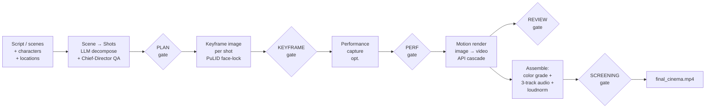

One orchestrator — `cinema_pipeline.CinemaPipeline` (`cinema_pipeline.py:49`) — drives that entire left-to-right sequence. You enter through the web server (`web_server.py`, a Flask app on port 8080); it constructs the pipeline (`web_server.py:1508`) and streams progress back to the browser over Server-Sent Events. There is exactly one entry point: the legacy CLI (`main.py`) has been deleted (verified: `ls main.py` → no such file).

> **Disambiguation up front (a documented footgun):** there are *two* classes named `CinemaPipeline`. The real orchestrator is `cinema_pipeline.CinemaPipeline` (`cinema_pipeline.py:49`). A separate, thin `cinema/pipeline.CinemaPipeline` (`cinema/pipeline.py:80`) is a generic list-of-phases driver that is **not** wired into the main run. Whenever this manual says "the orchestrator," it means the former.

### 1.4 Headline capabilities

- **Multi-API video generation with a fallback cascade.** A single entry point, `generate_ai_video` (`phase_c_ffmpeg.py:54`), routes each shot to an optimal engine and fails over through an ordered list — `KLING_NATIVE → SORA_NATIVE → RUNWAY_GEN4 → LTX → VEO_NATIVE → KLING_3_0 → SORA_2 → VEO (FAL) → RUNWAY` (`phase_c_ffmpeg.py:145`) — so one vendor outage doesn't stall a render. Eleven-plus engines are integrated behind native SDKs and FAL proxies; the winning engine's provenance is recorded on every take.

- **Character consistency.** Keyframes are face-locked with PuLID in a ComfyUI workflow; an `IdentityValidator` (`identity/validator.py`) scores every generated frame against the character's reference embedding (GhostFaceNet/ArcFace), and a rolling-stats feedback loop adapts the PuLID weight per character (`workflow_selector.py:540`). Locations stay consistent via a persisted per-location seed (`domain/location_manager.py`).

- **Native audio & dialogue.** `VEO_NATIVE` is the only video engine that generates voice *embedded in the clip* (`native_audio: True`, the sole such entry — `domain/scene_decomposer.py:43`); dialogue shots route to it when available. Every other engine produces silent video, so any non-embedded dialogue take gets a **mandatory lip-sync pass** (`cinema/shots/controller.py:1528`). Separately, a full audio stack generates TTS dialogue (ElevenLabs / Cartesia for Korean), BGM (Suno / FAL Stable Audio), and environmental foley (Stability AI), mixed into a 3-track final.

- **Quality tiers.** A `"production"` tier (ComfyUI + PuLID, FLUX-Dev) and a `"max"` tier that runs **N=8 adaptive best-of** generation with ArcFace + aesthetic scoring, four-channel ControlNet, FLUX Redux style transfer, FaceDetailer, and SUPIR 4K upscale (`quality_max.py:701`).

- **Metacognitive Chief-Director QA.** Before any pixels render, a `ChiefDirector` LLM (`llm/chief_director.py`) validates every shot prompt against eight hard constraints (identity firewall, schema/location/lighting locks, face-direction) and returns `APPROVED` / `MODIFIED` / `REJECTED` (`llm/chief_director.py:296`). Its verdict feeds the PLAN gate.

- **Human-in-the-loop OR fully headless.** Five review gates (PLAN_REVIEW → KEYFRAME_REVIEW → PERFORMANCE_REVIEW → REVIEW → SCREENING) punctuate the run; at each, an auto-approve heuristic clears shots that meet quality thresholds and parks the rest for an operator. Flip `headless=True` (`cinema_pipeline.py:49`) and unsatisfied gates fail fast with a diagnostic (`GateNotSatisfiedError`, `cinema/review/controller.py:93`) instead of blocking — enabling unattended batch runs.

### 1.5 What makes this powerful

- **It never silently produces junk.** Every stage is gated and scored: prompts by the Chief Director, images by ArcFace identity + aesthetic gates, motion by optical-flow fidelity, lip-sync by a SyncNet gate. Failures are diagnosed and routed to rework, not buried.
- **It degrades gracefully, not catastrophically.** Vendor cascades, LLM provider fallback (Anthropic → OpenAI), and deterministic LLM-free fallbacks (e.g. `_fallback_decompose`) mean a missing API key or a 429 narrows capability rather than killing the run.
- **It is resumable.** State is checkpointed to disk after every scene (`cinema/checkpoint.py`); a crashed run restarts where it left off.
- **It is yours to tune.** Nearly every behavior is a per-project knob in `global_settings` — quality tier, identity strictness, auto-approve thresholds, scene transitions, budget cap, LLM/judge model — read through one canonical helper (`get_project_setting`, `cinema/context.py:151`). One file, `config/prompts/pipeline_context.md`, is injected into *every* LLM in the pipeline, so global creative direction is a single edit away.
- **It tracks the bill.** A SQLite-backed `CostTracker` (`cost_tracker.py`) logs every LLM and API call and can hard-gate generation against a `budget_limit_usd`.

The remainder of this manual documents each of these systems in depth — the orchestration spine, the web/API surface, the phase and gate machinery, the data model, the creative-LLM brains, the video-routing cascade, the image tiers, identity/continuity, post-assembly/audio, and the cross-cutting cost/config/ops layer.

---

## 2. The Macro Workflow — the Program as One Flow

This section traces a single idea from text to a finished, sound-synced cinematic MP4, then describes how the orchestrator sequences that journey, where humans intervene, and how the same machine runs either interactively (web UI) or unattended (headless).

The program has exactly one runtime entry point: `web_server.py` (Flask, port 8080) constructs a `cinema_pipeline.CinemaPipeline` and calls `.generate()` on it in a daemon thread (`web_server.py:1508–1535`). The old `main.py` CLI is deleted; there is no second path. Everything below happens inside that one orchestrator object.

> **Naming caution:** there are *two* classes named `CinemaPipeline`. The real orchestrator is `cinema_pipeline.CinemaPipeline` (`cinema_pipeline.py:49`). A second, unrelated `cinema/pipeline.CinemaPipeline` (`cinema/pipeline.py:80`) is a generic list-of-phases iterator that is **not** wired into `generate()`. Throughout this manual, "the orchestrator" always means the former.

### 2.1 The end-to-end pipeline (one program, eleven stages)

The pipeline is a fixed, ordered gate sequence: **STYLE → SCENE_DECOMPOSE → PLAN_REVIEW → KEYFRAME_RENDER → KEYFRAME_REVIEW → PERFORMANCE_CAPTURE → PERFORMANCE_REVIEW → MOTION_RENDER → REVIEW → ASSEMBLY → SCREENING → COMPLETE**. Image/keyframe and video stages each have a fault-tolerant *cascade* underneath (multiple vendor APIs tried in priority order), and audio is generated alongside the visuals, then mixed in at the very end.

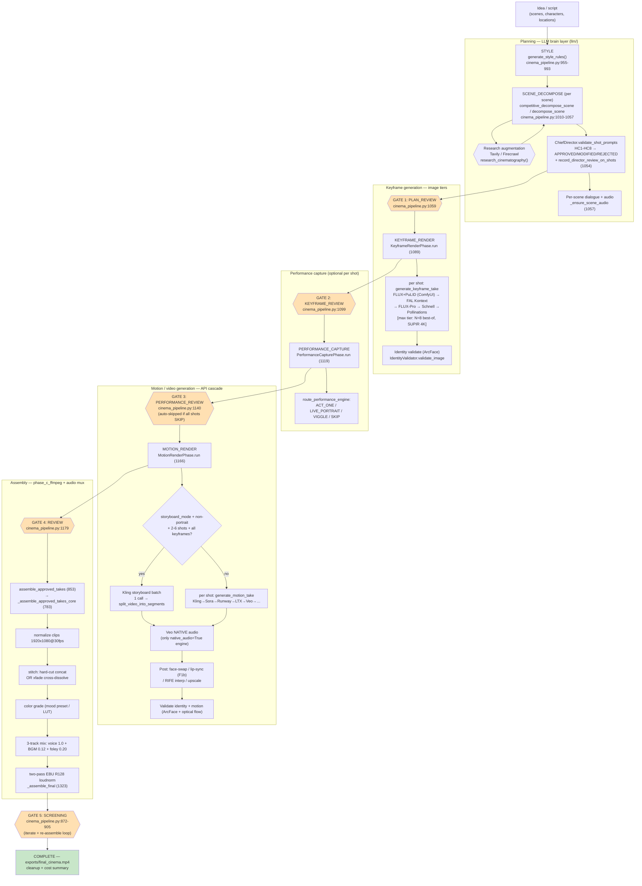

**Reading the flow stage by stage:**

| # | Stage | What happens | Primary modules |
|---|---|---|---|
| 1 | **STYLE** | Once per run. If `global_settings.style_rules` is empty, `generate_style_rules()` (GPT-4o, optionally Tavily-grounded) produces a 7-key style dict (cinematography, color grading, lighting, photorealism…) persisted to the project. A `style_rules_to_prompt_suffix` is appended to every downstream image prompt. | `llm/style_director.py:12`; called `cinema_pipeline.py:955-993` |
| 2 | **SCENE_DECOMPOSE** | Per scene (only if the scene has no shots yet). Converts scene prose → 2–5 API-routed shot records. `competitive_generation=True` runs GPT-4o vs Claude in parallel with a judge; otherwise single GPT-4o. Each shot gets `prompt`, `camera`, `visual_effect`, `target_api`, `characters_in_frame`. | `domain/scene_decomposer.py:436`/`:624`; called `cinema_pipeline.py:1010-1057` |
| 2a | **Research augmentation** | Optional, silently skipped if `TAVILY_API_KEY`/`FIRECRAWL_API_KEY` absent. A GPT-4o tool-loop (`run_with_tools`) injects live cinematography/location/music references into decomposition and dialogue prompts to ground output in real craft. | `research_engine.py:44`, `web_research.py:122` |
| 2b | **Director review** | `ChiefDirector.validate_shot_prompts` enforces hard constraints HC1–HC8 (identity firewall, schema lock, lighting lock, face-direction) and returns APPROVED / MODIFIED / REJECTED. **Critical:** `record_director_review_on_shots(shots, review)` then writes `shot["director_review"]` — the field the PLAN gate reads. | `llm/chief_director.py:296`; `cinema/auto_approve.py:235`; called `cinema_pipeline.py:1054` |
| 2c | **Dialogue + scene audio** | Per scene, `generate_dialogue` (LLM) → `generate_dialogue_voiceover` (ElevenLabs Dialogue Mode for 2+ speakers, or Cartesia Sonic 2 for Korean) produces an MP3 cached for later mux. BGM is pre-generated upfront. | `audio/dialogue.py:419`; `cinema_pipeline.py:1057` (audio), `:993` (BGM) |
| 3 | **KEYFRAME_RENDER** | Per unapproved shot, `generate_keyframe_take` builds the prompt via `ContinuityEngine.enhance_shot_prompt`, optionally optimizes it, then calls `generate_ai_broll`: FLUX-Dev + PuLID on a ComfyUI/RunPod pod is primary; FAL FLUX Kontext → FLUX-Pro → Schnell → Pollinations are cloud fallbacks. The optional **max tier** runs N=8 adaptive best-of with ArcFace+aesthetic scoring, ControlNet, Redux, FaceDetailer, ReActor, and SUPIR 4K upscale. | `phase_c_assembly.py:75`, `quality_max.py:701`; phase wrapper `cinema/phases/keyframe_render.py:68`; called `cinema_pipeline.py:1089` |
| 4 | **PERFORMANCE_CAPTURE** | Per shot with an approved keyframe, retargets a performance onto the still: ACT_ONE / LIVE_PORTRAIT / VIGGLE, or SKIP (the domain router decides via `route_performance_engine`). Shots routed to SKIP are passed over with no generation. | `cinema/phases/performance.py:35`, `domain/performance.py:103`; called `cinema_pipeline.py:1119` |
| 5 | **MOTION_RENDER** | Per shot, `generate_motion_take` turns the keyframe into a clip via the **video cascade** (`generate_ai_video`): Kling→Sora→Runway→LTX→Veo→Kling-3.0→…, filtering disabled engines and retrying on total exhaustion. Dialogue shots route first to **Veo native audio** (the only `native_audio=True` engine); non-embedded dialogue clips get a mandatory lip-sync pass. A storyboard batch path (Kling Native) handles 2–6-shot scenes in one call when all keyframes exist and the aspect is non-portrait (M-1 guard — portrait always takes the per-shot path). | `phase_c_ffmpeg.py:54`, `cinema/phases/motion_render.py:342`; called `cinema_pipeline.py:1166` |
| 5a | **Post-processing** | Identity/continuity correction and finish passes happen at take-generation and operator-correction time: face-swap (PixVerse→FaceFusion), lip-sync overlay/generation cascades with a SyncNet gate, RIFE interpolation, SeedVR2/Topaz upscale. Stored as additive `postprocess_variants`. | `phase_c_vision.py:54`, `lip_sync.py:178`/`:475`/`:705`/`:815` |
| 6 | **ASSEMBLY** | Collects approved takes in scene order, normalizes each to 1920×1080@30fps, stitches (hard-cut concat by default, or `xfade` cross-dissolve when `scene_transitions=True`), applies a mood-mapped color grade, performs the 3-track audio mix (voice 1.0 + BGM 0.12 + foley 0.20), and finishes with a two-pass EBU R128 loudness normalize. Output: `exports/final_cinema.mp4`. | `cinema_pipeline.py:783-851` / `:1315-1431`; ffmpeg helpers in `phase_c_ffmpeg.py` |
| 7 | **SCREENING → COMPLETE** | The operator watches the assembled cut, can iterate individual shots (marking them `needs_reassembly`) and trigger incremental re-assembly, then approves. On approval the run cleans temp artifacts, logs the cost summary, clears the checkpoint, and emits COMPLETE at 100%. | `cinema/screening.py`; `cinema_pipeline.py:853-925` |

**Identity & continuity is a cross-cutting spine, not a stage.** It threads through stages 3–5: `ContinuityEngine.enhance_shot_prompt` injects location fragments, wardrobe continuity, physics constraints, and an adaptive PuLID weight per shot; `IdentityValidator` (GhostFaceNet/ArcFace) scores keyframes and videos and feeds a rolling-stats loop that self-calibrates the next shot's PuLID weight; `coherence_analyzer` checks color/lighting/composition drift between consecutive shots.

### 2.2 The run lifecycle — how `generate()` sequences the phases

`CinemaPipeline.__init__` (`cinema_pipeline.py:55`) composes the run from four collaborators that all share **one** `RunState` reference: long-lived services live on `PipelineCore` (project dict, dirs, `ContinuityEngine`, `ChiefDirector`, `CostTracker`, `LLMEnsemble`); per-run mutable state on `RunState`; pause/cancel/gate-wait/progress on `ThreadedLifecycle`; and the three controllers `ShotController` / `ReviewController` / `CheckpointStore`. The `headless` flag is set here and read by every gate.

`generate(resume=False)` (`cinema_pipeline.py:942`) then runs the ordered sequence below. Each gate call is the synchronization point between the worker thread and the outside world.

```
generate(resume=False)
 │
 ├─ _refresh_project_snapshot()              # load → model_validate → swap in place (443)
 ├─ [resume] _restore_from_checkpoint() + _rebuild_review_clips()   (954-955)
 │
 ├─ STYLE       generate_style_rules() → mutate_project()           (955-993)  ~2%
 ├─ _ensure_bgm(settings)                                            (993)     pre-generate BGM
 │
 ├─ for each scene:                                                  (1010-1057) SCENE_DECOMPOSE
 │    ├─ competitive_decompose_scene() / decompose_scene()
 │    ├─ ChiefDirector.validate_shot_prompts(shots, scene)
 │    ├─ record_director_review_on_shots(shots, review)             (1054)  ← writes director_review
 │    ├─ update_scene_shots(); _save_checkpoint()
 │    └─ _ensure_scene_audio(scene, chars)                          (1057)
 │
 ├─ ╔═ GATE 1 ═╗ _wait_for_gate("PLAN_REVIEW", …, 25)               (1059)
 │
 ├─ KeyframeRenderPhase(self, project).run(ctx)                     (1089)     ~50%
 ├─ ╔═ GATE 2 ═╗ _wait_for_gate("KEYFRAME_REVIEW", …, 55)           (1099)
 │
 ├─ PerformanceCapturePhase(self, project).run(ctx)                 (1119)    ~62%
 ├─ ╔═ GATE 3 ═╗ _wait_for_gate("PERFORMANCE_REVIEW", …)            (1140)  ← skipped if all SKIP
 │
 ├─ MotionRenderPhase(self, project).run(ctx)                       (1166)    ~80%
 ├─ _rebuild_review_clips(project); _save_checkpoint()
 ├─ ╔═ GATE 4 ═╗ _wait_for_gate("REVIEW", …, 82)                    (1179)
 │
 └─ assemble_approved_takes()                                       (853)
      ├─ _assemble_approved_takes_core()                            (783)
      │    └─ _assemble_final(scene_data, bgm, settings)            (1323)  → exports/final_cinema.mp4
      ├─ ╔═ GATE 5 ═╗ wait_for_gate("SCREENING", …)                 (872-905)  ~95%  (if enabled)
      ├─ cleanup_project(); cost_tracker.get_video_cost()
      └─ progress("COMPLETE", final_path, 100%)
```

**Phases vs. gates.** The three render loops (keyframe, performance, motion) are `Phase`-protocol objects that receive a shared `PipelineContext` and return a `PhaseResult`; the four review gates and SCREENING are **inline** in the orchestrator, not phases. A key behavioral fact: **all three phases always return `ok=True` even when individual shots fail** (`cinema/phases/keyframe_render.py:105-108`) — partial failures route through an `on_failure` callback into `RunState.failed_shots` and are reworked from the review UI; the pipeline does not abort on a failed shot.

**Progress and cancellation.** Every stage emits a progress event through `lifecycle.report_progress()` → the per-project SSE queue → the browser. Phases poll `ctx.lifecycle.is_cancelled()` at scene and shot boundaries, so `POST /cancel` interrupts mid-loop. `pause()`/`resume()` block on a `threading.Event`.

### 2.3 The human-approval gates

Five mandatory gates punctuate the run. At each, an **auto-approve heuristic** pre-screens shots against configurable thresholds; whatever it cannot clear waits for a human (interactive) or fails fast (headless).

| Gate | Stage % | Predicate to pass (`_gate_satisfied`) | Auto-approve rule family | Operator endpoint |
|---|---|---|---|---|
| **PLAN_REVIEW** | 25 | every shot `plan_status=="approved"` | `_rules_for_plan`: vetoes unless `director_review.decision=="APPROVED"` and no violations | `…/shots/<id>/plan/approve`·`/reject` |
| **KEYFRAME_REVIEW** | 55 | every shot has `approved_keyframe_take_id` | `_rules_for_image`: composite ≥ `image_min_composite` (0.97 PuLID / 0.78 fallback), no cascade fallback, within budget | `…/keyframes/<take_id>/approve` |
| **PERFORMANCE_REVIEW** | 65 | each shot has `approved_performance_take_id` **or** is SKIP **or** lacks a keyframe | `_rules_for_motion` — **opt-in only**: requires `CINEMA_AUTO_APPROVE_MOTION=1`, else always manual | `…/performance/<take_id>/approve` |
| **REVIEW** | 82 | every shot has `approved_final_take_id` | `_rules_for_final`: lipsync ≥ `final_min_lipsync` (0.8); **`final_require_human_if_upstream_auto` (default True) forces a human here if any earlier gate auto-approved** | `…/final/<take_id>/approve` |
| **SCREENING** | 95 | `project["screening_approved"] == True` | n/a (operator watches the cut; may iterate shots → `needs_reassembly`, re-assemble, then approve) | `…/assemble/screen`, `…/screening/approve`, `…/assemble/re-assemble` |

Each gate is implemented by `ReviewController._wait_for_gate` (`cinema/review/controller.py:507`): it sets `RunState.current_stage`, runs `_run_auto_approve_pass(gate)` (which mutates approved shots and always appends an audit entry to `shot["auto_approve_audit"]`), then either polls `lifecycle.wait_for_gate(...)` at 0.5 s (interactive) or — in headless mode — checks the predicate once and raises `GateNotSatisfiedError` (`cinema/review/controller.py:93`) with per-shot block reasons.

> **PERFORMANCE_REVIEW auto-skip.** When *every* shot is SKIP-routed or has no approved keyframe, the gate is bypassed entirely (`cinema_pipeline.py:1140`) — a SKIP-only production never stops here.

> **The historically dangerous gate is PLAN_REVIEW.** If shots are loaded without running through decomposition, `director_review` is never written and `_rules_for_plan` vetoes forever — the cycle-17 headless stall. The fix is the unconditional `record_director_review_on_shots` call at `cinema_pipeline.py:1054`, and **MODIFIED is now normalized to APPROVED** at the gate (`cinema/auto_approve.py:267`, decision `138d7c7`) so a director-corrected scene no longer dead-ends.

### 2.4 Headless vs. interactive — the same machine, two run modes

The pipeline is one orchestrator; the run *mode* is a single constructor flag plus auto-approve configuration.

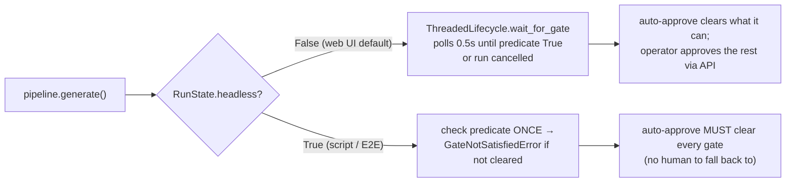

| Aspect | Interactive (web UI) | Headless (`CinemaPipeline(pid, headless=True)`) |
|---|---|---|
| Constructed by | `web_server.py` per `POST …/generate` | Python caller / E2E scripts |
| Lifecycle | `ThreadedLifecycle` — blocks at each gate | `ThreadedLifecycle` — **fails fast** (`GateNotSatisfiedError`) |
| Unblocked by | operator approvals via REST | auto-approve thresholds alone |
| To reach COMPLETE unattended | n/a (human drives) | tune `global_settings.auto_approve`: lower composite/lipsync floors, and **set `final_require_human_if_upstream_auto=false`** (else REVIEW always forces a human) |

> **Headless does NOT use `NullLifecycle`.** This is a sharp, repeated correction. `NullLifecycle` (`cinema/lifecycle.py:70`) is the dead CLI's no-op lifecycle and its `wait_for_gate` returns `True` regardless of the predicate — it would *silently skip* gate enforcement. The only correct non-interactive path is `CinemaPipeline(headless=True)`, which keeps `ThreadedLifecycle` but reads `RunState.headless` in `_wait_for_gate` to raise instead of poll. Any doc claiming "headless uses `NullLifecycle`" is wrong.

### 2.5 Checkpoints and resume

After every scene-loop iteration and after each audio step, `CheckpointStore._save_checkpoint` (`cinema/checkpoint.py:87`) atomically writes `temp/pipeline_state.json` (`tempfile.mkstemp` + `os.replace`), serializing `current_stage`/`scene_id`/`shot_id`, completed scene indices, scene clips/audio/foley, shot results, and failed shots. `generate(resume=True)` calls `_restore_from_checkpoint()` (`cinema/checkpoint.py:163`), which rehydrates `RunState` wholesale and marks any referenced media that has gone missing as `"lost"`. The in-memory `review_clips` manifest is *not* persisted, so resume separately calls `_rebuild_review_clips(project)` (`cinema_pipeline.py:308`). On successful completion `_clear_checkpoint()` removes the file. The web surface exposes resumability read-only via `GET …/checkpoint` → `checkpoint_info()` (`cinema/services.py:100`), which reads the JSON without constructing a pipeline.

> **Re-assembly avoids a deadlock by design.** The SCREENING re-assemble endpoint calls `_assemble_approved_takes_core()` (`cinema_pipeline.py:783`) directly rather than the public `assemble_approved_takes()`. The public method appends the SCREENING gate-wait, and a fresh per-request `CinemaPipeline` constructed in a Flask thread is *not* the instance that `signal_gate` will unblock — calling it there would hang the request (`cinema_pipeline.py:783-851`, orchestration gotcha #9).

### 2.6 One run, narrated end to end

Putting the pieces together, a single interactive run reads as: the operator creates and configures a project, adds characters (with reference images → multi-angle FLUX refs → ArcFace embeddings) and locations, writes scenes, and posts `…/generate`. The orchestrator generates style rules, pre-generates BGM, then per scene decomposes → has the ChiefDirector validate → writes `director_review` → generates dialogue audio, and parks at **PLAN_REVIEW**. After plan approval it renders keyframes (FLUX+PuLID, optionally N=8 max-tier) and parks at **KEYFRAME_REVIEW**; then performance capture and (unless all-SKIP) **PERFORMANCE_REVIEW**; then the motion cascade — Veo-native-audio-first for dialogue, lip-sync for the rest — and **REVIEW**. On final approval it assembles (normalize → stitch → grade → 3-track mix → R128 loudnorm) into `exports/final_cinema.mp4`, parks at **SCREENING** for a watch-and-iterate loop, and on approval cleans up, logs cost, and reports **COMPLETE**. The identical sequence runs unattended when `headless=True` and auto-approve thresholds are tuned to clear all five gates without a human.

---

## 3. Component & Module Topology (the micro level)

This is the developer's "what is where / what does what" reference. It catalogs every subsystem of the pipeline, its canonical module paths (real, verified), and a compact table of its most important functions and classes with `file:line` citations. Use it to locate the code behind any behavior; use [§2](#) for how the pieces connect into a run.

All line numbers and LOC counts below were verified against the live source (`wc -l`, `grep -n`) at manual-authoring time; per the project's ADR-013 discipline, line anchors are point-in-time and can shift after edits — re-grep the symbol name if a number looks stale.

### 3.0 Reading this section: the dual-module shim convention

Six modules exist at **both** the repo root and inside `domain/`. In every case the top-level file is a **9-line re-export shim** (`from domain.<X> import *`) and the `domain/` file is canonical. This is the single most important fact for navigating the tree — `grep import scene_decomposer` finds two files; only one has logic.

| Top-level shim (9 LOC) | Canonical module | Canonical LOC |
|---|---|---|
| `scene_decomposer.py` | `domain/scene_decomposer.py` | 919 |
| `dialogue_writer.py` | `domain/dialogue_writer.py` | 156 |
| `project_manager.py` | `domain/project_manager.py` | 1235 |
| `character_manager.py` | `domain/character_manager.py` | 527 |
| `location_manager.py` | `domain/location_manager.py` | 214 |
| `continuity_engine.py` | `domain/continuity_engine.py` | 620 |

Verified: `wc -l` on all twelve files shows 9 LOC each for the shims, the LOC above for the canonical files. New code should import from `domain.*` directly; the shims exist only to preserve legacy import surfaces from before the Phase-8 package move. Their docstrings mention `main.py` as a caller — that is stale (`main.py` was deleted).

A second naming hazard recurs throughout: **two classes named `CinemaPipeline`**. `cinema_pipeline.CinemaPipeline` (`cinema_pipeline.py:49`) is the real orchestrator; `cinema/pipeline.CinemaPipeline` (`cinema/pipeline.py:80`) is an unrelated generic list-of-phases driver not wired into the main run. Any doc that says "CinemaPipeline" without a path is ambiguous — the orchestrator is always `cinema_pipeline.CinemaPipeline`. Likewise `pipeline_context.py` (a 15-line LLM-prompt-string loader) is **not** `cinema/context.py` (the typed `PipelineContext` dataclass).

### 3.1 Orchestration (the macro-spine)

**Role:** `cinema_pipeline.CinemaPipeline` is the sole run driver. It owns the ordered gate sequence and `generate()` main loop, composes the three controllers (shot / review / checkpoint) over one shared `RunState`, and performs final assembly. Long-lived dependencies live on `PipelineCore`; per-run mutable state on `RunState`; pause/cancel/gate mechanics on `ThreadedLifecycle`.

**Canonical modules:** `cinema_pipeline.py` (1677 LOC, the orchestrator), `cinema/core.py`, `cinema/runstate.py`, `cinema/lifecycle.py`, `cinema/context.py`, `pipeline_context.py` (top-level LLM-prompt loader), `cinema/pipeline.py` (generic driver, not the orchestrator).

| Name | file:line | What it does |
|---|---|---|
| `CinemaPipeline.__init__` | `cinema_pipeline.py:55` | Builds `PipelineCore`, `ThreadedLifecycle(progress_callback)`, `RunState(headless=…)`; composes `ShotController`, `ReviewController`, `CheckpointStore` — all sharing ONE `RunState`. `headless=True` makes gates fail-fast. |
| `CinemaPipeline.generate` | `cinema_pipeline.py:942` | Main production loop. Ordered: refresh snapshot → style rules → BGM → per-scene decompose+director-review → PLAN_REVIEW gate → keyframe phase → KEYFRAME_REVIEW gate → performance phase → (conditional) PERFORMANCE_REVIEW gate → motion phase → REVIEW gate → assemble. Returns `final_cinema.mp4` path or `None`. |
| `CinemaPipeline.assemble_approved_takes` | `cinema_pipeline.py:853` | Full assembly: core assembly → SCREENING gate wait (if enabled) → cleanup → cost summary → COMPLETE at 100%. |
| `CinemaPipeline._assemble_approved_takes_core` | `cinema_pipeline.py:783` | Steps 1–5 only (refresh → REVIEW guard → scene packages → previews → `_assemble_final`). Called directly by the re-assemble endpoint to **avoid SCREENING-gate deadlock** on a Flask thread. |
| `CinemaPipeline._assemble_final` | `cinema_pipeline.py:1323` | ffmpeg: normalize 1920×1080@30 → stitch (hard-cut or xfade) → color grade → 3-track audio mix (voice/BGM/foley) → two-pass loudnorm → `exports/final_cinema.mp4`. |
| `CinemaPipeline._refresh_project_snapshot` | `cinema_pipeline.py:443` | `load_project` → `Project.model_validate` **before** swapping `self.project` (validate-before-swap keeps state coherent on failure) → rebuilds continuity trackers. Called 6+ times at gate boundaries. |
| `CinemaPipeline._build_scene_packages` | `cinema_pipeline.py:709` | Resolves approved take paths per scene; detects "all shots `audio_embedded`" to suppress double-voice TTS. |
| `build_pipeline_core` | `cinema/core.py:75` | Factory: loads project, mkdirs, constructs `PipelineCore(project, dirs, ContinuityEngine, ChiefDirector, CostTracker, LLMEnsemble)`. Raises `ValueError` if project absent. |
| `PipelineCore` | `cinema/core.py:62` | Dataclass of long-lived services (project dict, dirs, continuity, director, cost_tracker, ensemble). Process-cached in `web_server._running_cores`. |
| `RunState` | `cinema/runstate.py:60` | Dataclass: all per-run mutable state (`shot_results`, `scene_clips`, `scene_audio`, `failed_shots`, `current_stage`, `headless`, `completed_scene_indices`). One instance, shared by all controllers. |
| `ThreadedLifecycle` | `cinema/lifecycle.py:110` | Event-backed pause/cancel/gate-wait. `wait_for_gate(name, predicate, poll=0.5)`, `signal_gate(name)` for early wake, `check_pause()`. |
| `NullLifecycle` | `cinema/lifecycle.py:70` | No-op lifecycle whose `wait_for_gate` returns `True` unconditionally. **NOT used by `CinemaPipeline`** — was the deleted CLI's lifecycle. See §3.13 gotcha. |
| `PipelineContext` | `cinema/context.py:49` | Typed shared state passed INTO phase `.run()` calls (`global_settings`, `lifecycle`, audio paths, `char_lora_paths`, …). Dict-compat layer (`__getitem__`/`.get()`) keeps legacy dict-style phases working. |
| `get_project_setting(ctx, key, default)` | `cinema/context.py:151` | **Canonical** read path for per-project UI knobs (reads `ctx.global_settings`). Must be used instead of `config.settings.Settings` for any user-tunable setting. |
| `cinema.pipeline.CinemaPipeline` | `cinema/pipeline.py:80` | Generic `run()` over a `list[Phase]`; short-circuits on `ok=False`. NOT the orchestrator. |

### 3.2 Web / API surface (the user entry point)

**Role:** `web_server.py` is the sole human-facing entry — a Flask server (port 8080) that serves the React SPA, exposes the full REST API for project/character/location/scene/shot CRUD and pipeline control, and streams progress via SSE. `web_services.py` holds the pure, unit-testable SSE-event shaper.

**Canonical modules:** `web_server.py` (2664 LOC), `web_services.py` (121 LOC). Read endpoints without constructing a pipeline come from `cinema/services.py` (§3.3).

| Name | file:line | What it does |
|---|---|---|
| `_running_pipelines` (module state) | `web_server.py:73` | pid → live `CinemaPipeline` (or `_PIPELINE_PENDING` sentinel). Single truth for "is generation active?". |
| `_running_cores` (module state) | `web_server.py:109` | pid → cached `PipelineCore`. Process-lifetime; **not** invalidated on `settings.json` edits. |
| `_progress_queues` | `web_server.py:72` | Per-pid SSE queue. |
| `_reassembly_in_flight` | `web_server.py:125` | Re-entrancy guard for the re-assemble endpoint (separate from `_running_pipelines` because re-assembly runs while SCREENING occupies it). |
| `_GATE_STAGES` | `web_server.py:94` | `frozenset` of stages where gate-acting endpoints bypass the busy fence. |
| `_get_or_build_core(pid)` | `web_server.py:129` | Thread-safe get-or-create of `PipelineCore`; raises `ValueError` on bad pid. |
| `_get_running_pipeline(pid)` | `web_server.py:145` | Safe reader (returns `None` for sentinel/absent). All callers MUST use this. |
| `_get_stage_pipeline(pid)` | `web_server.py:184` | Live pipeline if present, else a per-request `CinemaPipeline` sharing the cached core. Used by gate/take/shot endpoints. |
| `_reject_if_project_busy` / `…_outside_gate` | `web_server.py:226` / `:257` | 409 busy fence; the gate-bypass variant lets iterate/screening/re-assemble through while parked at a gate. |
| `run_pipeline()` (nested in api_generate thread) | `web_server.py:1529` | Daemon thread: builds pipeline, replaces sentinel, calls `pipeline.generate(resume=…)`. |
| `api_stream` (SSE) | `web_server.py:1577` | Yields `data: <json>\n\n`; 30s HEARTBEAT; terminates on `None` sentinel. **Single consumer** — no fan-out. |
| `make_progress_callback(queue)` | `web_services.py:29` | Returns the `progress_cb(stage, detail, percent, …)` that `CinemaPipeline` receives; shapes the event dict and `queue.put`s it. Producer extras (`engine`, `spent`, `budget`, …) pass through with a JSON-serializability guard (NF-3 lift, P1-3). No-op if queue is `None`. |

**Key endpoint families** (all under `/api/projects/<pid>/…`, line = `@app.route` decorator): CRUD for characters (`:552`), objects (`:979`), locations (`:1143`), scenes (`:1284`); scene prep — `generate-dialogue` (`:1362`), `decompose` (`:1398`), `style-rules` (`:1447`); run control — `generate` (`:1507`), `stream` (`:1576`), `cancel` (`:1597`), `pause`/`resume` (`:1998`/`:2008`); gates — plan `approve`/`reject` (`:1627`/`:1639`), keyframe/performance/final `approve` (`:1677`/`:1688`/`:1725`), `iterate` (`:1736`), `reject-auto-approve` (`:1839`); assembly + screening — `assemble` (`:2172`), `assemble/screen` (`:2194`), `screening/approve` (`:2280`), `assemble/re-assemble` (`:2369`); cost/cleanup/export — `cost-live` (`:2577`), `cleanup` (`:2557`), `export` (`:2613`).

### 3.3 Phase system (the per-shot render loops)

**Role:** wraps the three per-shot loops (keyframe, performance, motion) in lightweight Protocol-conforming classes. Each takes a `PipelineContext`, iterates the project's shots, and returns a `PhaseResult` — leaving gates and retry policy to the orchestrator. `cinema/services.py` provides read-only disk-state helpers so web endpoints can read state without constructing the heavy pipeline.

**Canonical modules:** `cinema/phases/base.py`, `keyframe_render.py`, `performance.py`, `motion_render.py`, plus `cinema/services.py` and the generic `cinema/pipeline.py`.

| Name | file:line | What it does |
|---|---|---|
| `Phase` (Protocol) | `cinema/phases/base.py:61` | Requires `name: str` + `run(ctx) -> PhaseResult`. `@runtime_checkable`; no inheritance needed. Retry/fallback explicitly NOT part of the contract. |
| `PhaseResult` | `cinema/phases/base.py:39` | Dataclass `ok / message / elapsed_s`. Orchestrator reads only `ok`. |
| `KeyframeRenderPhase.run` | `cinema/phases/keyframe_render.py:68` | Iterates shots, skips those with `approved_keyframe_take_id`, calls `generate_keyframe_take`. Polls cancellation per scene+shot. **Partial failures do not fail the phase** (`ok=True` always except missing-config / cancel). |
| `PerformanceCapturePhase.run` | `cinema/phases/performance.py:35` | Three skip conditions: already-approved performance, `performance_engine=="SKIP"`, or no approved keyframe. Calls `generate_performance_take`. |
| `MotionRenderPhase.run` | `cinema/phases/motion_render.py:342` | Per scene: storyboard batch path if `storyboard_mode` AND non-portrait aspect (M-1 guard, `:364` — the batch path bypasses the orientation fences, so portrait always falls through) AND 2–6 unapproved shots all with keyframes; else per-shot `generate_motion_take`. |
| `_get_storyboard_mode` | `cinema/phases/motion_render.py:45` | Reads the nested `global_settings.api_engines.KLING_NATIVE.storyboard_mode` (two levels deep) from `self._project`. |
| `MotionRenderPhase._run_storyboard_scene` | `cinema/phases/motion_render.py:100` | One `KlingNativeAPI.generate_storyboard` call → `split_video_into_segments` → per-segment `_finalize_motion_take(record_cost=False)`. Per-segment failure falls back to per-shot. Accesses private `_shot_ctrl` internals (see §3.13). |
| `state_snapshot(pid)` | `cinema/services.py:61` | `load_project` → gate-status counts; in-memory fields empty. Backs `GET …/pipeline-state` when idle (`web_server.py:2019`). |
| `checkpoint_info(pid)` | `cinema/services.py:100` | Reads `temp/pipeline_state.json` directly; resume-info dict. Backs `GET …/checkpoint` (`web_server.py:1565`). |

### 3.4 Review / Gates / Auto-approve / Screening / Checkpoints

**Role:** enforces the five operator review gates (PLAN_REVIEW, KEYFRAME_REVIEW, PERFORMANCE_REVIEW, REVIEW, SCREENING). A veto-rule auto-approve engine pre-clears shots meeting quality thresholds; in headless mode an unclearable gate raises a diagnosable error instead of polling forever. A JSON checkpoint persists `RunState` after every scene for crash-resume; the post-assembly SCREENING gate lets the operator preview, iterate, and re-assemble before sign-off.

**Canonical modules:** `cinema/review/controller.py` (700 LOC), `cinema/auto_approve.py` (762 LOC), `cinema/screening.py` (684 LOC), `cinema/checkpoint.py` (185 LOC), `cinema/runstate.py`.

| Name | file:line | What it does |
|---|---|---|
| `GateNotSatisfiedError` | `cinema/review/controller.py:93` | `RuntimeError` raised by `_wait_for_gate` in headless mode when auto-approve can't clear a gate; carries per-shot diagnostic reasons. |
| `ReviewController._gate_satisfied` | `cinema/review/controller.py:224` | Pure predicate: PLAN→all `plan_status=="approved"`; KEYFRAME→all `approved_keyframe_take_id`; PERFORMANCE→all SKIP or `approved_performance_take_id`; REVIEW→all `approved_final_take_id`. |
| `ReviewController._run_auto_approve_pass` | `cinema/review/controller.py:253` | Per shot calls `check_gate`, mutates approved shots, appends `auto_approve_audit`. Gate→key map; motion key only if `CINEMA_AUTO_APPROVE_MOTION=1`. Never raises. |
| `ReviewController._wait_for_gate` | `cinema/review/controller.py:507` | Runs auto-approve, then headless → check-once-and-raise, else `lifecycle.wait_for_gate` poll. |
| `ReviewController.approve_shot_plan` | `cinema/review/controller.py:633` | Human approval of a shot plan. |
| `ReviewController.approve_take` | `cinema/review/controller.py:647` | Validates collection membership (a keyframe can't be approved as final) and walks `source_take_id` for `approved_motion_take_id`. |
| `AutoApproveConfig` | `cinema/auto_approve.py:71` | All thresholds from `global_settings.auto_approve`. Defaults: `image_min_composite=0.97`/fallback `0.78`, `motion_min_identity=0.85`, `final_min_lipsync=0.8`, `final_require_human_if_upstream_auto=True`. |
| `record_director_review_on_shots` | `cinema/auto_approve.py:235` | **Writer** of `shot["director_review"]`; called unconditionally after `validate_shot_prompts` (`cinema_pipeline.py:1054`). Normalizes MODIFIED→APPROVED (cycle-17). Its absence was the headless-stall root cause. |
| `_rules_for_plan` | `cinema/auto_approve.py:203` | Two vetoes: decision≠APPROVED; non-empty violations. Reads `director_review`. |
| `check_gate` | `cinema/auto_approve.py:625` | Public entry; returns `AutoApproveDecision`. Catches all exceptions (`deferred=True` on eval error); returns not-approved if config disabled. |
| `_screening_stage_enabled` | `cinema/screening.py:104` | Flag: `global_settings.screening_stage_enabled` > `CINEMA_SCREENING_STAGE` env > default ON. |
| `_build_timeline_manifest` | `cinema/screening.py:177` | Per-shot `{start_s, end_s, take}` list; `verify_files=True` mirrors `_assemble_final`'s on-disk inclusion rule. |
| `mark_screening_approved` | `cinema/screening.py:307` | Persist `screening_approved`. |
| `mark_shot_needs_reassembly` | `cinema/screening.py:371` | Dirty-track a shot for re-assembly. |
| `clear_needs_reassembly` | `cinema/screening.py:421` | Race-safe clear (`only_shots=` preserves concurrently dirtied shots). |
| `CheckpointStore._save_checkpoint` | `cinema/checkpoint.py:87` | Atomic JSON write (mkstemp+`os.replace`) of RunState. |
| `_restore_from_checkpoint` | `cinema/checkpoint.py:163` | Rehydrate RunState on resume, marking missing files `"lost"`. |

### 3.5 Domain / State (the data model & persistence)

**Role:** the canonical in-memory schema and all on-disk persistence. Data flows as plain dicts through most of the pipeline; Pydantic v2 is a **warn-only** validation net at load/save boundaries. Persistence is `domain/projects/<pid>/project.json`, guarded by per-project `filelock`, written atomically.

**Canonical modules:** `domain/models.py` (179 LOC, schema), `domain/project_manager.py` (1235 LOC, the canonical home), `domain/shot_types.py`, `domain/performance.py` (engine routing — see §3.9).

| Name | file:line | What it does |
|---|---|---|
| `TakeRecord` / `Shot` / `Scene` / `Character` / `Location` / `Project` | `domain/models.py:62 / 82 / 118 / 137 / 155 / 166` | Pydantic models with `extra="allow"`. Several live fields (e.g. `objects`, `performance_engine`, `director_review`, `screening_approved`) are NOT in the models — they exist on the raw dict. See §3.13. |
| `DirectorialIntent` | `domain/models.py:38` | Iteration-provenance substrate (`prose`/`verb`/`params`/`target_stage`) embedded in `TakeRecord`. |
| `CascadeMetadata` | `domain/models.py:26` | Cascade-selection bookkeeping embedded in `TakeRecord`. |
| `mutate_project(pid, mutator, …)` | `domain/project_manager.py:712` | **The canonical RMW primitive.** Lock → load → normalize → `mutator(latest)` → save-if-changed. `snapshot=` syncs the caller's dict in place. |
| `load_project` | `domain/project_manager.py:700` | Locked read (auto-saves on migration). |
| `save_project` | `domain/project_manager.py:688` | Atomic validated write. |
| `make_take / make_shot / make_character / make_object / make_location / make_scene / make_project` | `domain/project_manager.py:139 / 262 / 158 / 180 / 215 / 236 / 309` | Factories. `new_id()` (`:128`) = `uuid4().hex[:12]` with type prefixes (`char_`/`loc_`/`scene_`/`take_`/`obj_`). |
| `normalize_shot_schema` | `domain/project_manager.py:405` | In-place shot migration: unique shot IDs (collision → `shot_{scene_id}_{idx}`), legacy-field migration. |
| `normalize_project_schema` | `domain/project_manager.py:552` | In-place project migration: scene re-ordering, VBench-key stripping. |
| `_validate_project` | `domain/project_manager.py:641` | `Project.model_validate`; warn-only unless `CINEMA_STRICT_SCHEMA=1`. |
| Entity + shot-package helpers | `domain/project_manager.py:800–1235` | `add/remove/get` for character/object/location/scene; `ensure_shot_package` + sidecar I/O (`shots/<id>/inputs|outputs`). |
| `normalize_shot_type` | `domain/shot_types.py:34` | Alias normalizer (`closeup`→`close_up`). |
| `FACE_READABLE_SHOTS` | `domain/shot_types.py:47` | `frozenset({"close_up","portrait","medium"})` used by performance routing. |

### 3.6 LLM brains (the creative-direction layer)

**Role:** the AI intelligence stack that turns intent + script into machine-executable shot specs, enforces hard constraints pre-generation, translates iteration instructions post-generation, and runs multi-provider competition with judge selection. Stateless — reads project dicts, writes back to shots.

**Canonical modules:** `llm/chief_director.py`, `llm/director.py`, `llm/ensemble.py`, `llm/prompt_optimizer.py`, `llm/style_director.py`, `llm/negative_prompts.py`.

| Name | file:line | What it does |
|---|---|---|
| `ChiefDirector.validate_shot_prompts` | `llm/chief_director.py:296` | Pre-gen gate against HC1–HC8. Returns `{decision: APPROVED/MODIFIED/REJECTED, violations, shots}`; applies MODIFIED edits in place; ≤1 JSON retry; fail-safe APPROVED on parse failure. |
| `ChiefDirector._call_llm` | `llm/chief_director.py:85` | Anthropic (`claude-sonnet-4-6`) primary, OpenAI (`gpt-4o`) fallback; honors `creative_llm` only if model-family matches active provider. |
| `ChiefDirector.evaluate_generation_quality` | `llm/chief_director.py:406` | 2×2 (identity × coherence) mutation matrix with negative-prompt enrichment. **Wired by T6** — invoked by `cinema/shots/controller.py::diagnose_clip` on the opt-in deep path (`deep=True`); see the remediation-advisory design spec. **Vision-grounded** (`d974c15`+`a4cb076`) — attaches take + canonical reference images (PIL re-encode → JPEG q90, 1568px long-edge cap) and returns an extra `visual_findings` key surfaced in `advisory_deep`. |
| `CinemaDirector.translate_intent` | `llm/director.py:275` | Permissive iteration translator (operator intent overrides HC). |
| `intent_translator` | `llm/director.py:418` | Verb DSL (`tighten_framing`/`match_shot`/`shift_emotion`) → `{revised_prompt, params_delta, anchor_refs}`. Called at `cinema/shots/controller.py:1796`. |
| `LLMEnsemble.competitive_generate` | `llm/ensemble.py:146` | Parallel multi-model gen + judge-pick → `EnsembleResult`. Default rosters per task (`script`/`decompose`/`default`); default judge `claude-sonnet-4`. |
| `build_anthropic_system_blocks` | `llm/ensemble.py:40` | Wraps system text with `cache_control: ephemeral` for Anthropic prompt caching; callers must pass stable strings. |
| `optimize_shot_prompt` | `llm/prompt_optimizer.py:355` | UI text → 13-field structured shot spec via ensemble (`task_type="decompose"`); `_coerce_to_valid_keys` sanitizes enums; `_fallback_optimize` is the LLM-free path. |
| `generate_style_rules` | `llm/style_director.py:12` | **OpenAI-only** 7-key style dict (Tavily-grounded); falls back to `_default_style_rules` if no OpenAI key. Asymmetric with the Anthropic-first directors (see §3.13). |
| `style_rules_to_prompt_suffix` | `llm/style_director.py:187` | Concatenates color/lighting/photorealism/composition rules into the suffix prepended to every image prompt (`cinema/shots/controller.py:497`). |
| `get_negative_prompt_for_failure` | `llm/negative_prompts.py:41` | Maps `FailureReason.value` → negative-prompt phrase; used by `evaluate_generation_quality` and `build_remediation_advisory`. |
| `build_remediation_advisory` | `llm/negative_prompts.py:52` | **Wired by T6** — builds `{failure_label, suggested_negative_prompt, remediation_steps}` advisory dict; called from `generate_keyframe_take` and `diagnose_clip`. |

### 3.7 Script → Scenes → Dialogue → Research

**Role:** converts user scenes into concrete, API-routed shot records (GPT-4o or a GPT-4o-vs-Claude ensemble enforcing five hard constraints), generates per-character dialogue, and injects live web research to ground both.

**Canonical modules:** `domain/scene_decomposer.py` (919 LOC), `domain/dialogue_writer.py` (156 LOC), `domain/language_defaults.py` (212 LOC), `research_engine.py` (160 LOC), `web_research.py` (221 LOC).

| Name | file:line | What it does |
|---|---|---|
| `decompose_scene` | `domain/scene_decomposer.py:436` | Single-model GPT-4o decompose via `run_with_tools` (≤2 tool rounds). `target_shots = max(2, min(5, duration/2.5))`. Validates each shot through `make_shot`. Falls back to `_fallback_decompose`. |
| `competitive_decompose_scene` | `domain/scene_decomposer.py:624` | Ensemble (GPT-4o vs Claude, judged) decompose; adds `ensemble_winner`/`ensemble_scores`. Falls back to `decompose_scene`. |
| `_build_cinedecompose_system_prompt` | `domain/scene_decomposer.py:326` | Single-source CineDecompose prompt: HC1–HC5 (identity firewall, schema/location/lighting lock, face-toward-camera), `[SHOT][SCENE][ACTION][OUTFIT][QUALITY]` schema, `PIPELINE_CONTEXT`. |
| `update_scene_shots` | `domain/scene_decomposer.py:887` | Persists shots via `mutate_project`. Called by `cinema_pipeline.py:1055` and `web_server.py:1438`. |
| `_fallback_decompose` | `domain/scene_decomposer.py:844` | No-key path; always 2 hardcoded shots (establishing wide + medium CU). |
| `API_REGISTRY` | `domain/scene_decomposer.py:36` | 40+ engine capability table. (Also the source of `native_audio` for video routing — §3.8.) |
| `PURPOSE_API_RANKING` | `domain/scene_decomposer.py:120` | Per-purpose ordered API lists. |
| `rank_apis_for_purpose` | `domain/scene_decomposer.py:283` | Best-first ranking filter. |
| `estimate_short_cost` | `domain/scene_decomposer.py:173` | 60-shot project cost breakdown. |
| `generate_dialogue` | `domain/dialogue_writer.py:12` | Per-character lines `{character_id, character_name, text, delivery}`; non-English directive keeps `text` native, `delivery` English. |
| `merge_language_defaults_into_settings` | `domain/language_defaults.py:157` | Merges per-language defaults into project settings. |
| `get_language_defaults` | `domain/language_defaults.py:136` | Per-language pipeline defaults (TTS provider, lipsync priority, validation threshold). English/Korean/Japanese/Mandarin/`_default`. |
| `run_with_tools` | `web_research.py:122` | Two-phase GPT-4o tool loop (Tavily/Firecrawl) + final JSON call; logs to `CostTracker`. |
| `research_cinematography` | `research_engine.py:44` | Tavily/Firecrawl wrapper; silently returns `""` if unconfigured. |
| `research_location_visual` | `research_engine.py:72` | Tavily/Firecrawl wrapper; silently returns `[]` if unconfigured. |
| `research_music_reference` | `research_engine.py:94` | Tavily/Firecrawl wrapper; silently returns `""` if unconfigured. |

### 3.8 Video generation + routing (the API cascade)

**Role:** turns a keyframe still into a video clip — classify shot, select an optimal video API, run a fault-tolerant ordered fallback cascade across vendors, route dialogue through native-audio (Veo) or a mandatory lipsync pass, and write cascade provenance to the take.

**Canonical modules:** `phase_c_ffmpeg.py` (1551 LOC — central routing + all per-API handlers + ffmpeg utilities), `workflow_selector.py` (581 LOC), and the native clients `kling_native.py`, `veo_native.py`, `ltx_native.py`, `sora_native.py`. (`RUNWAY*` and `SEEDANCE` are inline in `phase_c_ffmpeg.py` — no wrapper class.)

| Name | file:line | What it does |
|---|---|---|
| `generate_ai_video` | `phase_c_ffmpeg.py:54` | Central dispatch + cascade. Per-engine branches (KLING_NATIVE `:234`, SORA_NATIVE `:270`, VEO_NATIVE `:313`, LTX `:345`, RUNWAY_GEN4 `:387`, SORA_2 `:445`, VEO/FAL `:499`, KLING_3_0 `:576`, FAL_SVD `:665`, RUNWAY `:729`, SEEDANCE `:765`). Returns path or `None`. |
| `try_next_api` (inner) | `phase_c_ffmpeg.py:139` | Iterates fallbacks, filters attempted + `api_engines`-disabled; on exhaustion sleeps 30s and retries up to `MAX_CASCADE_RETRIES` (default 1, `cascade_retry_limit` override). |
| `_record_video_cascade` (inner) | `phase_c_ffmpeg.py:108` | Writes `{engine, attempts}` into `_cascade_out` before each successful return (provenance for the take record). |
| `_veo_quota_blocked` | `phase_c_ffmpeg.py:33` | Checks the 1800s TTL cooldown flag. |
| `_VEO_QUOTA_EXHAUSTED_UNTIL` | `phase_c_ffmpeg.py:19` | Cooldown timestamp — only the **FAL-proxy VEO** branch sets/checks it; VEO_NATIVE has no quota guard (§3.13). |
| `stitch_modules` | `phase_c_ffmpeg.py:857` | Concat demuxer (`-c copy`). |
| `split_video_into_segments` | `phase_c_ffmpeg.py:883` | Storyboard splitter (last segment to EOF). |
| `classify_shot_type` | `workflow_selector.py:411` | → `portrait/medium/wide/action/landscape`. Note: never returns `close_up` despite a `MOTION_FIDELITY_FLOORS` key for it (§3.13). |
| `WORKFLOW_TEMPLATES` | `workflow_selector.py:21` | Per-shot-type primary API + fallback list + render params (e.g. portrait→KLING_NATIVE; wide/landscape→LTX; action→SORA_NATIVE). |
| `VeoNativeAPI.generate_video` | `veo_native.py:138` | Vertex-preferred / Gemini-fallback. **Bug #4:** `reference_images` accepted but dropped (Vertex exclusivity). `driving_video_path` accepted but unwired. Duration clamped to (4,6,8). |
| `_extract_video_bytes` | `veo_native.py:85` | Inline `video_bytes` (Vertex) vs `files.download` (Gemini). Cycle-17 native-audio fix path. |
| `_clamp_image_to_video_duration` | `veo_native.py:38` | Duration clamp (5s→6). |
| `KlingNativeAPI` | `kling_native.py:19` | JWT HS256 auth; `create_image_to_video` (`:86`), `poll_task` (`:170`), `generate_storyboard` (`:313`, ≤6 shots, `face_consistency`). |
| `SoraNativeAPI.generate_video` / `LTXVideoAPI.generate_video` | `sora_native.py:56` / `ltx_native.py:68` | Sora: durations [4,8,12,16,20], driving-video as `input_reference` (only engine that fully wires it). LTX: native REST preferred, FAL fallback; `_*_transition` methods exist but are dead in the cascade. |

### 3.9 Image / keyframe generation + quality tiers

**Role:** converts a per-shot prompt into a 1344×768 keyframe (the anchor for all downstream video). Production tier = FLUX-Dev on RunPod ComfyUI with PuLID face-lock (FAL fallbacks); optional **max** tier = N=8 adaptive best-of with ArcFace/Aesthetic scoring, Union ControlNet, Redux, FaceDetailer, ReActor, SUPIR 4K. Performance capture (Act-One/LivePortrait/Viggle) lives alongside.

**Canonical modules:** `phase_c_assembly.py` (606 LOC, the image generator — despite the "assembly" name), `quality_max.py` (1001 LOC), `workflow_selector.py`, `face_validator_gate.py`, `cinema/shots/controller.py` (2206 LOC), plus the `performance/` package and ComfyUI graphs `pulid.json` / `pulid_max.json`.

| Name | file:line | What it does |
|---|---|---|
| `generate_ai_broll` | `phase_c_assembly.py:75` | Priority chain: `quality_max` (if tier=="max") → ComfyUI PuLID → `_fal_flux_fallback`. Dynamic node injection (prompt/latent/seed/PuLID + ControlNet-depth + img2img + IP-Adapter). |
| `RunPodComfyUI` | `phase_c_assembly.py:35` | ComfyUI REST client (`upload_image`/`queue_prompt`/`get_history`/`get_image`); shared by both tiers. |
| `_fal_flux_fallback` | `phase_c_assembly.py:510` | FLUX Kontext Max Multi → FLUX-Pro → Schnell → Pollinations. |
| `ImageGenResult` | `phase_c_assembly.py:18` | `NamedTuple(path, api_name)`; `api_name` is the authoritative backend token. |
| `generate_ai_broll_max` | `quality_max.py:701` | Max-tier orchestrator: probe → load `pulid_max.json` → optional HiDream swap → prune → 5 inject axes → best-of-N loop → PuLID-boost retry → copy best. |
| `_probe_node_availability` | `quality_max.py:253` | One-time `/object_info` probe. |
| `_prune_unavailable` | `quality_max.py:364` | Strip absent nodes with safe rewires. |
| `_inject_identity / _inject_conditioning / _inject_sampling / _inject_latent_source / _inject_post_passes` | `quality_max.py:461 / 509 / 543 / 564 / 587` | Wire LoRA+PuLID; prompt+guidance+ControlNet+Redux; AYS steps+sampler+SLG+FreeU; latent source (txt2img / LatentBlend / img2img); FaceDetailer+SUPIR+4K. |
| `_validate_overlay_value` | `quality_max.py:144` | Clamp/validate 17 ComfyUI + 8 halt UI knobs against `_MAX_TIER_KNOB_SCHEMA`. |
| `score_candidate` | `face_validator_gate.py:170` | Composite = `0.6·arc + 0.4·aesthetic`. |
| `should_halt` | `face_validator_gate.py:227` | Halt on budget or composite ≥ threshold. |
| `needs_regenerate` | `face_validator_gate.py:326` | Regenerate (one PuLID-boost retry) if `arc < floor`. |
| `get_workflow_params` | `workflow_selector.py:450` | Per-type params + UI overlays. |
| `apply_workflow_params` | `workflow_selector.py:501` | Write params into the `pulid.json` node map. |
| `get_adaptive_pulid_weight` | `workflow_selector.py:540` | Rolling-stats adaptive PuLID weight. |
| `generate_keyframe_take` | `cinema/shots/controller.py:544` | Requires `plan_status=="approved"`; `enhance_shot_prompt` → optional optimizer → `generate_ai_broll` → identity validate → append take → record cost. |

### 3.10 Identity / Continuity / Coherence

**Role:** keeps characters, locations, and visual properties coherent across shots. Four continuity sub-engines + a unified identity validation stack (GhostFaceNet/ArcFace, adaptive frame sampling, rolling stats feeding PuLID adaptation) + a pixel-level coherence analyzer.

**Canonical modules:** `domain/continuity_engine.py` (620 LOC, 4 sub-engines + orchestrator), `coherence_analyzer.py` (277 LOC), `face_validator_gate.py` (§3.9), `domain/character_manager.py` (527 LOC), `domain/location_manager.py` (214 LOC), and the `identity/` package (`__init__.py`, `types.py`, `validator.py`). Note: the skill source-map's flat `identity_validator.py`/`identity_types.py` are **wrong** — the real package is `identity/`.

| Name | file:line | What it does |
|---|---|---|
| `ContinuityEngine.enhance_shot_prompt` | `domain/continuity_engine.py:446` | Central shot augmentation: builds enhanced prompt + the `continuity_config` dict (`use_img2img`, `init_image`, `denoise_strength`, seeds, `primary_reference`, `multi_angle_refs`, `identity_anchor`, `pulid_weight_override`). |
| `ContinuityEngine.validate_shot` | `domain/continuity_engine.py:583` | Delegates to `IdentityValidator.validate_video` for post-gen video identity. |
| `TemporalConsistencyManager.get_denoise_strength` | `domain/continuity_engine.py:368` | Context-aware denoise (0.30–0.55). |
| `should_use_img2img` | `domain/continuity_engine.py:350` | img2img only same-scene, `shot_index>0`. |
| `IdentityValidator.validate_video` | `identity/validator.py:133` | Adaptive sampling (`_compute_sample_positions` `:366`, 3–10 frames by shot type) → `_analyze_frame` (`:409`, GhostFaceNet cosine) → aggregate → `IdentityValidationResult`. |
| `IdentityValidator.get_rolling_stats` | `identity/validator.py:267` | Window over history → `suggested_pulid_delta` (success<0.5→+0.10, etc.). Drives adaptive PuLID weight. |
| `SHOT_TYPE_THRESHOLDS` | `identity/types.py:95` | Per-type strict/standard/lenient thresholds. |
| `get_threshold_for_shot` | `identity/types.py:104` | Attempt-based interpolation toward lenient. |
| `make_validator` | `identity/__init__.py:40` | Factory (wires `vision_fallback`). Always use this — bare `IdentityValidator` lacks the fallback. |
| `get_shared_validator` | `identity/__init__.py:62` | Process-wide singleton wrapper over `make_validator`. |
| `assess_coherence` | `coherence_analyzer.py:215` | `overall = (1-color_drift)·0.4 + lighting·0.3 + composition·0.3`; returns `valid=False` if either image fails to load — callers MUST check `valid`. |
| `create_character_with_images` | `domain/character_manager.py:105` | Canonical-face pick; orchestrates the full character build. |
| `_generate_multi_angle_refs` | `domain/character_manager.py:227` | FLUX Kontext Max Multi 5-angle reference generation. |
| `assign_voice` | `domain/character_manager.py:389` | Language + gender voice assignment. |
| `build_identity_anchor` | `domain/character_manager.py:479` | `"{name}: {traits}"` anchor (injected verbatim, never rephrased). |
| `create_location_with_images` | `domain/location_manager.py:41` | Location refs (+ optional Tavily research). |
| `build_location_prompt_fragment` | `domain/location_manager.py:117` | Verbatim prompt fragment for the location. |
| `get_location_seed` | `domain/location_manager.py:198` | Persistent seed for architectural consistency. |

### 3.11 Performance capture (engine routing + execution)

**Role:** retargets a still keyframe into a performance clip (lip-readable acting) for dialogue/face-readable shots, routing per shot to Act-One, LivePortrait, Viggle, or SKIP, with a post-gen identity/motion gate.

**Canonical modules:** `domain/performance.py` (185 LOC, pure routing), `performance/_router.py` (dispatch), and per-engine modules `act_one.py`, `live_portrait.py`, `viggle.py`, `driving_video.py`, plus the gates `motion_gate.py`, `identity_gate.py`.

| Name | file:line | What it does |
|---|---|---|
| `route_performance_engine` | `domain/performance.py:103` | Decision matrix → `ACT_ONE / LIVE_PORTRAIT / VIGGLE / SKIP`: SKIP (no chars/wide) → ACT_ONE (dialogue + face-readable; budget mode → LIVE_PORTRAIT) → VIGGLE (action no-dialogue) → ACT_ONE (remaining dialogue) → SKIP. |
| `should_capture` | `domain/performance.py:72` | Pure gate (skip no-chars/landscape/wide-no-dialogue). |
| `shot_needs_driving_video` | `domain/performance.py:94` | Whether the shot needs a driving video. |
| `driving_video_source` | `domain/performance.py:145` | Driving-video source (`upload`/`tts_auto`/`none`). |
| `precondition_error` | `domain/performance.py:163` | Pre-allocation guard (ACT_ONE needs audio; LP/VIGGLE need driving video). |
| `dispatch` | `performance/_router.py:89` | The single engine entry called by `cinema/shots/controller.py:921`; routes to the per-engine `generate_*` based on the resolved engine. |
| `generate_act_one_performance` | `performance/act_one.py:46` | Runway Act-One via REST; identity comes from the keyframe + driving audio. |
| `generate_live_portrait_performance` / `generate_viggle_performance` | `performance/live_portrait.py:43` / `viggle.py:42` | LivePortrait (driving video) and Viggle Mode-A motion retargeting. |
| `score_motion_fidelity` | `performance/motion_gate.py:141` | Optical-flow motion-fidelity score (sample count from `MOTION_GATE_SAMPLES`, read once at module load). |
| `needs_remotion` | `performance/motion_gate.py:184` | Remotion advisory. |
| `validate_performance_take` | `performance/identity_gate.py:95` | 1s-frame ArcFace check via the shared validator; floor `DEFAULT_PERFORMANCE_FLOOR=0.70`. Returns similarity or `None` (inconclusive). |

### 3.12 Post-processing / Assembly / Audio

**Role:** everything after video generation — face-swap, lip-sync (overlay or full talking-head), RIFE interpolation, SeedVR2/Topaz upscale, per-character LoRA training, and the ffmpeg assembly that grades, stitches, mixes 3-track audio, and normalizes to EBU R128. The audio side generates dialogue TTS, BGM, foley, forced alignment, and voice DSP.

**Canonical modules:** `phase_c_ffmpeg.py` (assembly utilities — §3.8), `phase_c_vision.py` (427 LOC, face-swap + vision QC), `lip_sync.py` (875 LOC), `prep/lora_training.py` (566 LOC), `prep/topaz_upscale.py` (151 LOC), and the `audio/` package (`dialogue.py`, `music.py`, `foley.py`, `effects.py`, `alignment.py`, `voiceover.py`, `_client.py`).

| Name | file:line | What it does |
|---|---|---|
| `apply_color_grade` | `phase_c_ffmpeg.py:1106` | 8 grade presets (`COLOR_GRADE_PRESETS` at `:1094`) or LUT. |
| `two_pass_loudnorm` | `phase_c_ffmpeg.py:1242` | EBU R128 two-pass (-14 LUFS). |
| `xfade_concat` | `phase_c_ffmpeg.py:1513` | Cross-dissolve (mixed-audio-presence fix in `_build_xfade_filtergraph` at `:1444`). |
| `assess_motion_quality` | `phase_c_ffmpeg.py:982` | Optical-flow → `accept/interpolate/regenerate`. Requires OpenCV. |
| `face_swap_video_frames` | `phase_c_vision.py:54` | fal PixVerse → FaceFusion CLI (CPU-only providers hardcoded). |
| `validate_shot_quality_vision` | `phase_c_vision.py:146` | GPT-4o QC (0–10); default-pass on missing key/image. |
| `validate_identity_vision` | `phase_c_vision.py:238` | Claude identity match; default-pass on missing key/image. |
| `validate_scene_coherence_vision` | `phase_c_vision.py:347` | Gemini coherence; default-pass on missing key/image. |
| `lipsync_overlay` | `lip_sync.py:178` | Overlay cascade (SyncV3→MuseTalk→LatentSync→SyncV2). |
| `lipsync_generation` | `lip_sync.py:475` | Generation cascade (Hedra→Kling→Omnihuman→Aurora). |
| `generate_lip_sync_video` | `lip_sync.py:705` | Smart router (`mode="auto"`); SyncNet quality gate via `_sync_gate_settings` at `:434`. |
| `generate_rife_interpolation` | `lip_sync.py:758` | Cloud RIFE (FPS multiplier). |
| `upscale_video_seedvr2` | `lip_sync.py:815` | Cloud SeedVR2 upscale (1080p/2160p). |
| `train_character_lora` | `prep/lora_training.py:431` | ai-toolkit subprocess FLUX LoRA training (rank-32 default). (`validate_lora_quality` has moved to `prep/lora_quality.py:172` and is now a real ArcFace scoring oracle — strength × prompt sweep vs the character's `canonical_reference` — not the old stub.) |
| `prepare_character_lora_dataset` | `prep/lora_training.py:161` | Builds the LoRA training dataset from the character's reference images. |
| `upscale_with_topaz` | `prep/topaz_upscale.py:75` | Local Topaz CLI wrapper (no-op if CLI absent → caller falls back to SeedVR2). |
| `generate_dialogue_voiceover` | `audio/dialogue.py:419` | ElevenLabs v3 Dialogue Mode (2+ speakers) or per-line loop; Cartesia Sonic 2 for Korean; optional `.alignment.json` sidecar. |
| `generate_fal_bgm` | `audio/music.py:285` | FAL Stable Audio BGM (25+ vibes). |
| `master_music` | `audio/music.py:389` | Mastering via AU/Pedalboard/ffmpeg presets (`MUSIC_MASTERING_PRESETS` at `:34`). |
| `generate_stability_foley` | `audio/foley.py:110` | Stability AI Stable Audio 2.0 foley (15+ environment prompts). |
| `_build_foley_prompt` | `audio/foley.py:30` | Builds the foley prompt from the scene descriptor. |
| `align_audio_to_text` | `audio/alignment.py:217` | WhisperX → vanilla Whisper word timestamps; thread-safe model cache. |
| `apply_voice_effect` | `audio/effects.py:230` | AU plugin → Pedalboard chain → ffmpeg (13 voice-FX presets). |

### 3.13 Cross-cutting services

**Role:** pipeline-wide infrastructure — durable spend ledger + budget gate, file-lifecycle cleanup, structured JSON logging, and the single env-var settings singleton.

**Canonical modules:** `cost_tracker.py` (551 LOC), `cleanup.py` (154 LOC), `cinema/logging_config.py` (114 LOC), `config/settings.py` (141 LOC). (`reporter.py`, the legacy diagnostic orphan, has since been deleted.)

| Name | file:line | What it does |
|---|---|---|
| `CostTracker` | `cost_tracker.py:138` | SQLite ledger (`data/experiments.db`) + budget gate. `spent_usd` is an in-process accumulator (NOT loaded from SQLite on init). |
| `record_api_call` | `cost_tracker.py:293` | Primary API logging path. |
| `log_llm` | `cost_tracker.py:231` | LLM logging path; auto-detects provider from `PRICING` (`:78`) and silently records `$0.00` for unknown models. |
| `would_exceed` | `cost_tracker.py:353` | Pre-call budget predicate — wired as the pre-spend gate in `generate_motion_take` (`cinema/shots/controller.py:1344`) since 2026-06-10 (P0-2). |
| `is_over_budget` | `cost_tracker.py:363` | Post-call budget gate, consulted in `cinema/shots/controller.py:1312`. |
| `API_COST_USD` | `cost_tracker.py:45` | ±30% per-call USD estimates — operators must calibrate against invoices. |
| `cleanup_project` | `cleanup.py:56` | Deletes intermediate `temp/` artifacts post-assembly (called at `cinema_pipeline.py:907`, non-fatal); `aggressive=True` also removes generated media. |
| `CLEANUP_RULES` | `cleanup.py:34` | The delete-pattern ruleset `cleanup_project` applies. |
| `setup_logging` | `cinema/logging_config.py:97` | Idempotent JSON-line root handler; reads `CINEMA_LOG_LEVEL`. Called before any cinema imports (`web_server.py:29`). |
| `_JsonFormatter` | `cinema/logging_config.py:68` | The JSON-line log-record formatter. |
| `Settings` | `config/settings.py:49` | Frozen dataclass of all env vars. **Only API keys + infra paths belong here**; project UI knobs flow through `get_project_setting`. |
| `get_settings` | `config/settings.py:137` | `@lru_cache` singleton accessor. |
| `_parse_cors_origins` | `config/settings.py:33` | Parses `WEB_CORS_ORIGINS`. (`CINEMA_*` behavioral flags are read live via `os.environ`, not cached in `Settings`.) |

### Known divergences, dead code, and footguns

These are the load-bearing gotchas a developer will hit; each is verified against source.

| Item | Where | Note |
|---|---|---|
| Two `CinemaPipeline` classes | `cinema_pipeline.py:49` vs `cinema/pipeline.py:80` | Orchestrator vs generic driver. Path disambiguates. |
| `pipeline_context.py` vs `cinema/context.py` | top-level vs `cinema/` | 15-line prompt-string loader vs typed `PipelineContext` dataclass. |
| `headless=True` does NOT use `NullLifecycle` | `cinema/lifecycle.py:70` | Headless still uses `ThreadedLifecycle`; `RunState.headless` makes `_wait_for_gate` raise. `NullLifecycle.wait_for_gate` returns `True` unconditionally — using it would silently skip gate enforcement. |
| PLAN_REVIEW headless stall (FIXED) | `cinema_pipeline.py:1054`, `cinema/auto_approve.py:235` | Without `record_director_review_on_shots`, `_rules_for_plan` always vetoed → headless hang. Now called unconditionally; MODIFIED→APPROVED (cycle-17, `138d7c7`). |
| `evaluate_generation_quality` wired by T6 | `llm/chief_director.py:406` | Full 2×2 mutation matrix; **now called** by `diagnose_clip(deep=True)` in `cinema/shots/controller.py:1984` (T6, `10a0eb4`); vision-grounded since `d974c15` (take + reference images attached to the LLM call). |
| `style_director` is OpenAI-only | `llm/style_director.py:38` | No Anthropic path — asymmetric with the Anthropic-first ChiefDirector/CinemaDirector. |
| Veo `reference_images` silently dropped (Bug #4) | `veo_native.py:155` | Vertex rejects image+reference both set; identity comes from the start frame only. `driving_video_path` also unwired on Veo (only Sora wires it). |
| VEO_NATIVE has no quota guard | `phase_c_ffmpeg.py:313` | The 1800s cooldown TTL is set/checked only by the FAL-proxy `VEO` branch. |
| `close_up` unreachable in motion floors | `workflow_selector.py:395` | `MOTION_FIDELITY_FLOORS` has a `close_up` key but `classify_shot_type` never returns it. |
| Several live shot/project fields not in Pydantic models | `Shot` (`domain/models.py:82`) / `Project` (`domain/models.py:166`) | `objects`, `performance_engine`, `driving_video_path`, `director_review`, `screening_approved`, `needs_reassembly`, `auto_approve_audit` live via `extra="allow"`. Strict mode warns; default absorbs. |
| `shot_id` not globally unique | `domain/project_manager.py:405` | `shot_{scene_id}_{idx}` can collide across projects (cycle-6/S13 F1 CRITICAL) — always pair with `project_id` on endpoints. |
| Audio/performance `CostTracker()` instances bypass the budget gate | `audio/dialogue.py`, `audio/music.py`, `performance/*` | Each constructs a fresh no-budget tracker; spend lands in the DB but does NOT update the core's `spent_usd`. Budget governance covers video/image gen only. |
| `EXPERIMENTS_DB_PATH` wired env-direct, not via `Settings` | `cost_tracker.py:157` vs `config/settings.py:128`, `cinema/core.py:113` | Since T7 (`4af8c05`) `CostTracker.__init__` resolves `db_path` arg > `EXPERIMENTS_DB_PATH` env > `data/experiments.db`, so the env var takes effect for every tracker. `Settings.experiments_db_path` is never threaded into the constructor — decorative; both read the same env var. |
| `spent_usd` resets per process | `cost_tracker.py:166` | Not loaded from SQLite on init — budget gate is per-run, not cumulative-lifetime. |
| Single SSE consumer | `web_server.py:1577` | A second `/stream` tab drains the shared queue; both miss events. |
| `_running_cores` not invalidated on settings edit | `web_server.py:109` | Out-of-band `settings.json` edits need a server restart. |
| Re-assemble must call `_assemble_approved_takes_core` directly | `web_server.py:2371`, `cinema_pipeline.py:783` | Calling the full `assemble_approved_takes()` from a Flask thread during screening deadlocks (the approve signal targets the original pipeline). |
| Single-mode / zero-caller features | `face_validator_gate.py:227`, `cinema/auto_approve.py:736` | `should_halt` dispatches `composite_only` and `conjunctive` (wired via the `max_halt_rule` knob — `quality_max.py:134`/`:763`/`:892`/`:959`); only `budget_only` is deferred, falling back to composite-only behavior (`face_validator_gate.py:302`); `summarize_audit` is defined but no web endpoint calls it. (Two former entries here are now resolved: `validate_lora_quality` is a real ArcFace oracle at `prep/lora_quality.py:172` — see §3.12 — and the hires-fix pass-2 denoise IS now injected, at `quality_max.py:620`.) |
| `reporter.py` + dialogue helpers removed | — | The legacy `reporter.py` diagnostic orphan has been **deleted** outright; the dead dialogue helpers `format_dialogue_for_voiceover` / `dialogue_to_narration_text` were also removed (audio uses raw `generate_dialogue` output). |

---

## 4. Phase-by-Phase Deep Dive

This section walks the pipeline stage by stage in execution order, exactly as `CinemaPipeline.generate()` drives it (`cinema_pipeline.py:942`). Each stage documents its inputs, processing, the key functions (with file:line), the decision points (routing, cascade, gate pass/fail, tier selection), outputs, and failure/recovery behavior.

Two structural facts shape every stage below and are worth stating once:

- **The real orchestrator is `cinema_pipeline.CinemaPipeline` (`cinema_pipeline.py:49`).** There is a *second, unrelated* class also named `CinemaPipeline` at `cinema/pipeline.py:80` — a generic list-of-`Phase` driver that is **not** wired into the production `generate()` path. Wherever this section says "the orchestrator," it means `cinema_pipeline.py`.
- **Three render stages are `Phase` objects** (keyframe, performance, motion) implementing the `Phase` Protocol (`cinema/phases/base.py:61`). The **gates between them are not phases** — they are inline `_wait_for_gate(...)` calls in the orchestrator. All three render phases return `PhaseResult(ok=True)` even when individual shots fail (`cinema/phases/keyframe_render.py:105-108`); a stage never aborts the run on per-shot failure. Failed shots are surfaced through the `on_failure` callback into `failed_shots` and the review UI.

### Stage map and progress checkpoints

| # | Stage | Type | Key entry point | Progress % | Gate after |
|---|---|---|---|---|---|
| 0 | Style rules + BGM | inline | `generate_style_rules()` / `_ensure_bgm()` | 2% | — |
| 1 | Scene decomposition | inline loop | `competitive_decompose_scene()` / `decompose_scene()` | — | PLAN_REVIEW (25%) |
| 2 | Keyframe / image render | `KeyframeRenderPhase` | `keyframe_render.py:31` | 50% | KEYFRAME_REVIEW (55%) |
| 3 | Performance capture | `PerformanceCapturePhase` | `performance.py:19` | 62% | PERFORMANCE_REVIEW (65%, conditional) |
| 4 | Motion / video render | `MotionRenderPhase` | `motion_render.py:57` | 80% | REVIEW (82%) |
| 5 | Assembly + audio mix | inline | `assemble_approved_takes()` | up to 95% | SCREENING (95%, optional) |
| 6 | Cleanup + complete | inline | `cleanup_project()` | 100% | — |

Verified call sites: PLAN_REVIEW gate `cinema_pipeline.py:1059`; keyframe phase `:1089`; KEYFRAME_REVIEW `:1099`; performance phase `:1119`; PERFORMANCE_REVIEW `:1140`; motion phase `:1166`; REVIEW `:1179`; assembly `:1186`.

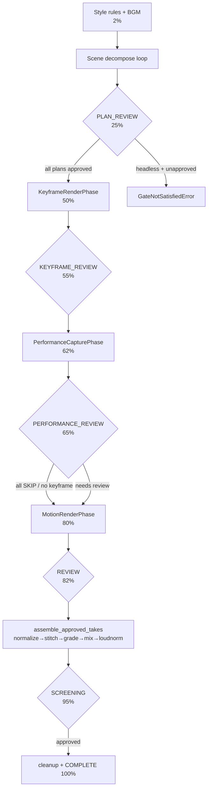

---

### Stage 0 — Style rules and BGM (run setup)

**INPUTS:** `project.global_settings` (`music_mood`, `color_palette`, `aspect_ratio`, pre-existing `style_rules`, `music_mastering`); the project snapshot reloaded from disk by `_refresh_project_snapshot()` (`cinema_pipeline.py:443`).

**PROCESSING:**
1. `generate_style_rules(project_name, mood, color_palette, music_mood, aspect_ratio)` (`llm/style_director.py:12`) produces a 7-key style dict (`director_vision`, `cinematography_rules`, `color_grading_palette`, `lighting_rules`, `sound_design`, `photorealism_rules`, `composition_rules`), persisted via `mutate_project` (`cinema_pipeline.py:955-993`).
2. `_ensure_bgm(settings)` (`cinema_pipeline.py:627`) generates BGM upfront via `generate_fal_bgm(..., duration=47)`, then optionally masters it via `master_music(..., preset="cinema_master")`.

**KEY FUNCTIONS:** `generate_style_rules` (`llm/style_director.py:12`, OpenAI-only — see failure mode); `style_rules_to_prompt_suffix` (`llm/style_director.py:187`, the string appended to every downstream image prompt); `_ensure_bgm` (`cinema_pipeline.py:627`).

**DECISION POINTS:**
- **Skip style-gen if pre-baked.** If `global_settings.style_rules` is non-empty at run start, the LLM call is skipped entirely (`cinema_pipeline.py:959`). Operators who want determinism can hand-author this dict.
- **Style director is OpenAI-only.** If only `ANTHROPIC_API_KEY` is set (no OpenAI key), `generate_style_rules` falls through to `_default_style_rules` immediately (`llm/style_director.py:127-133`) — asymmetric with ChiefDirector/CinemaDirector, which prefer Anthropic.

**OUTPUTS:** `project.global_settings.style_rules` persisted; `temp/bgm_*.mp3` (mastered or raw).

**FAILURE MODES + RECOVERY:** Style-gen failure → hardcoded `_default_style_rules` keyed on mood (`llm/style_director.py:127`); the run continues. BGM mastering failure is **non-critical** — logs a WARNING and proceeds with the unmastered track (`cinema_pipeline.py:627`).

---

### Stage 1 — Scene decomposition (script → shots)

**INPUTS:** Per scene: `scene` dict (`title`, `action`, `dialogue`, `mood`, `duration_seconds`, `characters_present`, `location_id`), the matched `characters` and `location` dicts, `global_settings`, and the `style_rules` from Stage 0. The injected `PIPELINE_CONTEXT` string (`pipeline_context.py:15`, loaded from `config/prompts/pipeline_context.md`) rides along in every LLM system prompt.

**PROCESSING (per scene with empty `shots`):**
1. **Route:** `use_competitive = settings.get("competitive_generation", True)` (`cinema_pipeline.py:1016`).
2. **Decompose:** `competitive_decompose_scene()` (`domain/scene_decomposer.py:624`) runs GPT-4o + Claude-Sonnet in parallel via `LLMEnsemble.competitive_generate(task_type="decompose")` and a judge picks the winner; or `decompose_scene()` (`domain/scene_decomposer.py:436`) runs a single GPT-4o tool-loop call. Shot count: `target_shots = max(2, min(5, int(duration_seconds / 2.5)))` (`domain/scene_decomposer.py:497`).
3. **Validate (ChiefDirector pre-gen gate):** `self.director.validate_shot_prompts(shots, scene)` (`cinema_pipeline.py:1031`; `llm/chief_director.py:296`) enforces hard constraints HC1–HC8 and returns `APPROVED` / `MODIFIED` / `REJECTED`.
4. **Record the verdict — critical:** `record_director_review_on_shots(shots, review)` (`cinema_pipeline.py:1054`; `cinema/auto_approve.py:235`) writes `shot["director_review"]` onto every shot. **This call is load-bearing for headless runs** (see failure mode).
5. **Persist:** `update_scene_shots(project, scene_id, shots)` (`domain/scene_decomposer.py:887`) writes shots under the per-project lock.
6. **Per-scene dialogue:** `_ensure_scene_audio(scene, chars)` (`cinema_pipeline.py:499`) calls `generate_dialogue` → `generate_dialogue_voiceover`, caching the MP3.
7. `_save_checkpoint()` after each scene.

**DECISION POINTS:**
- **Competitive vs single-model** (`cinema_pipeline.py:1016`). Competitive doubles LLM cost but consistently wins on quality.
- **MODIFIED → APPROVED normalization.** `record_director_review_on_shots` normalizes a `MODIFIED` verdict to a gate-decision of `APPROVED` (`cinema/auto_approve.py:235`, cycle-17 user decision, commit `138d7c7`). The raw verdict is preserved in `chief_director_verdict`. Any older doc that calls MODIFIED a *blocking* state is stale.
- **REJECTED → re-decompose.** A REJECTED scene re-runs `decompose_scene` with stricter constraints (`cinema_pipeline.py:1047`).

**OUTPUTS:** Per-shot dicts (`make_shot`, `domain/project_manager.py:262`) with `prompt`, `camera`, `visual_effect`, `target_api`, `characters_in_frame`, `director_review`, `plan_status="pending_review"`; per-scene dialogue MP3.

**FAILURE MODES + RECOVERY:**
- **LLM unavailable / parse failure.** `decompose_scene` falls back to `_fallback_decompose` (`domain/scene_decomposer.py:844`) — exactly two hardcoded shots (an establishing wide + a medium close-up). `validate_shot_prompts` is fail-safe-for-throughput: on a None client or persistent `JSONDecodeError` (after ≤1 retry) it returns `APPROVED` with no modifications (`llm/chief_director.py:296-357`).
- **PLAN_REVIEW headless stall (FIXED, cycle-17).** Before `record_director_review_on_shots` was called unconditionally, `_rules_for_plan`'s `plan_decision_not_approved` veto always fired (because `shot["director_review"]` was never written), so a headless run polled forever. The fix wires the writer at `cinema_pipeline.py:1054`. **If you load shots that never passed through this call, the PLAN gate will veto.**

---

### PLAN_REVIEW gate (25%)

The first of five gates. Each gate runs the same machinery (`ReviewController._wait_for_gate`, `cinema/review/controller.py:507`): set `runstate.current_stage`, emit progress, run an **auto-approve pre-screen**, then either block on the operator (web) or fail fast (headless).

**Auto-approve pre-screen** (`_run_auto_approve_pass`, `cinema/review/controller.py:253`): for every unapproved shot, `check_gate("plan", ...)` (`cinema/auto_approve.py:625`) evaluates the plan veto rules (`_rules_for_plan`, `cinema/auto_approve.py:203`):
- `plan_decision_not_approved` — fires if `director_review.decision != "APPROVED"`.
- `plan_has_violations` — fires if `director_review.violations` is non-empty.

**Gate predicate** (`_gate_satisfied`, `cinema/review/controller.py:224`): PLAN_REVIEW is satisfied when **all shots have `plan_status == "approved"`**.

**DECISION POINT — web vs headless:**
- **Web:** `lifecycle.wait_for_gate(gate, predicate)` polls every 0.5s (`cinema/lifecycle.py:182`) until the operator approves remaining shots via `POST /api/projects/<pid>/shots/<shot_id>/plan/approve` → `approve_shot_plan` (`cinema/review/controller.py:633`).
- **Headless** (`RunState.headless=True`): the predicate is checked **once**; if unsatisfied, `GateNotSatisfiedError` is raised (`cinema/review/controller.py:93`) with per-shot reasons from `_gate_block_details`. This replaces the prior infinite poll.

**Critical headless caveat:** `headless=True` does **not** swap in `NullLifecycle`. It still uses `ThreadedLifecycle`; only `_wait_for_gate` changes behavior by reading `runstate.headless`. `NullLifecycle.wait_for_gate` returns `True` unconditionally (`cinema/lifecycle.py:110`) and would silently *skip* gate enforcement — so the only correct non-interactive path is `CinemaPipeline(headless=True)`.

---

### Stage 2 — Keyframe / image render

**INPUTS:** Approved shot plans. Per shot: `prompt`, `characters_in_frame`, previous shot's approved keyframe (img2img init), `global_settings` (tier, sampler knobs, LoRA/style paths, identity strictness), and the baseline ComfyUI workflow graph (`pulid.json` production / `pulid_max.json` max).

**PROCESSING** (`KeyframeRenderPhase.run`, `cinema/phases/keyframe_render.py:68` → per shot `generate_keyframe_take`, `cinema/shots/controller.py:544`):
1. Skip shots already carrying `approved_keyframe_take_id`.
2. Require `shot["plan_status"] == "approved"`.
3. `ContinuityEngine.enhance_shot_prompt` (`domain/continuity_engine.py:446`) builds the augmented prompt + a `continuity_config` dict (img2img flag, `init_image`, `denoise_strength`, scene/location seed, `pulid_weight_override`, identity anchor, threshold).
4. Optional `optimize_shot_prompt` (`llm/prompt_optimizer.py:355`) when `prompt_optimizer_enabled=True`, cached on `shot["optimizer_cache"]`.
5. `generate_ai_broll(...)` (`phase_c_assembly.py:75`) produces the image.
6. Post-gen identity validation: `IdentityValidator.validate_image(...)` (`cinema/shots/controller.py:674`) against `identity_strictness` (default 0.60).
7. Append take to `shot["keyframe_takes"]`; record cost.

**KEY FUNCTIONS:** `generate_ai_broll` (`phase_c_assembly.py:75`); `enhance_shot_prompt` (`domain/continuity_engine.py:446`); `classify_shot_type` (`workflow_selector.py:411`); `get_workflow_params` (`workflow_selector.py:450`) / `apply_workflow_params` (`workflow_selector.py:501`); `get_adaptive_pulid_weight` (`workflow_selector.py:540`); for max tier `generate_ai_broll_max` (`quality_max.py:701`).

**DECISION POINTS:**

*Tier selection* — `generate_ai_broll` dispatches by `quality_tier` (`phase_c_assembly.py:115`):

| Tier | Path | Behavior |
|---|---|---|
| `"max"` | `quality_max.generate_ai_broll_max` | N=8 adaptive best-of, 4-channel ControlNet, Redux, FaceDetailer, ReActor, SUPIR 4K. Falls through to production on `None`/exception. |
| `"production"` (default) | ComfyUI + PuLID via `RunPodComfyUI` | Used when `COMFYUI_SERVER_URL` set AND `pulid.json` exists. |
| (fallback) | `_fal_flux_fallback` | FLUX Kontext Max Multi → FLUX-Pro → FLUX Schnell → Pollinations (`phase_c_assembly.py:510`). |

*Shot-type → PuLID weight* (production `WORKFLOW_TEMPLATES`, `workflow_selector.py:21`, **verified**):

| shot_type | pulid_weight | image route |
|---|---|---|
| portrait | **1.0** | ComfyUI PuLID (max face-lock) |
| medium | **0.9** | ComfyUI PuLID |
| wide | **0.65** | ComfyUI PuLID |
| action | **0.8** | ComfyUI PuLID |
| landscape | **0.0** | PuLID skipped → FAL |

*Identity thresholds* (`SHOT_TYPE_THRESHOLDS`, `identity/types.py:95`, **verified**): portrait 0.75/0.70/0.60, medium 0.70/0.65/0.55, wide 0.60/0.55/0.45, action 0.65/0.60/0.50, landscape 0.0 (strict/standard/lenient). On retry, the threshold degrades linearly toward `lenient` (`get_threshold_for_shot`, `identity/types.py:104`), preventing infinite retry loops.

*Max-tier best-of-N* (`quality_max.py:926`): generate `max_candidate_count` (default 8) candidates in `max_candidate_batch` batches with deterministic seeds (`base_seed + i*1009`); after each batch `should_halt` (`face_validator_gate.py:227`) checks composite ≥ `halt_threshold_composite` (portrait default 0.92) once `n ≥ halt_min_n`; composite = `0.6*ArcFace + 0.4*aesthetic`. If `needs_regenerate` (best ArcFace < `regenerate_floor_arc`, portrait 0.82), one PuLID-boost retry runs (weight += 0.15, capped 1.0).

*img2img / continuity denoise* (`TemporalConsistencyManager.get_denoise_strength`, `domain/continuity_engine.py:368`): first shot 0.55, location change 0.50, same-location index ≤1 → 0.40, same-location index >1 → 0.30. UI override `continuity_options.img2img_denoise` clamps to **[0.2, 0.6]**.

**OUTPUTS:** JPEG at `{project_dir}/shots/{shot_id}/{take_id}.jpg` (1344×768 production; up to 3840×2160 after SUPIR); `ImageGenResult(path, api_name)` with the backend token; take metadata carrying `identity_score`, `identity_failure_reason`, `suggested_pulid_adjustment`.

**FAILURE MODES + RECOVERY:**
- **Per-shot failure does not fail the phase.** The phase always returns `ok=True`; the failed shot routes through `on_failure` into `failed_shots` for operator rework (`cinema/phases/keyframe_render.py:105-108`).
- **Max-tier fall-through.** If `generate_ai_broll_max` returns `None` or raises, generation silently falls to the production path (`phase_c_assembly.py:114-143`).
- **ComfyUI timeout** (600s, `phase_c_assembly.py:365-394`) or pod down → `_fal_flux_fallback`.
- **Node-availability divergence (max tier).** `_probe_node_availability` returning an empty set causes `_prune_unavailable` to no-op (`quality_max.py:364`); a pod missing custom nodes then fails at *queue* time, not probe time. Documented caveat, not auto-recovered.

---

### KEYFRAME_REVIEW gate (55%)

Same machinery as PLAN_REVIEW. Auto-approve runs `_rules_for_image` (`cinema/auto_approve.py:280`): `image_composite_below_threshold` (threshold `image_min_composite=0.97`, or the `image_min_composite_fallback=0.78` bar when any take used a fallback engine), `image_cascade_fallback` (vetoes any cascade-fallback take when `image_veto_on_fallback=True`), `image_over_budget`. On approval, `approved_keyframe_take_id` is set to the highest-composite take (`pick_best_take_by_composite`, `cinema/auto_approve.py:520`). **Gate predicate** (`cinema/review/controller.py:224`): all shots have `approved_keyframe_take_id`. Web operators approve via `POST .../keyframes/<take_id>/approve` → `approve_take(..., "keyframe")` (`cinema/review/controller.py:647`).

---

### Stage 3 — Performance capture

**INPUTS:** Shots with an approved keyframe. Per shot: `performance_engine` (routed earlier by `route_performance_engine`, `domain/performance.py:103`), optional `driving_video_path`, dialogue/audio.

**PROCESSING** (`PerformanceCapturePhase.run`, `cinema/phases/performance.py:35` → `generate_performance_take`): iterate shots, calling the performance engine for each that needs one. Three skip conditions per shot (`cinema/phases/performance.py:63-72`): (1) already has `approved_performance_take_id`; (2) `performance_engine == "SKIP"`; (3) no `approved_keyframe_take_id` (no anchor → motion would also skip). A take can also self-report `result.get("skipped")`.

**KEY FUNCTIONS:** `route_performance_engine` (`domain/performance.py:103`); `precondition_error` (`domain/performance.py:163`); `validate_performance_take` (`performance/identity_gate.py:95`, single-frame ArcFace at 1s, floor 0.70).

**DECISION POINTS — engine routing** (`domain/performance.py:103`):

| Condition | Engine |
|---|---|
| no characters / wide-no-dialogue / landscape | `SKIP` |
| dialogue + face-readable (`close_up`/`portrait`/`medium`) | `ACT_ONE` (or `LIVE_PORTRAIT` if `performance_budget_mode="budget"`) |
| action, no dialogue | `VIGGLE` |
| any remaining dialogue | `ACT_ONE` |

Driving-video mode (`driving_video_source`, `domain/performance.py:145`): `"upload"` when `driving_video_path` set; `"tts_auto"` when engine ≠ SKIP with dialogue; else `"none"`. ACT_ONE requires an audio path; LIVE_PORTRAIT/VIGGLE require a driving video (`precondition_error`).

**OUTPUTS:** Performance take records appended to the shot; `approved_performance_take_id` set at the gate.

**FAILURE MODES + RECOVERY:** Per-shot failure doesn't fail the phase (always `ok=True`). A shot that *was* supposed to get a performance but failed (landing in `failed_shots`) will keep the PERFORMANCE_REVIEW gate open for manual handling — it is not auto-skipped.

---

### PERFORMANCE_REVIEW gate (65%, conditional)

**This gate is conditionally skipped.** The orchestrator computes `all_skipped` over the project (`cinema_pipeline.py:1133`): every shot is either `performance_engine == "SKIP"` **or** lacks an approved keyframe. If `all_skipped`, the gate is bypassed with a `PERFORMANCE_SKIPPED_GATE` progress event at 65%; otherwise the `PERFORMANCE_REVIEW` gate-wait runs at `cinema_pipeline.py:1140`.

> **Cross-reference:** the `_gate_satisfied` PERFORMANCE_REVIEW branch (`cinema/review/controller.py:233-246`) carries an inline comment pointing at the orchestrator's all-skipped bypass at `cinema_pipeline.py:1133-1140`; the predicate logic mirrors that bypass, extended with the explicit-approval branch. (A previously-flagged stale line-cite in that comment was fixed in the same touch as this note.)

**Auto-approve here is opt-in.** The motion gate map entry is only added when `CINEMA_AUTO_APPROVE_MOTION` is truthy (`1`/`true`/`yes`, case-insensitive; `cinema/auto_approve.py:620`). Without it, PERFORMANCE_REVIEW is always manual even when auto-approve is otherwise enabled. When enabled, `_rules_for_motion` (`cinema/auto_approve.py:340`) checks `motion_min_identity=0.85` and `motion_min_motion_score=0.7`. **Gate predicate** (`cinema/review/controller.py:224`): each shot is SKIP, lacks a keyframe, or has `approved_performance_take_id`.

---

### Stage 4 — Motion / video render

**INPUTS:** Approved keyframes (and approved performance takes where applicable). Per shot: `target_api`, `camera`, `duration`, `motion_description`/`prompt`, `negative_constraints`, `has_dialogue` (derived from optimizer purpose), `driving_video_path`, `multi_angle_refs`, `ctx` carrying `api_engines` + `cascade_retry_limit`.

**PROCESSING** (`MotionRenderPhase.run`, `cinema/phases/motion_render.py:321` → `generate_motion_take` → `generate_ai_video`, `phase_c_ffmpeg.py:54`):

*Storyboard batch path (optional).* When `global_settings.api_engines.KLING_NATIVE.storyboard_mode=True` AND the aspect is non-portrait (M-1 guard, `motion_render.py:364` — portrait always takes the per-shot path) AND a scene has **2–6 unapproved shots** all with approved keyframes (`motion_render.py:393`), `_run_storyboard_scene` (`motion_render.py:100`) calls `KlingNativeAPI.generate_storyboard()` once, then `split_video_into_segments()` (`phase_c_ffmpeg.py:883`) recovers per-shot clips, registering each via `_finalize_motion_take(record_cost=False)`. Cost is recorded once for the batch. **Caveat:** `storyboard_mode` is at the nested path `global_settings.api_engines.KLING_NATIVE.storyboard_mode`; reading it flat returns `None` (`_get_storyboard_mode`, `motion_render.py:45`). F2b wired this end-to-end: `_get_storyboard_mode` gates `_run_storyboard_scene`, with coverage in `tests/unit/test_f2b_storyboard_mode.py`.

*Per-shot path* — `generate_ai_video` (`phase_c_ffmpeg.py:54`) classifies the shot, resolves the engine, and runs a fault-tolerant cascade.

**KEY FUNCTIONS:** `generate_ai_video` (`phase_c_ffmpeg.py:54`); inner `try_next_api` (`phase_c_ffmpeg.py:139`) and `_record_video_cascade` (`phase_c_ffmpeg.py:108`); the dialogue override + `audio_embedded` tagging + mandatory lipsync at `cinema/shots/controller.py:139` (routing helper), `:183` (tagging), and `:1528` (F1b lipsync), all driven from `generate_motion_take` (`:1344`).

**DECISION POINTS:**

*API resolution* (dialogue-routing helper `cinema/shots/controller.py:139-180`, applied in `generate_motion_take`):
- `target_api == "AUTO"` → use the optimizer's `suggested_video_api` if it's a valid `API_REGISTRY` key, else `WORKFLOW_TEMPLATES[shot_type]["target_api"]` + its fallbacks.
- **Dialogue override (F1a):** if `has_dialogue=True`, scan `PURPOSE_API_RANKING[purpose]` for the first entry with `native_audio=True AND modality=="video" AND status=="live"` — currently **VEO_NATIVE** — and pin it; `video_fallbacks` is nulled only in `dialogue_voice_mode="native"` — the overlay default keeps the template fallbacks so a Veo RAI-block cascades to a silent engine and F1b overlays the voice. VEO_NATIVE is the *only* engine with `native_audio: True` (`domain/scene_decomposer.py:43`).
- Explicit `target_api` → use as-is, no fallbacks.

*Fallback cascade* (`try_next_api`, default order `phase_c_ffmpeg.py:139`): `KLING_NATIVE → SORA_NATIVE → RUNWAY_GEN4 → LTX → VEO_NATIVE → KLING_3_0 → SORA_2 → VEO → RUNWAY`. The cascade filters already-attempted engines and any disabled via `ctx.api_engines[engine].enabled == False`. On total exhaustion it sleeps 30s and retries the whole list up to `MAX_CASCADE_RETRIES` (default 1, override `cascade_retry_limit`).

*Per-engine duration / behavior highlights:*

| Engine | Duration | Notable |
|---|---|---|
| KLING_NATIVE | 5s | `face_consistency=True` for portrait/medium/action; `image_references=multi_angle_refs`; 180s poll |
| SORA_NATIVE | action/wide/landscape→8s, portrait/medium→4s | fully wires `driving_video_path` as `input_reference` |
| VEO_NATIVE | **clamped to {4,6,8}** (`veo_native.py:26`) | `generate_audio=(landscape or has_dialogue)`; 5s is server-rejected, snapped up (5→6, 7→8) |
| LTX | `duration*24` frames | 4K for landscape; cheapest |
| RUNWAY_GEN4 | 10s | `runwayml` SDK, 300s poll |

**OUTPUTS:** MP4 at the shot's take path; `_cascade_out["cascade_metadata"] = {"engine", "attempts"}` for provenance; `take.metadata.audio_embedded=True` when VEO_NATIVE won a dialogue shot; `take.metadata.has_dialogue` always written for gate awareness.

**FAILURE MODES + RECOVERY:**
- **Cascade** is the primary recovery: each engine failure calls `try_next_api`, which recurses into the next engine (`phase_c_ffmpeg.py:122-179`).
- **Dialogue native-audio guarantee is primary-attempt only.** When `has_dialogue=True` the override sets `video_fallbacks=None`, but if VEO_NATIVE itself fails, `try_next_api` falls through to the *default* global list, which includes non-audio engines (`cinema/shots/controller.py:165-180`). The native-audio guarantee therefore holds only for the first attempt.
- **Mandatory lipsync pass (F1b).** Post-render, if `has_dialogue=True` AND `not audio_embedded`, `generate_lip_sync_video(mode="auto")` runs (`cinema/shots/controller.py:1528`), writing `lipsync_score`. This covers every silent-video engine (Kling/Sora/Runway/LTX produce no audio).
- **VEO_NATIVE has no quota cooldown.** The `_VEO_QUOTA_EXHAUSTED_UNTIL` TTL flag is set/checked only on the FAL-proxy `VEO` branch (`phase_c_ffmpeg.py:502-504`); native-Veo quota errors are caught generically and cascade with no cooldown.

---

### REVIEW gate (82%)

The last per-shot gate before assembly. `_rebuild_review_clips(project)` builds the in-memory manifest first (`cinema/review/controller.py:606`). Auto-approve runs `_rules_for_final` (`cinema/auto_approve.py:384`) over `postprocess_variants + motion_takes`:
- `final_lipsync_below_threshold` — dialogue-aware: returns 1.0 (pass) for non-dialogue shots and for `audio_embedded=True` takes; 0.0 for a dialogue shot with no lipsync score and no embedded audio. Threshold `final_min_lipsync=0.8`.
- `final_upstream_was_auto_approved` — **safety net**: if any earlier gate auto-approved this shot, force human review at REVIEW (`final_require_human_if_upstream_auto=True` by default).

On approval, `approved_final_take_id` (and `approved_motion_take_id` via the `source_take_id` chain) is set to the best take (`pick_best_take_for_final` prefers non-fallback, then highest composite, `cinema/auto_approve.py:551`). **Gate predicate** (`cinema/review/controller.py:224`): all shots have `approved_final_take_id`.

> **Footgun for unattended runs:** `final_require_human_if_upstream_auto=True` blocks a *fully* headless completion even when every other rule passes — by design. To complete fully unattended, set it to `false` in `global_settings.auto_approve` (after the pipeline is calibrated). This is the single most common headless dead-end after the cycle-17 PLAN fix.

---

### Stage 5 — Assembly + audio mix

**INPUTS:** Approved final takes (collected in scene order), per-scene dialogue MP3s, per-scene foley MP3s, the BGM MP3, and `global_settings` (`mood`, `scene_transitions`, `transition_duration`, `music_mastering`).

**PROCESSING** (`assemble_approved_takes`, `cinema_pipeline.py:853` → `_assemble_approved_takes_core`, `:783` → `_assemble_final`, `:1323`):
1. `_refresh_project_snapshot()` then re-assert the REVIEW gate as a guard.
2. `_build_scene_packages(project)` (`cinema_pipeline.py:709`) resolves each approved take path and collects per-scene audio/foley. **All-embedded detection:** when every approved shot in a scene has `metadata.audio_embedded=True`, standalone TTS is suppressed to avoid double-voice from Veo/Omnihuman.
3. `_assemble_final(scene_data, bgm_path, settings)` (`cinema_pipeline.py:1323`):
   a. **Normalize** each clip to 1920×1080@30fps (`scale + pad + fps`, `libx264 crf=20`, `aac 192k`).
   b. **Stitch** — hard-cut concat demuxer by default, OR `xfade_concat` cross-dissolve per scene boundary when `scene_transitions=True` (`phase_c_ffmpeg.py:1513`), with transition clamped to `0.4 * min(durations)`.
   c. **Color grade** via `apply_color_grade()` (`phase_c_ffmpeg.py:1106`) using a mood→preset map (`COLOR_GRADE_PRESETS`, `phase_c_ffmpeg.py:1094`).
   d. **Tri-mix audio:** voice (1.0) + BGM (0.12) + foley (0.20). Voice source binds dynamically: `[0:a]` when audio is embedded, else the standalone dialogue MP3; `amix duration=longest` for the standalone path, `first` when embedded.
   e. **Two-pass loudnorm** EBU R128 (`two_pass_loudnorm`, `phase_c_ffmpeg.py:1242`; defaults -14 LUFS / 11 LU / -1.5 dBTP).

**KEY FUNCTIONS:** `_assemble_final` (`cinema_pipeline.py:1323`); `_build_scene_packages` (`:709`); `xfade_concat` (`phase_c_ffmpeg.py:1513`) / `_build_xfade_filtergraph` (`:1444`); `apply_color_grade` (`phase_c_ffmpeg.py:1106`); `two_pass_loudnorm` (`phase_c_ffmpeg.py:1242`).

**DECISION POINTS:**
- **Stitch mode** — `scene_transitions` (default `False`).
- **Voice source** — embedded vs standalone, decided per the all-embedded detection.
- **Re-assembly bypass (S21).** The web re-assemble endpoint calls `_assemble_approved_takes_core()` **directly** (`cinema_pipeline.py:783`), skipping the SCREENING gate-wait — calling the full public `assemble_approved_takes()` from a Flask request thread during screening would deadlock (the gate predicate polls `is_screening_approved()`, which is False by design, and the request's fresh pipeline is not the instance `signal_gate` will unblock).

**OUTPUTS:** `exports/final_cinema.mp4` — 1920×1080@30fps, H.264, AAC, EBU R128 normalized, color-graded, with optional scene transitions and the dialogue+BGM+foley mix. Per-stage intermediates land in `temp/` (`*_norm.mp4`, `stitched.mp4`, `graded.mp4`).

**FAILURE MODES + RECOVERY:**
- **Audio mix fallback cascade** (`_assemble_final`): 3-input → 2-input → BGM-only → copy-as-is, so a missing foley/BGM track degrades gracefully rather than failing assembly.
- **xfade audio mismatch (FIXED, Lane V #24/#25).** Engines like Kling produce silent clips; Veo embeds audio. `_has_audio_stream` (`phase_c_ffmpeg.py:1424`) probes each leg: all-silent → video-only filtergraph (`alab=None`); mixed → silent legs padded with `anullsrc` and every leg normalized to 48kHz stereo `fltp` before `acrossfade` (`phase_c_ffmpeg.py:1444-1511`). A `xfade_concat` failure raises, and the caller falls back to hard-cut concat.
- **Color grade is single project-level mood** (`settings.get("mood")`) — every scene gets the same grade; per-scene mood is not honored at the final grade.

---

### SCREENING gate (95%, optional) + Stage 6 — Cleanup & complete

**SCREENING gate** (`assemble_approved_takes`, `cinema_pipeline.py:853-884`): runs only if `_screening_stage_enabled()` (`cinema/screening.py:104`; project override > `CINEMA_SCREENING_STAGE` env > default ON). The pipeline emits 95% progress and blocks on `lifecycle.wait_for_gate("SCREENING", predicate)` where the predicate reads `is_screening_approved(project)` (`cinema/screening.py:295`).

During the wait the operator: hits `POST .../assemble/screen` for the timeline manifest; may iterate individual shots (each iterate marks `mark_shot_needs_reassembly`, `cinema/screening.py:371`); may `POST .../assemble/re-assemble` to re-stitch only dirty shots (`clear_needs_reassembly(only_shots=...)` preserves concurrently-dirtied shots, `cinema/screening.py:421`); and finally `POST .../screening/approve` → `mark_screening_approved` + `lifecycle.signal_gate("SCREENING")` (`web_server.py:2359`) to wake the waiter. **Precondition:** `screening/approve` requires `exports/final_cinema.mp4` to exist, returning 409 otherwise (`api_screening_approve`, `web_server.py:2282`).

**Cleanup & complete** (`cinema_pipeline.py:905-935`): `cleanup_project(pid, aggressive=False)` purges intermediate temp artifacts (always-delete patterns only; generated media preserved unless `aggressive=True`); `cost_tracker.get_video_cost()` logs the spend breakdown; `_clear_checkpoint()` removes `temp/pipeline_state.json`; a final `COMPLETE` progress event fires at 100%.

**FAILURE MODES + RECOVERY:** Cleanup is non-fatal — wrapped in try/except, a failure logs and the run still completes (`cinema_pipeline.py:906-913`). Across the whole run, **checkpointing** (`_save_checkpoint`, `cinema/checkpoint.py:87`, atomic via `mkstemp + os.replace`) is written after every scene and audio step, so a crashed run resumes via `generate(resume=True)` → `_restore_from_checkpoint` (`cinema/checkpoint.py:163`), which rehydrates `RunState` and marks any vanished referenced files as `"lost"`.

---

**Cross-cutting note on the cost gate (assembly-relevant):** the budget gate (`would_exceed` at `cost_tracker.py:353`, `is_over_budget` at `cost_tracker.py:363`) accounts for video/image generation only. Audio modules (`audio/dialogue.py`, `audio/music.py`, `audio/foley.py`) and performance modules each construct **isolated** `CostTracker()` instances that log to the same SQLite DB but do **not** add to the core tracker's `spent_usd` — so audio API spend runs uncapped, and `spent_usd` resets per process (it is not loaded from SQLite on init). Operators relying on `budget_limit_usd` for hard governance should know it bounds the generation stages, not the full run.

---

## 5. The User Manual — Driving It to MAXIMUM Capability

This is the operator's playbook. It assumes you have the server running (see §3 for env-var setup) and want to take a project from a blank idea to a finished, photorealistic film — and to squeeze every drop of quality out of the pipeline along the way. Every knob below is grounded in a real setting, flag, or endpoint with a file:line citation so you can verify it yourself.

> **Two things to internalize before you start.**
> 1. **`web_server.py` is the only entry point.** The old CLI (`main.py`) is deleted. Everything you do is an HTTP call to the Flask server (port 8080, `web_server.py:2664`) or a click in the React UI that maps to one. There is no auth layer — CORS is the only access control (`web_server.py:69`), so do not expose it to a hostile network without a reverse proxy.
> 2. **Per-project quality knobs live in `project["global_settings"]`, set via `PUT /api/projects/<pid>` (`web_server.py:499`).** They are read at runtime through `get_project_setting(ctx, key, default)` (`cinema/context.py:151`), *not* from `config/settings.py`. The `config/settings.py` singleton is for API keys and infra paths only. If a doc tells you to set a creative knob via an env var, it is almost certainly wrong — the only env vars that change pipeline *behavior* are the `CINEMA_*` flags in §5.5.

### 5.1 End-to-End Operation: From Idea to Final Film

The pipeline is a fixed gate sequence owned by `CinemaPipeline.generate()` (`cinema_pipeline.py:942`):

```
STYLE → SCENE_DECOMPOSE → PLAN_REVIEW → KEYFRAME_RENDER → KEYFRAME_REVIEW
   → PERFORMANCE_CAPTURE → PERFORMANCE_REVIEW → MOTION_RENDER → REVIEW
   → ASSEMBLY → SCREENING → COMPLETE
```

Five of those are **mandatory operator gates** (PLAN_REVIEW, KEYFRAME_REVIEW, PERFORMANCE_REVIEW, REVIEW, SCREENING). At each, the pipeline worker thread blocks in `lifecycle.wait_for_gate` until you act — or, if auto-approve clears every shot, it sails through unattended (§5.3, §5.6).

#### The operator workflow, step by step

| # | Action | Endpoint (verify) | What happens |
|---|---|---|---|
| 1 | **Create project** | `POST /api/projects` (`web_server.py:473`) | `create_project(name)` returns a project with a `pid`. |
| 2 | **Configure global settings** | `PUT /api/projects/<pid>` (`web_server.py:499`) | Writes your `global_settings` dict (aspect ratio, language, mood, quality tier, identity knobs, auto-approve thresholds…). |
| 3 | **Add characters** (with reference images) | `POST .../characters` — multipart (`web_server.py:552`) | `create_character_with_images` face-detects the best upload, generates 5 multi-angle FLUX refs, computes a GhostFaceNet embedding, assigns a language/gender-aware voice. |
| 4 | **Add locations** | `POST .../locations` (`web_server.py:1143`) | Builds a reusable `prompt_fragment` + deterministic `seed` so every shot at that location is architecturally consistent. |
| 5 | **(Optional) Style board** | `POST .../style-board` (`web_server.py:928`) | Uploads style-reference images → drives FLUX Redux style transfer. |
| 6 | **Add scenes** | `POST .../scenes` (`web_server.py:1284`) | A scene = title, action, mood, dialogue, duration, characters, location. |
| 7 | **(Optional) Generate dialogue** | `POST .../scenes/<sid>/generate-dialogue` (`web_server.py:1362`) | LLM writes per-character spoken lines. |
| 8 | **(Optional) Generate style rules** | `POST .../style-rules` (`web_server.py:1447`) | LLM produces cinematography/color/lighting/photorealism rules persisted into `global_settings.style_rules`. *Skipped automatically at run time if already present* (`cinema_pipeline.py:959`). |
| 9 | **(Optional) Decompose a scene early** | `POST .../scenes/<sid>/decompose` (`web_server.py:1398`) | Turns a scene into shots now (single-model path — see the divergence note below). |
| 10 | **Start the run** | `POST /api/projects/<pid>/generate` (`web_server.py:1507`) | Spawns a daemon worker thread; returns immediately `{"started": true}`. |
| 11 | **Stream progress** | `GET /api/projects/<pid>/stream` (SSE, `web_server.py:1576`) | Live `{stage, detail, percent, …}` events. **Single consumer only** — a second browser tab steals events from the shared queue (`web_server.py:1577`). |
| 12 | **Clear the gates** | per-gate approve endpoints (§5.1 gate table) | You approve shot plans, keyframes, performances, final takes. |
| 13 | **Screen & sign off** | `POST .../assemble/screen` → `.../screening/approve` (`web_server.py:2194`, `:2280`) | Preview the assembled cut, iterate shots, then approve. |
| 14 | **Retrieve the film** | `GET /api/projects/<pid>/export` (`web_server.py:2613`) | Streams `exports/final_cinema.mp4` (1920×1080@30fps, H.264, AAC, EBU R128). |

> **Divergence to know (decompose path):** The on-demand `POST .../scenes/<sid>/decompose` endpoint always uses the single-model `decompose_scene` (`web_server.py:1400`). The *competitive* GPT-4o-vs-Claude ensemble path (`competitive_decompose_scene`) only runs inside the automated pipeline when `competitive_generation=True` (`cinema_pipeline.py:1016`). If you want the higher-quality ensemble decomposition, let the pipeline do it — don't pre-decompose via the UI button.

#### The five gates and how to clear each

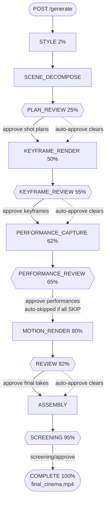

| Gate | What you approve | Approve endpoint | Predicate to satisfy (`controller.py`) |
|---|---|---|---|
| **PLAN_REVIEW** | Each shot's plan | `POST .../shots/<sid>/plan/approve` (`web_server.py:1627`) | all shots `plan_status=="approved"` (`cinema/review/controller.py:224`) |
| **KEYFRAME_REVIEW** | The chosen keyframe take | `POST .../keyframes/<take_id>/approve` (`web_server.py:1677`) | all shots have `approved_keyframe_take_id` |
| **PERFORMANCE_REVIEW** | The performance take (lip/body retarget) | `POST .../performance/<take_id>/approve` (`web_server.py:1688`) | each shot has `approved_performance_take_id` **OR** `performance_engine=="SKIP"` **OR** lacks a keyframe. **Auto-skipped entirely if all shots are SKIP-routed** (`cinema_pipeline.py:1133`). |
| **REVIEW** | The final motion take | `POST .../final/<take_id>/approve` (`web_server.py:1725`) | all shots have `approved_final_take_id` |
| **SCREENING** | The whole assembled cut | `POST .../screening/approve` (`web_server.py:2280`) | `screening_approved == True`; requires `exports/final_cinema.mp4` to exist on disk or returns 409 (`web_server.py:2282`) |

**Reject / iterate while at a gate.** You are not limited to approve. You can:
- **Reject a plan:** `POST .../shots/<sid>/plan/reject` with a reason (`web_server.py:1639`).
- **Reject an auto-approval:** `POST .../shots/<sid>/reject-auto-approve` with `{gate, reason}` (`web_server.py:1839`) — pulls a shot back for human review.
- **Iterate a take with directorial intent:** `POST .../takes/<take_id>/iterate` (`web_server.py:1736`) with a `DirectorialIntent` body (prose, or a verb DSL — see §5.4). This is the single most powerful creative lever during review.
- **Edit a shot's spec:** `PUT .../shots/<sid>` (`web_server.py:1947`). Allowlisted fields only: `target_api`, `camera`, `visual_effect`, `prompt`, `scene_foley`, `negative_constraints`, `continuity_constraints`, `intent_notes` (`web_server.py:1947`–1996). Anything else in the body is silently dropped.

**Pause / resume / cancel** the running pipeline at any time: `POST .../pause` (`web_server.py:1998`), `.../resume` (`:2008`), `.../cancel` (`:1597`). Cancel signals all gate events so the worker exits its wait promptly.

#### Interactive vs. headless mode

| | Interactive (default) | Headless |
|---|---|---|
| **How invoked** | `POST /api/projects/<pid>/generate` (the web path) | `CinemaPipeline(pid, headless=True)` in Python (`cinema_pipeline.py:49`) |
| **Gate behavior** | Worker blocks at each gate, polling the predicate at 0.5 s until you approve (`cinema/review/controller.py:559`) | Each gate is checked **once**; if auto-approve can't clear it, raises `GateNotSatisfiedError` with a per-shot diagnostic (`cinema/review/controller.py:93`, `:553`) — fails fast, never hangs |
| **Lifecycle** | `ThreadedLifecycle` (event-backed) | Still `ThreadedLifecycle` — **not** `NullLifecycle`. `headless=True` only flips the gate-wait to fail-fast (`cinema/lifecycle.py:70` docstring; this corrects a common doc error) |
| **Use it for** | Hands-on creative control, shot-by-shot iteration | Unattended batch runs, CI/E2E, overnight renders |

> **Critical headless caveat.** Do **not** instantiate `NullLifecycle` for unattended runs — its `wait_for_gate` returns `True` even when the predicate is false (`cinema/lifecycle.py:89`), silently skipping all gate enforcement. The only correct unattended path is `CinemaPipeline(headless=True)`. For headless to actually complete, you must also satisfy the auto-approve gates (see the unattended recipe in §5.6).

### 5.2 Quality Tiers: Standard (Production) vs. Max

The single biggest quality switch is `quality_tier` in `global_settings`. It is read at the top of `generate_ai_broll` (`phase_c_assembly.py:75`) and routes keyframe generation down one of two entirely different image pipelines.

| | **`"production"`** (default) | **`"max"`** |
|---|---|---|
| **Image engine** | FLUX-Dev on RunPod ComfyUI + PuLID face-lock (`pulid.json`, 22 nodes); FAL fallback chain | FLUX-Dev (or HiDream-I1) on `pulid_max.json` (56 nodes, FLUX-native `ApplyPulidFlux`) |
| **Generation strategy** | Single image per shot | **N=8 adaptive best-of** with ArcFace + LAION-Aesthetic scoring and an adaptive halt (`quality_max.py:701`) |
| **Identity** | PuLID weight by shot type | + 4-channel Union ControlNet (depth/canny/pose/tile), per-character LoRA, adaptive PuLID-boost retry |
| **Detail / upscale** | — | FaceDetailer (Impact Pack) + SUPIR 4K upscale (3840×2160 default) |
| **Style transfer** | IP-Adapter (img2img) | + FLUX Redux from your style board |
| **Cost / shot** | ~$0.04 (`COMFYUI_PULID`) | ~$0.40 (`QUALITY_MAX`) — 10× (`cost_tracker.py:45`) |
| **Output resolution** | 1344×768 keyframe | up to 3840×2160 after SUPIR |

**How to select it:** `PUT /api/projects/<pid>` with `{"global_settings": {"quality_tier": "max"}}`. Max tier requires `pulid_max.json` present on the pod and the pod running; on any failure or `None` return it transparently falls through to the production path (`phase_c_assembly.py:117`–143), so you never get a hard failure from choosing max.

> **Watch out:** `max_halt_rule` accepts `composite_only`/`conjunctive`/`budget_only` and `should_halt` dispatches `composite_only` and `conjunctive`; only `budget_only` is deferred, falling back to composite-only behavior (`face_validator_gate.py:227`). (The `hires_fix_denoise` knob, formerly unwired, **is** now injected into the pass-2 node at `quality_max.py:620`.) The post-passes (FaceDetailer/SUPIR) carry the bulk of the max-tier quality lift.

### 5.3 The Capability-Knobs Playbook

Every knob below lives in `project["global_settings"]` unless marked as an env var or per-shot field. Set them with `PUT /api/projects/<pid>` `{"global_settings": {…}}`.

#### A. API routing strategy (per shot type)

The router classifies each shot via `classify_shot_type` (`workflow_selector.py:411`) into `portrait | medium | wide | action | landscape`, then picks a primary video API and an ordered fallback cascade from `WORKFLOW_TEMPLATES` (`workflow_selector.py:21`):

| shot_type | Primary video API | Fallback cascade |
|---|---|---|
| portrait | `KLING_NATIVE` | RUNWAY_GEN4 → SORA_NATIVE → KLING_3_0 |
| medium | `KLING_NATIVE` | RUNWAY_GEN4 → SORA_NATIVE → LTX |
| wide | `LTX` | VEO_NATIVE → KLING_NATIVE → RUNWAY_GEN4 |
| action | `SORA_NATIVE` | KLING_NATIVE → RUNWAY_GEN4 → LTX → SEEDANCE |
| landscape | `LTX` | VEO_NATIVE → KLING_NATIVE |

The cascade is fault-tolerant: `generate_ai_video` (`phase_c_ffmpeg.py:54`) tries the primary, and on failure walks the fallback list (`try_next_api`, `phase_c_ffmpeg.py:139`), skipping already-attempted engines. On total exhaustion it sleeps 30 s and retries up to `cascade_retry_limit` (default 1).

**Levers:**
- **Pin an engine per shot:** set `shot.target_api` to any `API_REGISTRY` key via `PUT .../shots/<sid>`. `"AUTO"` (default) uses smart routing; an explicit value disables fallbacks (`video_fallbacks=None`).
- **Disable engines globally:** `api_engines` — e.g. `{"api_engines": {"VEO_NATIVE": {"enabled": false}}}` drops that engine from the cascade (`phase_c_ffmpeg.py:158`).
- **Raise retry resilience:** `cascade_retry_limit` (int ≥ 0) for flaky API environments (`phase_c_ffmpeg.py:183`).
- **Storyboard batch (cross-shot consistency):** `api_engines.KLING_NATIVE.storyboard_mode=true` — for non-portrait scenes of **2–6 unapproved shots that all have approved keyframes** (portrait disqualifies the batch path — M-1 guard, `cinema/phases/motion_render.py:364`), generates ONE Kling clip with cross-shot `image_references`, then splits it (`cinema/phases/motion_render.py:393`). *(Wired via `motion_render` (F2b): `_get_storyboard_mode` (`:45`) gates `_run_storyboard_scene` (`:100`); covered by `tests/unit/test_f2b_storyboard_mode.py`.)*

#### B. Character-consistency strategy

This is where most of your perceived quality lives. The knobs, in order of impact:

| Knob | Default | Range | Effect | File |
|---|---|---|---|---|
| `ip_adapter_weight` | 0.85 | 0.5–1.0 | PuLID face-lock strength (per-character and per-object) | `global_settings` |
| `identity_strictness` | 0.60 | — | Threshold for post-keyframe identity validation + N=8 scoring | `domain/project_manager.py:324`, `cinema/shots/controller.py:672` |
| `identity_threshold` | 0.55 | 0.4–0.8 | Per-shot face-similarity threshold | `global_settings` |
| `adaptive_pulid` | True | bool | Self-calibrates PuLID weight from rolling ArcFace stats (`get_adaptive_pulid_weight`) | `domain/continuity_engine.py:535`, `workflow_selector.py:540` |
| `img2img_denoise` | 0.35 | 0.2–0.6 | Continuity strength: lower = more consistent with prior shot | `workflow_selector.py:493` |
| `char_lora_paths` | {} | dict | Per-character trained LoRA `.safetensors` — the single biggest identity lever | `global_settings` |

Per-shot identity thresholds also auto-scale by shot type (`SHOT_TYPE_THRESHOLDS`, `identity/types.py:95`): portrait standard 0.70, medium 0.65, wide 0.55, action 0.60, landscape 0.0 (faces aren't gated in landscapes).

**LoRA training** (the highest-quality identity path): `POST .../characters/<cid>/train-lora` (`web_server.py:707`) runs a background ai-toolkit job (FLUX rank-32 fp16, 3000 steps; `prep/lora_training.py:105`). Upload **25–50 varied reference images** first. Poll `GET .../characters/<cid>/lora-status` (`web_server.py:813`). On completion the path lands in `char_lora_paths` and is used by the max-tier LoRA loader.

**Face swap** (post-hoc identity correction): `POST .../shots/<sid>/correct` with `action="face_swap"` (`web_server.py:2139` → `controller.apply_correction`). Cascade: fal.ai PixVerse → FaceFusion CLI (`phase_c_vision.py:53`). Note FaceFusion runs CPU-only by default.

#### C. Native audio, dialogue & lip-sync strategy

The pipeline achieves talking characters via **Veo's look + your TTS voice overlaid** —
the default since 2026-06-03. This realizes a *consistent character voice* (Veo has no
`voice_id` so its native audio is never character-consistent). The mode is controlled by
`dialogue_voice_mode`.

**Default flow (`dialogue_voice_mode="overlay"`):**
1. A shot is dialogue if its optimizer purpose ∈ `{dialogue_close_up, talking_head_full}` → `has_dialogue=True`.
2. Router sets primary to `VEO_NATIVE` (silent, `generate_audio=False`). Video fallback cascade is kept intact so a Veo RAI-block falls through to a silent-video engine — the overlay still fires.
3. Per-shot TTS rendered (`_ensure_shot_audio`); Veo clip duration clamped to ≥ speech length ({4s,6s,8s}).
4. F1b lip-sync pass overlays TTS onto the silent clip → lip-synced output with your consistent voice.
5. On overlay success, `take.metadata.dialogue_audio_in_clip=True`; assembler suppresses scene-level TTS (no double-voice).

**Legacy path (`dialogue_voice_mode="native"`):** Veo generates its own embedded voice.
`video_fallbacks=None`. Take tagged `audio_embedded=True`. F1b overlay skipped.

**Lip-sync and dialogue knobs:**

| Knob | Default | Values | Effect |
|---|---|---|---|
| `dialogue_voice_mode` | `"overlay"` | `overlay`/`native` | `overlay` = Veo silent + TTS overlay (consistent voice, RAI-resilient); `native` = Veo embedded voice (legacy) |
| `lip_sync_mode` | `"auto"` | `auto`/`overlay`/`generation`/`skip` | `overlay` = mouth-only on existing video (SyncV3→MuseTalk→LatentSync→SyncV2); `generation` = full talking-head from a still (Hedra→Kling→Omnihuman→Aurora) (`lip_sync.py:697`) |
| `lipsync_quality_validation` | True | bool | Enables the SyncNet quality gate (`lip_sync.py:429`) |
| `lipsync_validation_threshold` | 0.65 | 0–1 | Raise to 0.8+ to force the cascade to try more engines until sync clears |
| `dialogue_mode_enabled` | True | bool | ElevenLabs v3 Dialogue Mode for 2+ speaker scenes (best prosody continuity) (`audio/dialogue.py:419`) |
| `forced_alignment_enabled` | False | bool | Emits word-level `.alignment.json` sidecars (WhisperX) for tighter sync (`audio/dialogue.py:419`) |
| `language` | "English" | — | Korean routes TTS to Cartesia Sonic 2; sets a stricter 0.70 lip-sync gate (`audio/dialogue.py:208`) |

> **To maximize dialogue quality:** keep `dialogue_voice_mode="overlay"` (default) and ensure `ELEVENLABS_API_KEY` is set for high-quality TTS. Set `dialogue_mode_enabled=true` for 2+ speaker scenes. Raise `lipsync_validation_threshold` to 0.80+ to push the cascade toward better sync engines. For non-English projects, call `POST .../apply-language-defaults` (`web_server.py:384`) for the right TTS provider + native-trained lip-sync ordering. The overlay approach was validated end-to-end at sync score 0.955 (`logs/veo_musetalk_v2studio.mp4`).

#### D. Continuity & coherence tuning

| Knob | Default | Effect | File |
|---|---|---|---|
| `coherence_check_enabled` | True | Per-shot color/lighting/composition coherence scoring vs. the prior shot (`assess_coherence`) | `coherence_analyzer.py:215` |
| `color_drift_sensitivity` | 0.3 | Lower = more aggressive color-correction recommendations | `global_settings` |
| `coherence_threshold` | 0.6 (read with fallback; **not** scaffolded by default — set it explicitly) | Overall coherence floor below which a regenerate is recommended | `cinema/shots/controller.py:1932` |
| `scene_transitions` | False | Cross-dissolve between scenes via ffmpeg `xfade` instead of hard cuts | `cinema_pipeline.py:1327` |
| `transition_duration` | 0.5 s | xfade length; clamped to 0.4× shortest clip | `phase_c_ffmpeg.py:1539` |

Location consistency is automatic: each location carries a fixed `seed` and a verbatim `prompt_fragment` injected into every shot at that location (`domain/location_manager.py:117`, `:198`).

#### E. Cost-vs-quality tradeoffs

| Knob | Cheaper | Pricier / higher quality |
|---|---|---|
| `quality_tier` | `"production"` (~$0.04/keyframe) | `"max"` (~$0.40/keyframe) |
| `competitive_generation` | `false` (single LLM) | `true` (GPT-4o + Claude quorum — doubles LLM cost, better shots) |
| `quality_judge_llm` | `"auto"` (claude-sonnet) | `"claude-opus"` (best judge) (`llm/ensemble.py:113`) |
| `max_quality_parallel_workers` | 1 | up to 4 (faster N=8, more pod CPU) |
| `budget_limit_usd` | set a cap | `0`/null = uncapped |
| video API | `LTX` ($0.06–0.10/shot) | `SORA_NATIVE`/`VEO_NATIVE` ($0.40–0.80) |

**Budget governance** — three caveats that bite operators:
1. `budget_limit_usd` only gates **video/image** generation in `ShotController` (the pre-spend `would_exceed` gate at `cinema/shots/controller.py:1465` + the post-call `is_over_budget` check at `:1312`); **audio API costs run uncapped** (audio modules create isolated `CostTracker()` instances that log to the DB but don't update the core tracker's `spent_usd`).
2. `CostTracker.spent_usd` **resets to 0 each process** — it is not loaded from SQLite on init (`cost_tracker.py:166`). A server restart mid-project zeroes the in-memory budget counter.
3. `EXPERIMENTS_DB_PATH` works **via the environment only**: since T7 (`4af8c05`) every `CostTracker` resolves it at construction (`db_path` arg > env var > `data/experiments.db`, `cost_tracker.py:157`), but `Settings.experiments_db_path` is never threaded into the constructor (`cinema/core.py:113`) — set the env var, not the settings field.

> **Cost-estimate note:** `API_REGISTRY` and `cost_tracker.API_COST_USD` disagree on a few engines (e.g. VEO_NATIVE: $0.40 in the registry, $0.30 in the cost table). Both are ±30% estimates — calibrate against real invoices before trusting either for budgeting.

#### F. Upscale & interpolation (post-processing)

Triggered via `POST .../shots/<sid>/correct` (`web_server.py:2139`) or auto-recommended by `POST .../shots/<sid>/diagnose` (`web_server.py:2159`):

| Action | Engine | Knob | File |
|---|---|---|---|
| `rife` | fal.ai RIFE cloud | `num_frames` (1–4; 2 = 3× FPS) | `lip_sync.py:758` |
| `upscale` | fal.ai SeedVR2 cloud | `target_resolution="2160p"` for 4K | `lip_sync.py:815` |
| (offline) | Topaz Video AI local CLI | `model="cinema"` (rhea-1, grain-preserving), `scale=4` | `prep/topaz_upscale.py:75` — local-only, no cloud fallback |

### 5.4 "To Maximize X, Do Y" Recipes

**To maximize identity lock in portraits / close-ups:**
1. `quality_tier="max"` and ensure `pulid_max.json` + pod are live.
2. Upload many real front-facing reference photos per character; let the 5-angle FLUX generation run.
3. **Train a LoRA** (`POST .../characters/<cid>/train-lora`, 25–50 images) and confirm `char_lora_paths` populated.
4. `identity_strictness=0.70`, `ip_adapter_weight≈0.90`, keep `adaptive_pulid=true`.
5. Max-tier: `face_detailer_enabled=true`, `face_detailer_guide_size=1024`, `max_halt_threshold_composite=0.95`, `max_halt_min_n=4`.
6. Keep `img2img_denoise` low (0.2–0.3) for consecutive same-scene shots so the prior approved keyframe anchors identity.

**To get a clean, controlled background (no smear, no stray figures):**
1. Understand the cause first: the painterly "background smear" is the **base FLUX+PuLID generation reacting to an under-specified backdrop**, *not* a post-pass artifact. The SUPIR upscaler and hires-fix pass leave it unchanged — **validated on-pod 2026-06-09** (varying `supir_cfg_scale`/`hires_fix_denoise` does not alter the background). Fix it at the prompt, not by tuning post-passes.
2. Put an **explicit backdrop in the positive prompt** (the shot/scene prompt), e.g. `"plain neutral grey seamless studio backdrop"` or `"softly-lit plain interior wall"`. Leaving the background unspecified lets FLUX hallucinate smeary depth and stray figures.
3. **The max-tier keyframe is FLUX with `BasicGuider` (`pulid_max.json` node 22) — it has NO negative-prompt channel** (the only text node is the positive `CLIPTextEncode` node 122, set by `_inject_conditioning` at `quality_max.py:509`; `generate_ai_broll_max`'s `negative_prompt` arg is accepted but unwired). So express exclusions **positively** in the prompt: `"solo, alone, one person only, plain empty backdrop, no other people in frame"`. A negative prompt is a no-op on the max keyframe. (One pedantic exception: the SUPIR upscaler stage's `SUPIR_conditioner` node 504 carries its own fixed generic quality strings — e.g. negative `"blurry, low quality, deformed"` — but they are hard-coded upscale-pass boilerplate; shot prompts and `negative_constraints` never reach them.)
4. For the recurring **neck/collarbone elongation** artifact, likewise use **positive** anatomy guidance (`"natural proportional neck and shoulders, well-defined collarbone"`) — not a negative term. (The shot's `negative_constraints` field still threads to the standard tier + video-gen, but the max-tier FLUX keyframe ignores it.)
5. Keep the photoreal suffix consistent across every shot via `style_rules.photorealism_rules` (`llm/style_director.py:143`) → `style_rules_to_prompt_suffix` (`:187`, applied at `cinema/shots/controller.py:497`) so the background treatment doesn't drift shot-to-shot.
6. **On-pod confirmation (2026-06-09):** explicit clean backdrop + positive exclusion phrasing yielded a clean 4K background with identity intact (arc 0.829). SUPIR cfg and hires-fix are *upscalers* — they do not author the background; the (positive) prompt does.

**To maximize motion realism in action shots:**
1. Let `classify_shot_type` route to `action` → primary `SORA_NATIVE` (best physics).
2. Don't pin `target_api` unless you must; keep the fallback cascade alive.
3. After generation, run `POST .../shots/<sid>/diagnose` — `assess_motion_quality` (optical flow, `phase_c_ffmpeg.py:982`) recommends `interpolate` (RIFE) or `regenerate`.
4. For slow-mo smoothness, `correct` with `rife`, `num_frames=4` (5× FPS).

**To maximize scene-to-scene coherence:**
1. Reuse the same location (fixed seed + prompt fragment) across consecutive shots.
2. `coherence_check_enabled=true`, lower `color_drift_sensitivity` to ~0.2, set `coherence_threshold=0.65` explicitly.
3. Enable `api_engines.KLING_NATIVE.storyboard_mode=true` for 2–6-shot dialogue scenes to get cross-shot `image_references`.
4. `scene_transitions=true` with `transition_duration≈0.5` for cinematic dissolves.
5. Hand-author `style_rules` (or generate once and keep) so every shot shares the same color-grade/lighting/photorealism suffix (`style_rules_to_prompt_suffix`, `llm/style_director.py:187`).

**To maximize dialogue + lip-sync fidelity:**
1. Set `GOOGLE_CLOUD_PROJECT`; keep `VEO_NATIVE` live and enabled (only native-audio engine).
2. `dialogue_mode_enabled=true`, `forced_alignment_enabled=true`.
3. `lipsync_quality_validation=true`, `lipsync_validation_threshold=0.8` (forces the cascade to keep trying engines until sync clears).
4. For non-English, `POST .../apply-language-defaults` with `overwrite_existing=true`.

**To minimize cost:**
1. `quality_tier="production"`, `competitive_generation=false`, `quality_judge_llm="auto"`.
2. Pin cheap engines: `shot.target_api="LTX"` for non-dialogue B-roll.
3. Set a real `budget_limit_usd` (remembering it caps video/image only and resets on restart).
4. `lipsync_quality_validation=false` to skip extra cascade attempts where sync quality isn't critical.

**To run fully unattended / headless** (no human ever touches a gate):
1. Drive via `CinemaPipeline(pid, headless=True)` — never `NullLifecycle`.
2. Pre-tune auto-approve in `global_settings.auto_approve` (defaults in §5.5). The **most common footgun**: `final_require_human_if_upstream_auto` defaults to `True` (`cinema/auto_approve.py:99`), which forces a human at REVIEW if any earlier gate auto-approved. Set it to `false` for true unattended completion.
3. `PERFORMANCE_REVIEW` auto-approve is off by default — set env `CINEMA_AUTO_APPROVE_MOTION=1` to enable it (`cinema/auto_approve.py:620`), or ensure all shots route to SKIP so the gate is auto-bypassed.
4. To skip the SCREENING gate entirely, env `CINEMA_SCREENING_STAGE=0` (`cinema/screening.py:147`).
5. Calibrate thresholds gradually (track `auto_approve_audit` veto rates) before loosening `image_min_composite`/`final_min_lipsync`.

### 5.5 Auto-Approve Configuration (the unattended brain)

Set under `global_settings.auto_approve` (deserialized by `AutoApproveConfig.from_project`, `cinema/auto_approve.py:71`). Each gate runs a veto-rule pass before blocking; a shot that passes is auto-approved and audited.

| Field | Default | Effect |
|---|---|---|
| `enabled` | `true` | Master switch; `false` forces all gates manual |
| `image_min_composite` | `0.97` | PuLID composite floor for keyframe auto-approve |
| `image_min_composite_fallback` | `0.78` | Lower bar when a fallback (non-PuLID) engine was used |
| `image_max_spent_multiplier` | `1.5` | Veto if shot cost > 1.5× per-shot budget |
| `motion_min_identity` | `0.85` | Identity floor at motion gate (needs `CINEMA_AUTO_APPROVE_MOTION=1`) |
| `motion_min_motion_score` | `0.7` | Motion-fidelity floor |
| `final_min_lipsync` | `0.8` | Lip-sync floor for final-take auto-approve |
| `final_require_human_if_upstream_auto` | `true` | Safety net — forces a human at REVIEW if any earlier gate auto-approved. **Set `false` for fully unattended runs.** |

All verified at `cinema/auto_approve.py:80`–99. Write them with `PUT /api/projects/<pid>` `{"global_settings": {"auto_approve": {…}}}` (`web_server.py:506`).

> **The headless plan-gate fix you inherit (cycle-17):** PLAN_REVIEW auto-approve reads `shot["director_review"]`, which is written by `record_director_review_on_shots` *immediately after* the ChiefDirector validates each scene (`cinema_pipeline.py:1054`, `cinema/auto_approve.py:235`). A `MODIFIED` verdict is now normalized to `APPROVED` so a director-corrected scene no longer dead-ends a headless run. If you build your own runner that loads shots without going through decompose, you must call `record_director_review_on_shots` yourself or PLAN_REVIEW will veto forever.

### 5.6 Behavior-Changing Environment Variables

These are the *only* env vars that alter pipeline behavior (everything else in `config/settings.py` is API keys / paths). Set before server start.

| Env var | Default | Effect | Verify |
|---|---|---|---|
| `CINEMA_SCREENING_STAGE` | ON | `0`/`false`/`no` skips the SCREENING gate + its three endpoints | `cinema/screening.py:147` |
| `CINEMA_AUTO_APPROVE_MOTION` | OFF | `1`/`true`/`yes` enables PERFORMANCE_REVIEW auto-approve | `cinema/auto_approve.py:620` |
| `CINEMA_DIRECTORIAL_ITERATION` | ON | `0`/`false`/`no` disables the iterate endpoint | `cinema/shots/controller.py:112` |
| `CINEMA_STRICT_SCHEMA` | OFF | `1`/`true`/`yes` makes project-load validation raise instead of warn | `domain/project_manager.py:641` |
| `CINEMA_LOG_LEVEL` | INFO | `DEBUG` for verbose pipeline tracing (JSON-line logs) | `cinema/logging_config.py:104` |
| `WEB_BIND_HOST` | `127.0.0.1` | `0.0.0.0` for LAN access (tighten CORS!) | `config/settings.py:96` |
| `WEB_CORS_ORIGINS` | localhost:8080,5173 | `*` for wide-open, or comma-separated origins | `config/settings.py:33` |

> **Flag-parser inconsistency to know:** `CINEMA_STRICT_SCHEMA` uses an exact tuple match `in ("1","true","TRUE","yes")` and does *not* accept Python's `"True"` capitalization, whereas `CINEMA_AUTO_APPROVE_MOTION` is case-insensitive. When in doubt, use lowercase `1`/`true`/`yes`.

### 5.7 Global Prompt Control (the master lever)

One file shapes **every** LLM call in the pipeline: `config/prompts/pipeline_context.md`, loaded as `PIPELINE_CONTEXT` (`pipeline_context.py:15`) and injected into the system prompts of ChiefDirector, SceneDecomposer, DialogueWriter, and StyleDirector. Editing it changes API-routing guidance, identity rules, and prompt structure **across the whole pipeline without touching code**. This is the highest-leverage, lowest-effort customization available — but it is also a known source of drift (e.g., its lip-sync routing guidance currently disagrees with the hard-coded `PURPOSE_API_RANKING`; `domain/scene_decomposer.py:120`), so verify any change against the actual router behavior before trusting it.

---

## 6. Interconnection & Data Flow

This section is the "how it all wires together" narrative. Sections 2–5 describe each subsystem in isolation; here we trace the **state object** that every subsystem reads and writes, the **hand-offs** between stages, the **gate/checkpoint/resume control system** that interleaves with generation, the **API fallback cascade**, the **"LLM everywhere" layer**, the **headless-vs-interactive** control split, and the **concurrency/locking** model that makes a single Flask process safe to drive multiple projects.

A note on naming you must internalize before reading further: there are **two unrelated classes named `CinemaPipeline`**. The real orchestrator is `cinema_pipeline.CinemaPipeline` (`cinema_pipeline.py:49`). A separate, generic list-of-phases driver also called `CinemaPipeline` lives at `cinema/pipeline.py:80` and is **not** used by the main `generate()` path. Everywhere below, "the orchestrator" means `cinema_pipeline.CinemaPipeline`.

---

### 6.1 The state model: Project → Scene → Shot → Take

Almost everything in this pipeline is a plain Python `dict` describing one **Project**, persisted as JSON at `domain/projects/<pid>/project.json`. Pydantic v2 models (`domain/models.py`) exist, but they are used **only as a warn-only validation net at load/save boundaries** — the live data that flows through every stage is the raw dict, and many runtime fields exist via `extra="allow"` and never appear in the typed model (`domain/models.py:82` for `Shot`; §7.6 enumerates the missing fields). The canonical home for all factory/CRUD/persistence logic is `domain/project_manager.py` (1235 LOC); the repo-root `project_manager.py` is a **9-line re-export shim** (`project_manager.py:9`) preserved for legacy imports. (This shim pattern repeats across `scene_decomposer.py`, `dialogue_writer.py`, `character_manager.py`, `location_manager.py`, `continuity_engine.py` — top-level is always the shim, `domain/` is always canonical; import from `domain.*` in new code.)

The nesting is four levels deep, and the data that carries between stages lives in **specific fields at each level**:

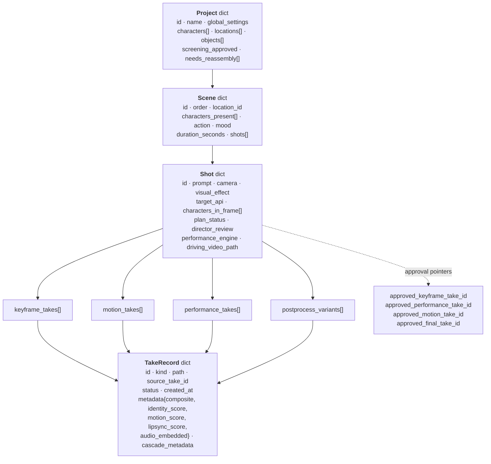

**The fields that carry data between stages** — the load-bearing "wiring" of the whole system — are:

| Field (on shot, unless noted) | Written by | Read by | What it carries forward |
|---|---|---|---|
| `global_settings` (project-level) | Web UI (`PUT /api/projects/<pid>`) | every subsystem via `get_project_setting(ctx, key, default)` | all user-tunable knobs (tier, thresholds, language, `api_engines`, …) |
| `director_review` | `record_director_review_on_shots` (`cinema/auto_approve.py:235`), called at `cinema_pipeline.py:1054` | PLAN_REVIEW auto-approve `_rules_for_plan` (`auto_approve.py:203`) | ChiefDirector's APPROVED/MODIFIED/REJECTED verdict; **MODIFIED is normalized to APPROVED** (the cycle-17 `138d7c7` decision) |
| `plan_status` | `approve_shot_plan` / auto-approve | PLAN_REVIEW gate predicate (`controller.py:633`) | `"approved"` unlocks keyframe generation |
| `target_api` | scene decomposer / operator (`PUT .../shots/<id>`) | video cascade routing (`cinema/shots/controller.py:1310`) + image routing | which engine to try first; `"AUTO"` triggers smart routing |
| `approved_keyframe_take_id` | `approve_take(kind="keyframe")` | KeyframeRenderPhase skip-gate, performance/motion `init_image` chain | the anchor still for all downstream video |
| `performance_engine` | `route_performance_engine` (`domain/performance.py:103`) | PerformanceCapturePhase + gate bypass | `ACT_ONE`/`LIVE_PORTRAIT`/`VIGGLE`/`SKIP`; `"SKIP"` skips the shot and (if all-SKIP) the whole gate |
| `approved_performance_take_id` | `approve_take(kind="performance")` | PERFORMANCE_REVIEW predicate, motion phase driving-video | retargeted-performance clip |
| `approved_final_take_id` (+ `approved_motion_take_id`) | `approve_take(kind="final")` | REVIEW predicate, `_build_scene_packages` | the clip that goes into final assembly |
| `metadata.audio_embedded` (on take) | video cascade post-call (`cinema/shots/controller.py:1511`) | `_build_scene_packages` / `_assemble_final` audio mix | whether the clip already contains dialogue audio (Veo native) → suppress standalone TTS |
| `cascade_metadata` (on take) | `_record_video_cascade` (`phase_c_ffmpeg.py:108`) | audit / `audio_embedded` decision | which engine actually won + attempt list |
| `screening_approved` (project-level) | `mark_screening_approved` (`screening.py:307`) | SCREENING gate predicate | operator sign-off on the assembled cut |
| `needs_reassembly[]` (project-level) | `mark_shot_needs_reassembly` | re-assemble endpoint | shots iterated during screening that need re-stitching |
| `final_video_path` / `exports/final_cinema.mp4` | `_assemble_final` (`cinema_pipeline.py:1323`) | export endpoint, `screening/approve` precondition | the deliverable |

The crucial architectural property: **takes are append-only history, and "approval" is a pointer.** A shot accumulates many `keyframe_takes`/`motion_takes`; approving one just writes its id into the corresponding `approved_*_take_id` field. The take a downstream stage consumes is always resolved through the approval pointer, never by "latest". This is what makes iteration (regenerate, screen-and-redo) safe — old takes are never destroyed.

---

### 6.2 How each subsystem hands off to the next

The orchestrator's `generate()` method (`cinema_pipeline.py:942`) is the spine. It does **not** hold media in memory and pass it along — instead, each stage **mutates the persisted project dict** (via `mutate_project`) and **re-reads a fresh snapshot** (`_refresh_project_snapshot`, `cinema_pipeline.py:443`) at the next gate boundary. The hand-off medium is the project JSON on disk, not function arguments. `_refresh_project_snapshot` is called 6+ times through `generate()`; critically it **validates before swapping** `self.project` (`cinema_pipeline.py:443`, cycle-11 fix) so a validation failure leaves the in-memory state coherent, and it rebuilds the `ContinuityEngine`'s typed-id-keyed `characters`/`locations` dicts each time.

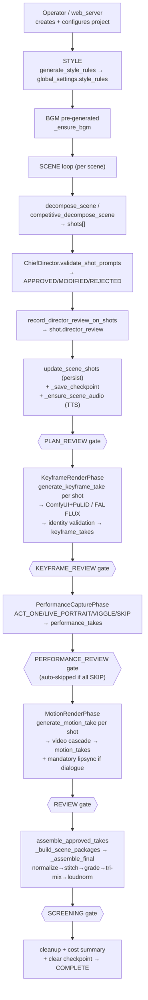

The hand-off contracts, stage by stage:

1. **Decompose → Director → Plan.** `decompose_scene` (`domain/scene_decomposer.py:436`) or its competitive variant produces shot dicts from `make_shot`. `ChiefDirector.validate_shot_prompts` (`llm/chief_director.py:296`) may modify them in place. `record_director_review_on_shots` then writes `director_review` onto each shot — **this single call is what unblocks the PLAN_REVIEW auto-approve gate**; without it, `_rules_for_plan` always vetoes (the field is absent) and a headless run dead-ends. `update_scene_shots` persists.
2. **Plan → Keyframe.** Once PLAN_REVIEW clears, `KeyframeRenderPhase.run(ctx)` (`cinema/phases/keyframe_render.py:68`) iterates shots, skipping any with `approved_keyframe_take_id`, and calls `generate_keyframe_take` (delegated to `ShotController`). The keyframe is the anchor still; its identity score lands in `take.metadata.identity_score`.
3. **Keyframe → Performance.** `PerformanceCapturePhase` (`cinema/phases/performance.py:19`) skips shots that are SKIP-routed, have no approved keyframe, or already have an approved performance take. The performance take (a driving-video / retarget) becomes optional conditioning for the motion stage.
4. **Performance → Motion.** `MotionRenderPhase` (`cinema/phases/motion_render.py:57`) turns the approved keyframe into a video clip via the cascade (§6.4). It has a **storyboard batch path** (Kling Native, non-portrait aspect only — M-1 guard, 2–6 unapproved shots all with keyframes) that generates one combined clip and splits it (`split_video_into_segments`), falling through to per-shot on any failure.
5. **Motion → Review → Assembly.** After motion, `_rebuild_review_clips` builds the in-memory manifest the web UI reads, and the REVIEW gate waits for `approved_final_take_id` on every shot. Then `assemble_approved_takes` resolves those approved takes' paths in `_build_scene_packages` (`cinema_pipeline.py:709`) and `_assemble_final` (`cinema_pipeline.py:1323`) produces `exports/final_cinema.mp4`.

A key correctness detail in the final hand-off: **the audio source for assembly depends on which video engine won.** `_build_scene_packages` detects whether every approved take in a scene has `metadata.audio_embedded=True` (Veo/Omnihuman embed dialogue; Kling image2video does not). If all embedded, standalone TTS is suppressed to avoid double-voice; if mixed, TTS is kept for the non-embedded shots and `_assemble_final` binds the voice filtergraph label to the right input index dynamically (the C-B2 fix).

**Phases never fail the run.** All three phases return `PhaseResult(ok=True)` even when individual shots fail — partial failures route through the `on_failure` callback into `RunState.failed_shots` and emit a `SHOT_FAILED` SSE event, but the phase proceeds (`cinema/phases/keyframe_render.py:105`). Operators rework failed shots from the review UI. The only `ok=False` returns are missing-constructor-args and cancellation. Callers that need to know about per-shot failures must inspect `failed_shots`, not the phase result.

---

### 6.3 The review / gate / checkpoint / resume control system

Five mandatory **gates** punctuate generation: PLAN_REVIEW → KEYFRAME_REVIEW → PERFORMANCE_REVIEW → REVIEW → SCREENING. They are **not phases** — they are inline `_wait_for_gate(...)` calls in `generate()` that block the worker thread until a predicate is satisfied. The gate machinery is `ReviewController` (`cinema/review/controller.py`), and it interleaves with generation as follows: a phase runs (generating takes), then a gate blocks (waiting for approvals), then the next phase runs against the now-approved state.

Each `_wait_for_gate` call (`controller.py:507`) does three things in order:

1. Sets `RunState.current_stage` and emits a progress event.
2. **Runs an auto-approve pass** (`_run_auto_approve_pass`, `controller.py:253`) — for each not-yet-approved shot it calls `auto_approve.check_gate(...)`, which evaluates per-gate veto rules; qualifying shots are pre-approved (their approval pointer/`plan_status` is written and a `<gate>_auto_approved` flag set), and an audit entry is appended to `shot["auto_approve_audit"]` for **every** shot checked. This pass **never raises** — on error it falls through to manual review.
3. **Waits** — using one of two completely different control paths depending on mode (§6.6).

The gate predicates (`_gate_satisfied`, `controller.py:224`) are pure functions of shot state:

| Gate | Satisfied when (all shots) |
|---|---|
| PLAN_REVIEW | `plan_status == "approved"` |
| KEYFRAME_REVIEW | `approved_keyframe_take_id` set |
| PERFORMANCE_REVIEW | `performance_engine == "SKIP"` **OR** no approved keyframe **OR** `approved_performance_take_id` set |
| REVIEW | `approved_final_take_id` set |
| SCREENING | `is_screening_approved(project)` is True |

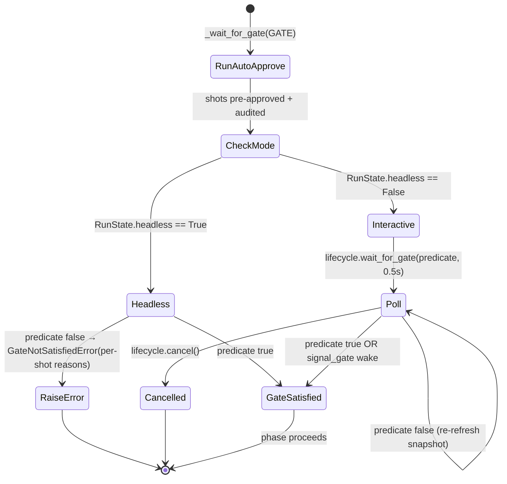

**Auto-approve thresholds** live in `global_settings.auto_approve` (`AutoApproveConfig`, `cinema/auto_approve.py:71`). The veto rules per gate: PLAN (decision-not-APPROVED, has-violations), IMAGE (composite below threshold — dynamic 0.97 PuLID / 0.78 fallback, cascade-fallback, over-budget), MOTION (identity/motion-score floors — **opt-in via `CINEMA_AUTO_APPROVE_MOTION=1`**), FINAL (lipsync floor, and the `final_require_human_if_upstream_auto` safety net). That last default is the most common footgun for unattended runs: if any earlier gate auto-approved a shot, the REVIEW gate forces a human unless you set `final_require_human_if_upstream_auto=false`.

**Checkpointing and resume.** `CheckpointStore` (`cinema/checkpoint.py`) atomically writes `temp/pipeline_state.json` (via `tempfile.mkstemp` + `os.replace`) after **each scene** and after each audio step (`_save_checkpoint`, `checkpoint.py:87`). It serializes the `RunState` fields wholesale: `current_stage/scene_id/shot_id`, `completed_scene_indices`, `scene_clips`, `scene_audio`, `scene_foley`, `foley_audio_paths`, `shot_results`, `failed_shots`. On `generate(resume=True)`, `_restore_from_checkpoint` (`checkpoint.py:163`) rehydrates those fields and marks any referenced file that's gone as `"lost"`. One subtlety: `review_clips` is **not** persisted in the checkpoint — it is rebuilt in-memory by a separate `_rebuild_review_clips` call on resume (`cinema_pipeline.py:308`).

**Screening (the post-assembly gate).** After `_assemble_final` produces the mp4, if screening is enabled (`CINEMA_SCREENING_STAGE` default ON, overridable per-project) the pipeline parks at the SCREENING gate at 95%. The operator hits `POST .../assemble/screen` to get a timeline manifest, may iterate individual shots (each iterate calls `mark_shot_needs_reassembly`), may call `POST .../assemble/re-assemble` to re-stitch only the dirty shots, and finally `POST .../screening/approve` → `mark_screening_approved` → the gate's predicate flips True. To wake the blocking waiter promptly, the approve endpoint also calls `pipeline.lifecycle.signal_gate(SCREENING_STAGE_NAME)` (`web_server.py:2359`); if the live pipeline object isn't reachable, the 0.5s poll is the fallback (verified `web_server.py:2359-2362`).

---

### 6.4 The API fallback cascade (in detail)

Video generation is the most fault-tolerant subsystem because vendor APIs fail, rate-limit, and reject inputs constantly. The single entry point is `generate_ai_video` (`phase_c_ffmpeg.py:54`); inside it, the closure `try_next_api` (`phase_c_ffmpeg.py:139`) implements an ordered, fault-tolerant cascade.

**Resolution → attempt → fallback** flows like this:

1. **Routing (caller side, `ShotController`).** For `target_api == "AUTO"`, the controller checks the optimizer's `suggested_video_api`, else falls to the shot-type template's primary + fallback list (`WORKFLOW_TEMPLATES[shot_type]`, e.g. portrait → `KLING_NATIVE` with fallbacks `RUNWAY_GEN4, SORA_NATIVE, KLING_3_0`). For an explicit `target_api`, it uses that and sets `video_fallbacks = None`.
2. **Dialogue override (F1a).** If `has_dialogue`, the controller scans `PURPOSE_API_RANKING[purpose]` for the first engine with `native_audio=True AND modality=="video" AND status=="live"` (today: `VEO_NATIVE`) and overrides `target_api` to it. Fallback handling depends on `dialogue_voice_mode` (default `"overlay"`): overlay mode **keeps the template `video_fallbacks`** so a Veo RAI-block cascades to a silent engine and the F1b TTS overlay still fires; native mode **sets `video_fallbacks = None`** so a cross-engine fallback can't silently route to a non-native-audio engine and drop the embedded voice (`cinema/shots/controller.py:133-180` helper; call site + rationale `:1348-1370`).
3. **Engine-disabled short-circuit.** Before attempting the targeted engine, `generate_ai_video` reads `api_engines` from `ctx`; if the operator set `{ENGINE: {enabled: false}}`, it delegates straight to `try_next_api` (respects "if I disabled X, don't use X even when explicitly targeted").
4. **Attempt the engine.** Each engine has its own handler branch (native: Kling/Veo/Sora/LTX; FAL-proxy: VEO/SORA_2/KLING_3_0/FAL_SVD; plus Runway). On success, `_record_video_cascade(api_name)` writes `{engine, attempts}` into `_cascade_out["cascade_metadata"]` and returns the path.
5. **Fallback on failure.** `try_next_api` walks the fallback list (or the default order), **filters out already-attempted engines and `api_engines`-disabled ones**, and recurses into `generate_ai_video` with the next engine.
6. **Exhaustion + retry.** When the list is exhausted, it sleeps 30s and restarts the whole cascade from the first engine, up to `MAX_CASCADE_RETRIES` (default 1, overridable via `cascade_retry_limit`). After that, it returns `None` (total failure).

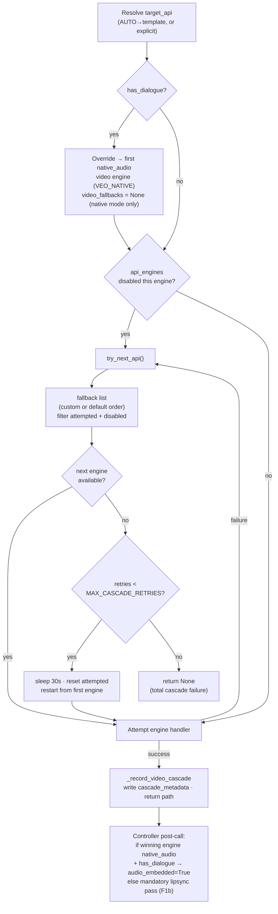

The **default cascade order** (when no custom `video_fallbacks`) is verified as: `KLING_NATIVE, SORA_NATIVE, RUNWAY_GEN4, LTX, VEO_NATIVE, KLING_3_0, SORA_2, VEO, RUNWAY` (`phase_c_ffmpeg.py:145`). Note that `VEO_NATIVE` (native SDK) and `VEO` (FAL proxy) are **distinct cascade members**.

Three cascade caveats engineers must know:

- **Native-audio is only guaranteed on the primary attempt.** When the dialogue override nulls `video_fallbacks` (native mode; the overlay default keeps the template list), if `VEO_NATIVE` itself fails, `try_next_api` falls through to the **default** list (which contains non-audio engines). The downstream guarantee is instead enforced by the **mandatory F1b lipsync pass** (`cinema/shots/controller.py:1528`): after the take is downloaded, if `has_dialogue and not audio_embedded`, the controller runs `generate_lip_sync_video` and writes `lipsync_score`.
- **`VEO_NATIVE` has no quota-block guard.** The `_VEO_QUOTA_EXHAUSTED_UNTIL` 30-min cooldown TTL is set/checked only for the **FAL-proxy `VEO`** branch (`phase_c_ffmpeg.py:502-504`); native-Veo quota errors are caught generically and cascade with no cooldown.
- **Some engine params are accepted but silently dropped.** Veo's `reference_images`/`multi_angle_refs` (Bug #4 — Vertex rejects image+reference_images together) and `driving_video_path` (SDK `video=`/`image=` mutual exclusivity) are accepted for interface stability but have no effect; only **Sora** fully wires driving-video conditioning (`sora_native.py:77`).

The same `try_next_api`-style fault tolerance recurs in the **image** path (ComfyUI+PuLID → FAL FLUX Kontext → FLUX-Pro → Schnell → Pollinations, `phase_c_assembly.py:415`), the **lipsync** path (SyncV3 → MuseTalk → LatentSync → SyncV2 for overlay; Hedra → Kling → Omnihuman → Aurora for generation, `lip_sync.py`), and the **TTS/BGM** paths. The pattern — ordered list, skip-on-failure, best-of-failed recovery, provenance written to a cascade dict — is the project's house style for any external dependency.

---

### 6.5 The "LLM everywhere" layer

LLMs are not a single stage — they are threaded through almost every decision point. The creative-LLM stack (`llm/`) sits above all image/video generation: nothing reaches a diffusion model or video API without passing through at least one of these. Every LLM that touches the pipeline ingests the shared `PIPELINE_CONTEXT` string (loaded from `config/prompts/pipeline_context.md` via `pipeline_context.py:15`) in its system prompt — so editing that one markdown file reshapes the behavior of **every** LLM in the pipeline without a code change.

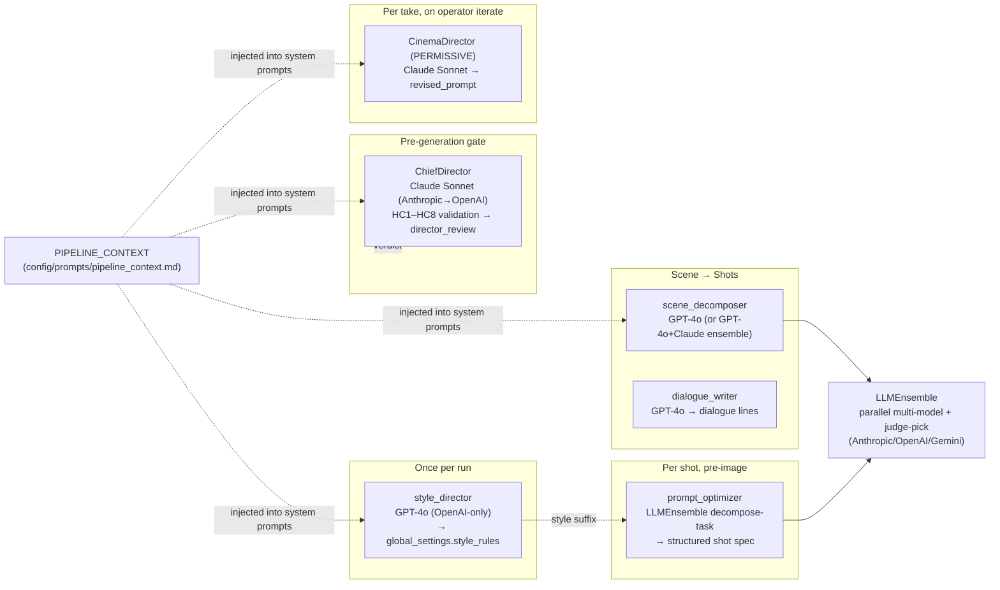

| Stage | Module | Model(s) | Role |
|---|---|---|---|
| Global style (once) | `llm/style_director.py:12` | **GPT-4o only** (no Anthropic path; falls to hardcoded defaults if no OpenAI key) | produces 7-key `style_rules` dict → `style_rules_to_prompt_suffix` is appended to every image prompt |
| Scene → shots | `domain/scene_decomposer.py` | GPT-4o, or GPT-4o+Claude via `LLMEnsemble` when `competitive_generation=True` | shot specs with HC1–HC5 constraints |
| Dialogue | `domain/dialogue_writer.py:12` | GPT-4o | per-character spoken lines |
| Pre-gen validation | `llm/chief_director.py:296` | Claude Sonnet 4 (Anthropic→OpenAI fallback) | enforces HC1–HC8; writes the `director_review` that gates PLAN_REVIEW |
| Per-shot prompt optimize | `llm/prompt_optimizer.py:355` | `LLMEnsemble` `decompose` roster | freeform → structured 13-field spec |
| Per-take iteration | `llm/director.py:275` | Claude Sonnet 4 | translates a `DirectorialIntent` into a `revised_prompt` (permissive — operator intent overrides HC firewalls) |
| Ensemble engine | `llm/ensemble.py:139` | parallel Anthropic/OpenAI/Gemini + judge | `competitive_generate` dispatches all models, judge picks winner |

One historical divergence is now resolved: `ChiefDirector.evaluate_generation_quality` (`llm/chief_director.py:406`) is fully implemented and **wired by T6** (`10a0eb4`) — invoked by `cinema/shots/controller.py::diagnose_clip` on the opt-in `deep=True` path. `negative_prompts.build_remediation_advisory` is similarly wired (`8d18e57`), called from both `generate_keyframe_take` and `diagnose_clip`. The remaining open divergence: `style_director` is **asymmetric** with the others (OpenAI-only), so an Anthropic-key-only deployment silently gets hardcoded default style rules. Model selection is steered by `global_settings.creative_llm` and `quality_judge_llm`, but the override is **family-checked, not provider-switching** — setting a `claude-*` model when only OpenAI is configured silently uses the OpenAI default.

---

### 6.6 Headless vs. interactive control flow

The same `generate()` code runs in two modes; the divergence is entirely localized to **how gates wait**, controlled by one boolean: `RunState.headless`, set once at `CinemaPipeline(headless=...)` construction.

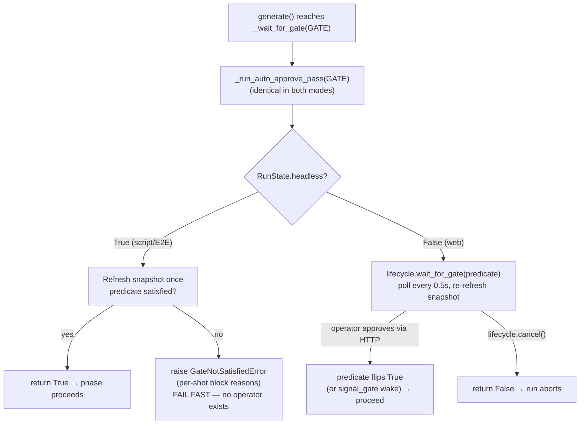

**Interactive (web) mode** (`headless=False`): the worker thread blocks in `ThreadedLifecycle.wait_for_gate` (`cinema/lifecycle.py:182`), which polls the predicate every 0.5s and re-refreshes the project snapshot each poll, so operator approvals made via HTTP endpoints are picked up automatically — **no explicit "Resume" click is needed** after approving. An explicit `signal_gate` call (e.g. from the screening-approve endpoint) wakes the waiter immediately rather than waiting for the next poll tick.

**Headless mode** (`headless=True`): there is no operator and no web UI, so polling forever would hang. Instead, after the auto-approve pass, the gate checks the predicate **once** and, if unsatisfied, **raises `GateNotSatisfiedError`** (`controller.py:93`) with per-shot block reasons (`_gate_block_details`). This is the cycle-17 fix for the headless plan-review stall.

A critical, easily-mis-stated fact: **headless mode does NOT use `NullLifecycle`.** `NullLifecycle` (`cinema/lifecycle.py:70`) was the now-deleted CLI's lifecycle; its `wait_for_gate` returns `True` regardless of the predicate, which would **silently skip all gate enforcement**. The correct non-interactive path is `CinemaPipeline(headless=True)`, which still uses `ThreadedLifecycle` but flips the fail-fast branch. Any doc claiming "headless uses NullLifecycle" is wrong. (Note also that `MEMORY.md` records `run_tier_c.py` was never a real unattended harness — it expected web approval; the supported unattended entry is `CinemaPipeline(headless=True)`.)

---

### 6.7 Concurrency, locking, and the SSE queues

A single Flask process (`web_server.py`, port 8080) drives potentially many projects concurrently. Concurrency safety rests on three mechanisms.

**1. The pipeline registry, `_pipelines_lock`, and the PENDING sentinel.** Module-level `_running_pipelines: dict[pid → CinemaPipeline]` (`web_server.py:73`) is the single truth source for "is generation active?". Because `CinemaPipeline.__init__` is heavy (it builds `ContinuityEngine`, `ChiefDirector`, `LLMEnsemble`, trackers), the server does **not** hold `_pipelines_lock` across the constructor. Instead it does an atomic check-then-reserve: under the lock it places a `_PIPELINE_PENDING` sentinel (defined at `web_server.py:81`, reserved at `web_server.py:1521`), releases the lock, constructs the pipeline outside the lock, then swaps the real object in. Every reader must go through `_get_running_pipeline` (`web_server.py:145`), which treats the sentinel as "absent". The same lock guards popping the pid + its progress queue at run completion.

**2. `_running_cores` + `_cores_lock`.** Expensive long-lived services are cached per-process in `_running_cores` (`web_server.py:109`), get-or-created under `_cores_lock` (`web_server.py:110`). Caveat: this cache is **not invalidated on `settings.json` edits** — out-of-band settings changes require a server restart.

**3. `mutate_project` + per-project filelock.** All durable state writes funnel through `mutate_project(pid, mutator)` (`domain/project_manager.py:712`), the canonical read-modify-write primitive: it acquires a per-project `filelock` (`projects/<pid>/project.lock`), loads fresh JSON, normalizes, runs the mutator in place, and writes atomically (`tempfile.mkstemp` + `os.replace`). This serializes concurrent writers to the same project. Two disciplines matter for engineers: external callers already inside a `project_lock()` context must use the unlocked `_save_project_unlocked` (the public `save_project` re-acquires the lock → deadlock), and shot IDs follow `shot_{scene_id}_{shot_index}` which is **not globally unique** — endpoints must always pid-scope (the F1 CRITICAL from cycle-6/S13; this is why CLAUDE.md's `R-PID` and Rule #13 stubs exist — full bodies in `docs/protocol/claude/director-operator.md`).

**The busy-fence and gate-bypass.** Generation-mutating endpoints reject 409 if the project is busy (`_reject_if_project_busy`, `web_server.py:226`). But gate-acting endpoints (approve, iterate, screen, re-assemble) must work **while** the worker is parked at a gate, so they use `_reject_if_project_busy_outside_gate` (`web_server.py:257`), which lets calls through when `current_stage` is in `_GATE_STAGES = {PLAN_REVIEW, KEYFRAME_REVIEW, PERFORMANCE_REVIEW, REVIEW, SCREENING}` (`web_server.py:94`). The re-assemble endpoint additionally has its own `_reassembly_in_flight` guard (`web_server.py:125`) — separate from `_running_pipelines` because re-assembly runs *while* the SCREENING gate-waiter still occupies the registry.

**SSE progress queues.** Each in-flight run gets one `queue.Queue` in `_progress_queues` (`web_server.py:72`). The pipeline's `progress_callback` (built by `make_progress_callback`, `web_services.py:29`) shapes each event into a dict — named fields keep their empty/negative-sentinel filtering, and producer extras pass through when JSON-serializable (NF-3 lift, P1-3) — and `put`s it. `api_stream` (`web_server.py:1577`) drains the queue, yielding `data: <json>\n\n`, with a 30s `HEARTBEAT` on timeout and an `END`/`None` sentinel to close. Two properties to know:

- **Single consumer, no fan-out.** A second browser tab on the same `/stream` drains from the *same* queue, so both tabs miss events (`web_server.py:1577`). This is a hard limit, not a bug to work around per-client.
- **Queue-cleanup identity check.** At completion the worker pops the queue only if `_progress_queues.get(pid) is q` (`web_server.py:1554`) — the identity check prevents clobbering a replacement queue created by a concurrent new run for the same pid.

```mermaid
flowchart LR
    POST["POST /generate"] -->|"under _pipelines_lock"| SENT["place _PIPELINE_PENDING<br/>create queue.Queue"]
    SENT --> THR["daemon thread: run_pipeline()"]
    THR --> CORE["_get_or_build_core (cached, _cores_lock)"]
    CORE --> CTOR["construct CinemaPipeline<br/>(outside lock)"]
    CTOR --> SWAP["swap sentinel → real pipeline"]
    SWAP --> RUN["pipeline.generate(resume)"]
    RUN -->|"progress_callback"| Q[("_progress_queues[pid]")]
    Q --> STREAM["GET /stream (single consumer)<br/>SSE: stage/percent/detail"]
    RUN -.mutate_project (per-project filelock).-> JSON[("project.json")]
    GATEEP["approve / iterate / screen<br/>(gate-bypass busy fence)"] -.mutate_project.-> JSON
    JSON -.0.5s poll re-refresh.-> RUN
    RUN -->|completion| POP["under _pipelines_lock:<br/>pop pid + queue (identity check)<br/>q.put(None)"]
```

---

### 6.8 The whole loop, end to end

Putting the pieces together, a single web-driven run is: **configure → STYLE → BGM → (per scene: decompose → ChiefDirector → record review → persist → TTS) → PLAN_REVIEW gate → keyframes → KEYFRAME_REVIEW gate → performance → PERFORMANCE_REVIEW gate (auto-skipped if all SKIP) → motion (+cascade, +lipsync) → REVIEW gate → assemble (normalize → stitch → grade → tri-mix → loudnorm) → SCREENING gate → cleanup + cost summary → COMPLETE.** Every arrow that crosses a stage boundary is a `mutate_project` write followed by a `_refresh_project_snapshot` read; every gate interleaves an auto-approve pass with either a fail-fast (headless) or a poll-until-approved (web) wait; every external API call is wrapped in a fault-tolerant cascade that records its provenance back onto the take. The project dict is the universal bus, the approval pointers are the hand-off tokens, and `RunState` (shared by reference across all three controllers, `cinema_pipeline.py:102`) is the per-run scratch space that the checkpoint serializes for resume.

---

## 7. Reference Appendix

This appendix is the quick-lookup layer of the manual: the files an engineer opens first, the functions they reach for, every tunable knob, the vocabulary, the failure-mode playbook, and — importantly — a catalog of the documentation drift discovered while building this manual so the next reader is not misled by stale maps. Every concrete claim carries a `file:line` citation traceable to the source as of the 2026-06-09 re-sweep. Where divergences exist between the plan and the source, they are surfaced rather than smoothed over (see §7.6).

### 7.1 Key Files Index

The pipeline's single entry point is `web_server.py` → `cinema_pipeline.py`; the old CLI `main.py` was deleted and no longer exists at the repo root (verified: `ls main.py` → "No such file or directory"). LOC values below were re-verified via `wc -l` in the 2026-06-09 re-sweep.

#### Orchestration & lifecycle

| Path | LOC | Role |
|---|---|---|
| `web_server.py` | 2664 | Flask app (port 8080), the **sole** human entry point: REST CRUD, SSE progress stream, pipeline control, module-level concurrency state |
| `cinema_pipeline.py` | 1677 | `CinemaPipeline` — the real orchestrator. Owns `generate()`, the 12-stage gate sequence, `_assemble_final`, scene-audio/foley/BGM helpers, checkpoint delegation |
| `cinema/core.py` | 115 | `PipelineCore` + `build_pipeline_core()` — long-lived services (project dict, dirs, `ContinuityEngine`, `ChiefDirector`, `CostTracker`, `LLMEnsemble`) |
| `cinema/runstate.py` | 157 | `RunState` dataclass — the single shared home for per-run mutable state; one instance, shared by all three controllers |
| `cinema/lifecycle.py` | 208 | `LifecycleService` protocol + `NullLifecycle` (no-op, **not** wired into `CinemaPipeline`) + `ThreadedLifecycle` (interactive, event-backed) |
| `cinema/context.py` | 181 | `PipelineContext` dataclass passed into phases; `get_project_setting()` canonical knob reader |
| `cinema/pipeline.py` | 114 | A **second, unrelated** `CinemaPipeline` — a generic list-of-`Phase` driver; NOT the orchestrator (see divergence D-1) |
| `pipeline_context.py` | 15 | Loads `config/prompts/pipeline_context.md` into `PIPELINE_CONTEXT`, injected into every LLM system prompt |
| `web_services.py` | 121 | Pure SSE-event builder `make_progress_callback` (factored out for unit-testability) |

#### Phases

| Path | LOC | Role |
|---|---|---|
| `cinema/phases/base.py` | 81 | `Phase` Protocol + `PhaseResult` dataclass — the entire phase contract |
| `cinema/phases/keyframe_render.py` | 109 | `KeyframeRenderPhase` — per-shot image-generation loop |
| `cinema/phases/performance.py` | 89 | `PerformanceCapturePhase` — per-shot performance-retargeting loop (skips SKIP-routed shots) |
| `cinema/phases/motion_render.py` | 425 | `MotionRenderPhase` — per-shot image→video loop + Kling storyboard batch path |
| `cinema/services.py` | 133 | Read-only disk-state helpers (`state_snapshot`, `checkpoint_info`) for web endpoints — no `CinemaPipeline` construction |

#### Review, gates, persistence

| Path | LOC | Role |
|---|---|---|
| `cinema/review/controller.py` | 700 | `ReviewController` — gate-wait logic, auto-approve integration, per-shot approval mutations, review-clip manifest |
| `cinema/auto_approve.py` | 762 | Veto-rule engine: per-gate rule builders, `check_gate`, `record_director_review_on_shots` |
| `cinema/screening.py` | 684 | Post-assembly SCREENING stage: feature flag, timeline manifest, `screening_approved` flag, `needs_reassembly` dirty-tracking |
| `cinema/checkpoint.py` | 185 | `CheckpointStore` — atomic JSON checkpoint save/load/restore into `RunState` |
| `domain/project_manager.py` | 1235 | **Canonical** persistence: factories, `normalize_*_schema`, `mutate_project` RMW primitive, per-project filelock, shot-package I/O |
| `domain/models.py` | 179 | Pydantic v2 schema (validation-only, warn-by-default); the live data type is a plain dict |
| `domain/shot_types.py` | 51 | Shot-type constants + `normalize_shot_type` alias normalizer |
| `domain/performance.py` | 185 | Pure performance-engine routing (`route_performance_engine`, `should_capture`) |

#### LLM / creative brain

| Path | LOC | Role |
|---|---|---|
| `llm/chief_director.py` | 664 | `ChiefDirector` — pre-gen HC1–HC8 validation gate (`validate_shot_prompts`); sole writer of `director_review` |
| `llm/director.py` | 432 | `CinemaDirector` — permissive iteration translator (`translate_intent`, S18 verb DSL) |
| `llm/ensemble.py` | 487 | `LLMEnsemble` — multi-provider parallel generation + judge-pick; `build_anthropic_system_blocks` caching helper |
| `llm/prompt_optimizer.py` | 507 | UI-text → structured shot spec (`optimize_shot_prompt`) |
| `llm/style_director.py` | 198 | Per-project global style rules (`generate_style_rules`) — **OpenAI-only** |
| `llm/negative_prompts.py` | 69 | Failure-reason → negative-prompt phrase lookup |
| `domain/scene_decomposer.py` | 919 | **Canonical** scene→shots: `API_REGISTRY`, `PURPOSE_API_RANKING`, `decompose_scene`, `competitive_decompose_scene` |
| `domain/dialogue_writer.py` | 156 | **Canonical** dialogue writer (`generate_dialogue`) |
| `domain/language_defaults.py` | 212 | Per-language pipeline defaults (TTS, lipsync priority, voice IDs) |
| `research_engine.py` / `web_research.py` | 160 / 221 | Tavily + Firecrawl wrappers; `run_with_tools` GPT-4o tool loop |

#### Image / video generation

| Path | LOC | Role |
|---|---|---|
| `phase_c_assembly.py` | 606 | Production-tier **image** gen: ComfyUI+PuLID, FLUX Kontext/Pro fallbacks, `generate_ai_broll` |
| `quality_max.py` | 1001 | Max-tier orchestrator: node prune/inject, N=8 best-of, SUPIR/FaceDetailer/Redux |
| `phase_c_ffmpeg.py` | 1551 | Central video routing (`generate_ai_video`) + all per-API handlers + FFmpeg assembly utilities (concat, xfade, color grade, loudnorm) |
| `workflow_selector.py` | 581 | `classify_shot_type`, `WORKFLOW_TEMPLATES` / `MAX_QUALITY_TEMPLATES`, adaptive PuLID weight |
| `kling_native.py` | 449 | Kling 3.0 native client (JWT HS256, image2video, storyboard mode) |
| `veo_native.py` | 286 | Veo 3.1 client (Vertex-preferred, Gemini fallback) — **only `native_audio` engine** |
| `ltx_native.py` | 373 | LTX Video 2.3 client (native REST preferred, FAL fallback) |
| `sora_native.py` | 179 | OpenAI Sora 2 client (only engine that wires driving-video) |
| `pulid.json` | 22 nodes | Production ComfyUI workflow (SDXL-era `ApplyPulid`) |
| `pulid_max.json` | 56 nodes | Max-tier ComfyUI workflow (FLUX-native `ApplyPulidFlux`) |

#### Identity / continuity / coherence

| Path | LOC | Role |
|---|---|---|
| `domain/continuity_engine.py` | 620 | 4 sub-engines + `ContinuityEngine.enhance_shot_prompt` (builds `continuity_config`) |
| `identity/validator.py` | 908 | `IdentityValidator` — GhostFaceNet embedding cache, adaptive frame sampling, rolling stats |
| `identity/types.py` | 126 | `FailureReason`, `SHOT_TYPE_THRESHOLDS`, `get_threshold_for_shot` |
| `identity/__init__.py` | 100 | `make_validator()` factory, `get_shared_validator()` singleton |
| `coherence_analyzer.py` | 277 | Pixel-level color/lighting/composition coherence (`assess_coherence`) |
| `face_validator_gate.py` | 341 | N=8 best-of gate (`score_candidate`, `should_halt`, `needs_regenerate`) |
| `domain/character_manager.py` | 527 | Character creation, multi-angle FLUX refs, voice assignment |
| `domain/location_manager.py` | 214 | Location creation, prompt fragments, deterministic seeds |
| `performance/identity_gate.py` | 119 | Performance-take single-frame ArcFace check |

#### Post-processing & audio

| Path | LOC | Role |
|---|---|---|
| `phase_c_vision.py` | 427 | Face swap (PixVerse → FaceFusion), GPT-4o QC, Claude identity, Gemini coherence |
| `lip_sync.py` | 875 | Lipsync overlay + generation cascades, RIFE interp, SeedVR2 upscale, SyncNet gate |
| `audio/dialogue.py` | 698 | Multi-character TTS (ElevenLabs Dialogue Mode / per-line; Cartesia for Korean) |
| `audio/music.py` | 434 | BGM (Suno V5 → FAL Stable Audio) + mastering presets |
| `audio/foley.py` | 193 | Environmental foley via Stability AI Stable Audio 2.0 |
| `audio/effects.py` | 284 | Pedalboard chain + macOS AU host + 13 FFmpeg voice-FX presets |
| `audio/alignment.py` | 288 | Forced alignment (WhisperX → Whisper word timestamps) |
| `prep/lora_training.py` | 566 | Per-character LoRA dataset prep + ai-toolkit subprocess trainer |
| `prep/topaz_upscale.py` | 151 | Topaz Video AI local CLI wrapper |

#### Cross-cutting services & config

| Path | LOC | Role |
|---|---|---|
| `cost_tracker.py` | 551 | SQLite spend ledger + budget gate (`record_api_call`, `would_exceed`, `is_over_budget`) |
| `config/settings.py` | 141 | Frozen `Settings` dataclass; `lru_cache` singleton; **API keys + infra paths only** |
| `cleanup.py` | 154 | Post-assembly temp/ file purge (`cleanup_project`) |
| `cinema/logging_config.py` | 114 | JSON-line root logger; reads `CINEMA_LOG_LEVEL` |

### 7.2 Key Functions Index

The functions an engineer reaches for most, grouped by task. All `file:line` references verified against current source.

#### Driving a run

| Function | Location | What it does |
|---|---|---|
| `CinemaPipeline.__init__` | `cinema_pipeline.py:55` | Builds `PipelineCore`, `ThreadedLifecycle`, `RunState(headless=…)`, composes the 3 controllers sharing one `RunState` |
| `CinemaPipeline.generate` | `cinema_pipeline.py:942` | Main loop; `resume=True` restores checkpoint. Returns `final_cinema.mp4` path or `None` |
| `CinemaPipeline.assemble_approved_takes` | `cinema_pipeline.py:853` | Full assembly + SCREENING gate + cleanup + cost summary |
| `CinemaPipeline._assemble_approved_takes_core` | `cinema_pipeline.py:783` | Assembly WITHOUT the SCREENING gate-wait — called by the re-assemble endpoint to avoid Flask-thread deadlock (D-9) |
| `CinemaPipeline._assemble_final` | `cinema_pipeline.py:1323` | normalize → stitch → color grade → 3-track audio mix → EBU R128 loudnorm |
| `CinemaPipeline._refresh_project_snapshot` | `cinema_pipeline.py:443` | `load_project` → **validate-before-swap** → rebuild trackers (cycle-11 correctness fix) |
| `build_pipeline_core` | `cinema/core.py:75` | Factory; constructs `CostTracker(budget_usd=…)` (note: **no** `db_path` — see D-config-1) |

#### Project state & persistence

| Function | Location | What it does |
|---|---|---|
| `mutate_project` | `domain/project_manager.py:712` | The canonical read-modify-write primitive: lock → load → normalize → `mutator(project)` → atomic save |
| `load_project` | `domain/project_manager.py:700` | Lock → read → `normalize_project_schema` (auto-saves if changed) → warn-only validate |
| `save_project` | `domain/project_manager.py:688` | Validate → filelock → atomic `mkstemp`+`os.replace`. **Do not** call while holding the lock — use the unlocked variant (D-state-1) |
| `make_shot` / `make_project` / `make_take` | `domain/project_manager.py:262 / 309 / 139` | Factories; `make_shot` scaffolds all take lists + performance fields the Pydantic `Shot` model omits |
| `normalize_shot_schema` | `domain/project_manager.py:405` | Enforces unique shot ID (collision → `shot_{scene_id}_{shot_index}`), migrates legacy fields |

#### Gates & approval

| Function | Location | What it does |
|---|---|---|
| `ReviewController._wait_for_gate` | `cinema/review/controller.py:507` | Runs auto-approve pass, then blocks (web) or raises `GateNotSatisfiedError` (headless, line 546) |
| `ReviewController._gate_satisfied` | `cinema/review/controller.py:224` | Per-gate predicate (plan/keyframe/performance/final approval-ID checks) |
| `check_gate` | `cinema/auto_approve.py:625` | Public auto-approve entry; returns `AutoApproveDecision`; catches all exceptions → `deferred=True` |
| `record_director_review_on_shots` | `cinema/auto_approve.py:235` | **Writes** `shot["director_review"]`; called at `cinema_pipeline.py:1054`. Without it the PLAN gate hangs headless runs (D-gate-1) |
| `approve_shot_plan` / `approve_take` | `cinema/review/controller.py:633 / 647` | Human approval mutations for the four review gates |
| `mark_screening_approved` | `cinema/screening.py:307` | Sets `screening_approved=True`; unblocks the SCREENING waiter |

#### Image / video generation

| Function | Location | What it does |
|---|---|---|
| `generate_ai_broll` | `phase_c_assembly.py:75` | Image-gen dispatch: max-tier → ComfyUI+PuLID → FAL fallback |
| `generate_ai_broll_max` | `quality_max.py:701` | N=8 adaptive best-of with prune/inject pipeline; returns `ImageGenResult(path, "QUALITY_MAX")` |
| `generate_ai_video` | `phase_c_ffmpeg.py:54` | Central video routing + fault-tolerant cascade across 9+ engines |
| `classify_shot_type` | `workflow_selector.py:411` | Returns `portrait\|medium\|wide\|action\|landscape` (note: **never** returns `close_up` — D-video-1) |
| `get_workflow_params` / `apply_workflow_params` | `workflow_selector.py:450 / 501` | Per-shot-type template + ComfyUI node injection |
| `get_adaptive_pulid_weight` | `workflow_selector.py:540` | Rolling-stats feedback → PuLID weight delta, clamped [0,1] |

#### Identity / continuity / audio assembly

| Function | Location | What it does |
|---|---|---|
| `ContinuityEngine.enhance_shot_prompt` | `domain/continuity_engine.py:446` | Builds enhanced prompt + `continuity_config` (img2img, seed, refs, thresholds) |
| `IdentityValidator.validate_video` | `identity/validator.py:133` | Adaptive 3–10 frame sampling, GhostFaceNet cosine similarity |
| `IdentityValidator.get_rolling_stats` | `identity/validator.py:267` | Window-10 history → `suggested_pulid_delta` feedback |
| `score_candidate` / `should_halt` | `face_validator_gate.py:168 / 225` | Composite = `0.6·arc + 0.4·aesthetic`; halt when `n≥min_n AND best≥threshold` |
| `assess_coherence` | `coherence_analyzer.py:215` | `overall = (1-color_drift)·0.4 + lighting·0.3 + composition·0.3`; check `result.valid` first |
| `two_pass_loudnorm` | `phase_c_ffmpeg.py:1242` | EBU R128 normalize to −14 LUFS / −1.5 dBTP |
| `xfade_concat` | `phase_c_ffmpeg.py:1513` | Cross-dissolve stitch; handles mixed audio-presence legs (Lane V #24/#25 fixes) |

#### Cost & cleanup

| Function | Location | What it does |
|---|---|---|
| `CostTracker.record_api_call` | `cost_tracker.py:293` | Logs a video/image/audio API spend (success path only); updates in-process `spent_usd` |
| `CostTracker.would_exceed` / `is_over_budget` | `cost_tracker.py:353 / 363` | Pre-call and post-call budget gates (return `False`/no-op when `budget_usd=None`; falsy budgets coerce to None at construction — 0 = unlimited) |
| `CostTracker.get_video_cost` | `cost_tracker.py:376` | Per-video breakdown by provider/operation |
| `cleanup_project` | `cleanup.py:56` | Deletes always-delete temp patterns; `aggressive=True` also deletes generated media |

### 7.3 Config / Env / Flags / Tiers

#### 7.3.1 Environment variables — API keys

Set in `.env` (loaded once at import via `load_dotenv`, frozen into the `Settings` singleton). Only API keys + infra paths belong here; **per-project UI knobs must NOT** be added to `Settings` — they flow through `get_project_setting(ctx, …)` (`config/settings.py:49`; `cinema/context.py:151`).

| Variable | Required? | Default | Effect |
|---|---|---|---|
| `ANTHROPIC_API_KEY` | Yes | — | LLMEnsemble, ChiefDirector, CinemaDirector (primary provider) |
| `OPENAI_API_KEY` | Yes | — | LLMEnsemble fallback, style director, dialogue writer, scene decompose |
| `GEMINI_API_KEY` / `GOOGLE_API_KEY` | Optional | — | Gemini judge / Veo Gemini-fallback path |
| `KLING_ACCESS_KEY` + `KLING_SECRET_KEY` | Recommended | — | KLING_NATIVE (JWT auth); primary video engine |
| `FAL_KEY` | Recommended | — | Sora, Veo-proxy, Kling 3.0, LTX-proxy, Hedra, all lipsync, music, FLUX image fallback |
| `LTX_API_KEY` | Optional | — | LTX native (preferred over FAL proxy) |
| `RUNWAYML_API_SECRET` | Optional | — | Runway Gen-4 / gen3a_turbo, Act-One performance |
| `SEEDANCE_API_KEY` | Optional | — | Seedance engine (action cascade only; speculative endpoint — D-video-2) |
| `ELEVENLABS_API_KEY` | Yes (audio) | — | TTS narration + dialogue voiceover |
| `CARTESIA_API_KEY` | Optional | — | Cartesia Sonic 2 (Korean dialogue) |
| `STABILITY_API_KEY` | Optional | — | Stable Audio foley/BGM |
| `SUNO_API_KEY` (alias `SUNO_TOKEN`) | Optional | — | Suno V5 BGM (`config/settings.py:117`) |
| `SUNO_API_BASE` | Optional | `https://api.suno.ai/v1` | Suno endpoint override |
| `VIGGLE_API_KEY` / `HEDRA_API_KEY` | Optional | — | Viggle Mode-A retarget / direct Hedra fallback |
| `GOOGLE_CLOUD_PROJECT` | Req. for Veo/Vertex | — | Vertex AI project ID |
| `GOOGLE_CLOUD_LOCATION` | Optional | `us-central1` | Vertex AI region |
| `TAVILY_API_KEY` / `FIRECRAWL_API_KEY` / `PEXELS_API_KEY` | Optional | — | Web research / scraping / stock-footage fallback |

#### 7.3.2 Environment variables — infrastructure & web

| Variable | Default | Effect |
|---|---|---|
| `COMFYUI_SERVER_URL` | `http://127.0.0.1:8188` | RunPod ComfyUI pod address (production + max tier); absence forces FAL image fallback |
| `EXPERIMENTS_DB_PATH` | `data/experiments.db` | Honored by every tracker via the `CostTracker` default-path env read (`cost_tracker.py:157`, T7 `4af8c05`); the `Settings.experiments_db_path` field itself is decorative (D-config-1 resolved) |
| `PERFORMANCE_CACHE_DIR` | `data/cache/driving` | SHA256-keyed driving-video cache |
| `MOTION_GATE_SAMPLES` | `8` | Frame-pair count for motion-fidelity scoring; read once at module load |
| `WEB_BIND_HOST` | `127.0.0.1` | Flask bind; set `0.0.0.0` for LAN (then tighten CORS) |
| `WEB_CORS_ORIGINS` | `localhost:8080,localhost:5173` | CORS allowlist; `*` = wide-open |
| `CINEMA_LOG_LEVEL` | `INFO` | Root logger level; `DEBUG` for verbose tracing (`cinema/logging_config.py:104`) |

#### 7.3.3 Behavioral feature flags (`CINEMA_*`)

Read live via `os.environ.get(...)` at call time — NOT cached in `Settings`. Two classes:

| Variable | Class | Default | Truthy form | Effect |
|---|---|---|---|---|
| `CINEMA_STRICT_SCHEMA` | A (opt-in) | OFF | `1`/`true`/`TRUE`/`yes` (NOT `"True"`) | `_validate_project` raises instead of warning (`domain/project_manager.py:641`) |
| `CINEMA_AUTO_APPROVE_MOTION` | A (opt-in) | OFF | `1`/`true`/`yes` (case-insensitive) | Wires motion-gate auto-approve into PERFORMANCE_REVIEW (`cinema/auto_approve.py:620`) |
| `CINEMA_DIRECTORIAL_ITERATION` | B (opt-out) | ON | anything not `0`/`false`/`no` (case-insensitive; `off` or empty string still leaves it ON) | Enables the iterate endpoint (`cinema/shots/controller.py:112`) |
| `CINEMA_SCREENING_STAGE` | B (opt-out) | ON | anything not `0`/`false`/`no` | Enables SCREENING gate + endpoints (`cinema/screening.py:147`) |

> **Parser inconsistency (carry forward):** `CINEMA_STRICT_SCHEMA` uses a tuple membership test that rejects Python-cased `"True"`; `CINEMA_AUTO_APPROVE_MOTION` uses `.strip().lower()`. New flags should follow the case-insensitive form.

#### 7.3.4 Project-level knobs (`global_settings`)

Set via `PUT /api/projects/<pid>` with `{"global_settings": {...}}`. The capability-maximizing values are flagged. Defaults from `make_project` (`domain/project_manager.py:309`).

**Creative / planning**

| Key | Default | Effect | Max-quality value |
|---|---|---|---|
| `competitive_generation` | `True` | GPT-4o + Claude parallel quorum, judged (doubles LLM cost) | keep `True` |
| `quality_judge_llm` | `"auto"` | Judge model; maps `claude-opus`→opus-4, `gemini-pro`→2.5-pro (`ensemble.py:113`) | `"claude-opus"` |
| `creative_llm` | `"auto"` | ChiefDirector/CinemaDirector model; family-checked, not provider-switching (D-llm-1) | `"auto"` |
| `style_rules` | `{}` (auto-gen) | If non-empty, skips the OpenAI style-gen call entirely | hand-craft to bypass OpenAI dep |
| `language` | `"English"` | Dialogue language; Korean routes to Cartesia | — |

**Image / identity**

| Key | Default | Effect | Max-quality value |
|---|---|---|---|
| `quality_tier` | `"production"` | `"max"` engages N=8 best-of + SUPIR | `"max"` |
| `identity_strictness` | `0.60` | Face-similarity threshold post-keyframe | `0.70–0.75` for portraits |
| `adaptive_pulid` | `True` | Rolling-stats PuLID self-calibration | keep `True` |
| `ip_adapter_weight` | `0.85` | PuLID face-lock strength (per-char & per-object) | `0.85–0.95` |
| `prompt_optimizer_enabled` | `True`¹ | LLM rewrites prompt pre-gen, cached on `optimizer_cache` | `True` |
| `char_lora_paths` | `{}` | Per-character LoRA `.safetensors` | train on 25–50 refs (biggest identity lever) |
| `style_reference_paths` | `[]` | Style-board images → FLUX Redux | provide a style board |
| `coherence_check_enabled` | `True` | Per-shot coherence comparison | keep `True` |
| `color_drift_sensitivity` | `0.3` | Color-grade recommendation threshold | lower to `0.2` for tight grading |

¹ The `make_project` default for `prompt_optimizer_enabled` is **True** (`domain/project_manager.py:309`, inside `make_project` at `:309`) — treat True as authoritative if any older note says otherwise.

**Max-tier halt & ComfyUI knobs** (UI: `MaxQualityTierSection.tsx` / `AdvancedSection.tsx`; clamped by `_validate_overlay_value`, `quality_max.py:144`)

| Key | Range / default | Effect |
|---|---|---|
| `max_candidate_count` | [1,16], 8 | Total best-of budget |
| `max_candidate_batch` | [1,8], 4 | Candidates per batch |
| `max_halt_threshold_composite` | [0.70,1.00], portrait 0.92 | Halt when best composite ≥ this |
| `max_halt_min_n` | [1,8], 4 | Minimum candidates before halt allowed |
| `max_regenerate_floor_arc` | [0.50,1.00], portrait 0.82 | Below → one PuLID-boost retry (+0.15) |
| `max_halt_rule` | enum, `composite_only` | **Accepted but only `composite_only` is dispatched** (D-image-1) |
| `max_quality_parallel_workers` | [1,4], 1 | Parallel ComfyUI workers per batch |
| `ays_steps` | [15,40] | AlignYourSteps step count (node 17) |
| `slg_scale` | [0.0,5.0] | SkipLayerGuidance (node 770) |
| `detail_daemon_amount` | [0.0,1.0] | Mid-sampling detail injection (node 780) |
| `controlnet_{canny,pose,tile}_strength` | [0.0,0.5/0.6/0.5] | Per-channel ControlNet |
| `redux_strength` | enum high/medium/low | FLUX Redux style strength (node 804) |
| `face_detailer_enabled` + `face_detailer_guide_size` | bool / {512,1024,2048} | FaceDetailer crop |
| `supir_enabled` + `supir_steps` | bool / [20,100] | SUPIR 4K upscale |
| `hires_fix_enabled` + `hires_fix_denoise` | bool / [0.2,0.6] | **Pass-2 denoise NOT wired** (D-image-2) |

**Video / motion / audio assembly**

| Key | Default | Effect |
|---|---|---|
| `api_engines` | absent (opt-in) | `{ENGINE:{enabled:false}}` drops an engine from the cascade |
| `api_engines.KLING_NATIVE.storyboard_mode` | `False` | Kling storyboard batch for 2–6-shot scenes (nested 2 levels; **is** wired — D-12) |
| `cascade_retry_limit` | `1` | Overrides `MAX_CASCADE_RETRIES` |
| `scene_transitions` + `transition_duration` | `False` / `0.5` | Cross-dissolve between scenes (ffmpeg xfade) |
| `color_grade` / `mood` | — / `"cinematic"` | Color-grade preset selector (project-level; same grade for all scenes — D-post-1) |
| `music_mood` | `"suspense"` | BGM mood + style-rule input |
| `music_mastering` | `"cinema_master"` | Mastering preset; read from `global_settings`, NOT `Settings` (D-orch-1) |
| `lip_sync_mode` | `"auto"` | `auto`/`overlay`/`generation`/`skip` |
| `lipsync_quality_validation` + `lipsync_validation_threshold` | `True` / `0.65` | SyncNet gate toggle + floor |
| `dialogue_mode_enabled` | `True` | ElevenLabs v3 Dialogue Mode for 2+ speakers |
| `forced_alignment_enabled` | `False` | Emits `.alignment.json` word-timing sidecar |
| `budget_limit_usd` | `0`/`None` (unlimited) | `CostTracker.budget_usd`; pauses pipeline when exceeded (per-process only — D-config-3) |
| `auto_approve.*` | see §7.3.5 | Per-gate veto thresholds |

#### 7.3.5 Auto-approve veto config (`global_settings.auto_approve`)

`AutoApproveConfig.from_project` (`cinema/auto_approve.py:71`). Lower thresholds = more permissive; set `enabled=False` to force full human review at every gate.

| Field | Default | Effect |
|---|---|---|
| `enabled` | `True` | Master switch for all auto-approve gates |
| `plan_require_approved` | `True` | Veto if `director_review.decision != "APPROVED"` |
| `plan_reject_on_violations` | `True` | Veto if ChiefDirector violation list non-empty |
| `image_min_composite` | `0.97` | PuLID composite floor for keyframe auto-approve |
| `image_min_composite_fallback` | `0.78` | Composite floor when a fallback engine was used |
| `image_veto_on_fallback` | `True` | Veto any cascade-fallback keyframe |
| `image_max_spent_multiplier` | `1.5` | Veto if shot cost > 1.5× per-shot budget |
| `motion_min_identity` | `0.85` | Motion identity floor (needs `CINEMA_AUTO_APPROVE_MOTION=1`) |
| `motion_min_motion_score` | `0.7` | Motion-fidelity floor |
| `final_min_lipsync` | `0.8` | Lipsync floor for final auto-approve |
| `final_require_human_if_upstream_auto` | `True` | **Safety net**: forces human at REVIEW if any earlier gate auto-approved — the #1 footgun for "why won't my headless run finish" (D-gate-2) |

#### 7.3.6 Quality tiers at a glance

| Tier | Image path | Identity | Notable |
|---|---|---|---|
| `production` (default) | ComfyUI FLUX-Dev + PuLID (`pulid.json`, 22 nodes) → FAL Kontext/Pro/Schnell/Pollinations | single ArcFace pass | 1344×768 keyframe; `ApplyPulid` (SDXL-era) |
| `max` | `pulid_max.json` (56 nodes), N=8 best-of | ArcFace + LAION aesthetic composite, PuLID-boost retry | FaceDetailer + ReActor + SUPIR 4K (3840×2160); `ApplyPulidFlux` (FLUX-native); optional HiDream-I1 swap |

### 7.4 Glossary

| Term | Meaning |
|---|---|
| **Shot** | The atomic pipeline unit: one prompt → one keyframe → one video clip. Lives in `scene["shots"][]`. ID format `shot_{scene_id}_{index}` after normalization — **not globally unique**, always pair with `pid` (D-state-4) |
| **Shot type** | `portrait \| medium \| wide \| action \| landscape`, from `classify_shot_type`. Drives PuLID weight, API routing, identity threshold. (`close_up` appears in threshold tables but is never emitted — D-video-1) |
| **Take** | One generation attempt for a shot, recorded as a `TakeRecord` of `kind ∈ {keyframe, motion, performance, postprocess}`. Shots hold four take lists; approval is by `approved_*_take_id` |
| **Gate** | A mandatory checkpoint between phases: PLAN_REVIEW, KEYFRAME_REVIEW, PERFORMANCE_REVIEW, REVIEW, SCREENING. The pipeline blocks (or fails-fast in headless) until satisfied |
| **Auto-approve** | Heuristic pre-screen at each gate (`check_gate`) that approves shots meeting thresholds; failures fall to human review. Veto rules per gate in `cinema/auto_approve.py` |
| **Veto rule** | A named predicate (`VetoRule`) that blocks auto-approval, e.g. `plan_decision_not_approved`, `image_cascade_fallback`. Carries a human-readable reason |
| **Cascade** | The fault-tolerant ordered fallback across video engines in `generate_ai_video`. On engine failure, `try_next_api` advances; total exhaustion sleeps 30 s and retries up to `cascade_retry_limit` |
| **Cascade metadata** | `{engine, attempts[]}` written by `_record_video_cascade` on success → persisted to the take for provenance/audit |
| **PuLID** | Identity-locking ComfyUI node that binds a character's face to generation from a reference image. Weight is shot-type-dependent and adaptively tuned. Production uses `ApplyPulid`; max uses `ApplyPulidFlux` (incompatible node classes — D-image-3) |
| **Composite score** | Max-tier candidate quality = `0.6·arc_score + 0.4·aesthetic_score`; missing component substitutes neutral 0.5 (`face_validator_gate.py`) |
| **ArcFace / GhostFaceNet** | Face-embedding models for identity cosine-similarity. `IdentityValidator` uses GhostFaceNet via DeepFace; mapped to [0,1] as `(1+cos)/2` |
| **Coherence score** | Pixel-level cross-shot consistency: `(1−color_drift)·0.4 + lighting·0.3 + composition·0.3`. Result may be invalid (image read failed) — check `result.valid` |
| **Identity drift** | Character face changing across shots — the core problem the continuity + PuLID + identity-validation stack exists to prevent |
| **Chief Director** | The pre-generation LLM gate (`ChiefDirector.validate_shot_prompts`) enforcing hard constraints HC1–HC8; sole writer of `director_review`. Verdict ∈ APPROVED/MODIFIED/REJECTED |
| **Cinema Director** | The **permissive** iteration LLM (`CinemaDirector.translate_intent`) that converts operator `DirectorialIntent` into a revised prompt; operator intent overrides HC firewalls here |
| **DirectorialIntent** | Operator iteration substrate: `{prose, verb, params, refs, target_stage}`. Verb DSL (`tighten_framing`/`match_shot`/`shift_emotion`) gives deterministic iteration |
| **Headless** | `CinemaPipeline(headless=True)` — non-interactive mode where gates fail-fast with `GateNotSatisfiedError` instead of polling. Still uses `ThreadedLifecycle`, **NOT** `NullLifecycle` (D-orch-2). The correct way to run unattended |
| **Tier** | `quality_tier` ∈ `production` / `max` — see §7.3.6 |
| **Storyboard mode** | Kling batch path: one `generate_storyboard` call for a 2–6-shot scene (all keyframes present, non-portrait aspect — M-1) instead of N per-shot calls, improving cross-shot consistency |
| **Lip-sync overlay vs generation** | Overlay = mouth-only edit on existing video (MuseTalk/LatentSync/SyncV2/V3); generation = full talking-head from still+audio (Hedra/Kling/Omnihuman/Aurora) |
| **`audio_embedded`** | Take metadata flag set when a `native_audio` engine (only VEO_NATIVE) produced voiced video. Suppresses standalone TTS in assembly to avoid double-voice |
| **RMW / `mutate_project`** | Read-modify-write under per-project filelock — the only safe way to mutate persisted project state |
| **Shim** | A 9-line top-level `from domain.X import *` re-export preserving legacy import paths. Canonical code is in `domain/` (see §7.6) |
| **Lane V / Lane D** | Project's operational verification (Lane V) and doc-sync (Lane D) workflows; many fixes cited in source comments reference "Lane V #N" findings |

### 7.5 Troubleshooting / Failure Modes

Each entry: **symptom → diagnose → fix**, with the source location that governs the behavior.

#### Identity drift (character face changes across shots)

- **Diagnose:** Check `take["metadata"]["identity_score"]` + `identity_failure_reason`. Run `IdentityValidator.get_rolling_stats(char_id)` — `common_failure` tells you the class (`FACE_ANGLE_EXTREME`, `SMALL_FACE_REGION`, `WRONG_PERSON`, `LOW_CONFIDENCE_DETECTION`).
- **Fix:** Upload more real front-facing references (not synthetic); let multi-angle FLUX generation run (`_generate_multi_angle_refs`, needs `FAL_KEY`); raise `identity_strictness` to 0.70–0.75 for portraits; keep `adaptive_pulid=True`; use `quality_tier="max"` to engage the N=8 face gate; train a per-character LoRA (single biggest lever). Note: boosting PuLID does **not** fix `FACE_ANGLE_EXTREME` — the adaptive logic correctly caps the delta to 0 in that case (`workflow_selector.py:540`).

#### Color shift / temporal discontinuity between shots

- **Diagnose:** `assess_coherence(current, previous)` returns `color_drift`, `lighting_consistency`, `composition_similarity` (`coherence_analyzer.py:215`). **First check `result.valid`** — `False` means an image failed to load, the scores are meaningless.
- **Fix:** Lower `color_drift_sensitivity` (→0.2) to trigger `adjust_color_prompt` sooner; lower `continuity_options.img2img_denoise` (→0.25–0.30) for tighter same-location consistency; for final-cut polish enable `scene_transitions` (cross-dissolve smooths boundaries); apply a per-shot color-grade correction via the iterate/correct endpoint. Caveat: the final color grade is a **single project-level preset** from `global_settings["mood"]` — all scenes get the same grade (D-post-1).

#### Quota exhaustion / API failures during video generation

- **Diagnose:** The cascade auto-falls-through; inspect the final `cascade_metadata.attempts` on the take to see which engines were tried. A FAL-proxy `VEO` 429 sets `_VEO_QUOTA_EXHAUSTED_UNTIL` (30-min TTL); **`VEO_NATIVE` has no such guard** — native Veo quota errors cascade silently without cooldown (D-video-3).
- **Fix:** Disable a failing engine via `api_engines.{ENGINE}.enabled=false`; raise `cascade_retry_limit` for flaky environments; verify the relevant API key is set. Remember the default cascade includes BOTH native and FAL-proxy duplicates of Veo/Kling/Sora/Runway, so a native failure still has a proxy fallback later in the list (`phase_c_ffmpeg.py:145`).

#### Lip-sync prerequisites not met / poor sync

- **Diagnose:** `check_overlay_prerequisites` / `check_generation_prerequisites` return blockers/warnings. Overlay needs video ≥0.5 s, width ≥256 px, audio within 2× duration ratio; generation needs image ≥512×512 and audio ≤60 s (blocker). SyncNet scoring requires the `syncnet_python` package — if absent it falls back to a coarse duration-match heuristic that only catches gross (20 %+) mismatches (D-post-2).
- **Fix:** For dialogue close-ups, prefer **VEO_NATIVE** (the only engine that generates voice+video together, `audio_embedded=True`, no lipsync pass needed). For non-embedded dialogue takes the mandatory F1b lipsync pass runs automatically (`cinema/shots/controller.py:1445`). Raise `lipsync_validation_threshold` to 0.8+ to make the cascade try more engines; for Korean, apply language defaults (stricter 0.70 gate, native-trained engine ordering).

#### Headless / E2E run hangs or dead-ends at a gate

This is the most common operational failure and has three distinct causes — all fixed/known as of cycle-17:

| Symptom | Cause | Fix |
|---|---|---|
| Hangs forever at PLAN_REVIEW | `shot["director_review"]` never written → veto always fires | Ensure `record_director_review_on_shots` runs after `validate_shot_prompts` (now unconditional at `cinema_pipeline.py:1054`). Don't load shots into a run bypassing decompose (D-gate-1) |
| Dead-ends on a MODIFIED verdict | (Historical) MODIFIED used to block | Fixed: MODIFIED is now normalized to gate-decision APPROVED (`auto_approve.py:267`, commit `138d7c7`) |
| Never reaches COMPLETE despite all auto-approve thresholds met | `final_require_human_if_upstream_auto=True` forces a human at REVIEW if any earlier gate auto-approved | Set `auto_approve.final_require_human_if_upstream_auto=false` for fully unattended runs (D-gate-2) |

- **Critical anti-pattern:** Do **not** use `NullLifecycle` for headless runs — `NullLifecycle.wait_for_gate` returns `True` unconditionally (`lifecycle.py:70`), silently skipping ALL gate enforcement. The only correct non-interactive path is `CinemaPipeline(headless=True)`, which uses `ThreadedLifecycle` but reads `runstate.headless` in `_wait_for_gate` to raise `GateNotSatisfiedError` (D-orch-2, D-gate-3).

#### Re-assembly deadlock (Flask request hangs)

- **Diagnose:** A re-assemble or screening call never returns; the worker is parked at the SCREENING gate.
- **Fix:** The re-assemble endpoint must call `_assemble_approved_takes_core()` (`cinema_pipeline.py:783`), NOT the public `assemble_approved_takes()` — the latter appends the SCREENING gate-wait, and the fresh per-request `CinemaPipeline` is not the instance `signal_gate` will unblock (D-9, `web_server.py:2371`). `screening/approve` requires `exports/final_cinema.mp4` to exist or returns 409 (`web_server.py:2282`).

#### Budget gate doesn't fire

- **Diagnose:** Spend exceeds `budget_limit_usd` but the pipeline keeps running.
- **Causes & fixes (all known limitations):**
  - `CostTracker.spent_usd` starts at 0.0 each process and is **not** loaded from SQLite — a mid-project server restart resets the counter, so the gate is per-process-run, not cumulative lifetime (D-config-3).
  - Audio + performance modules construct **isolated** `CostTracker()` instances (no `budget_usd`); their spend lands in the DB but never adds to the core's `spent_usd`. Only video/image generation is actually gated (D-config-2).
  - `EXPERIMENTS_DB_PATH` is honored by every tracker (env read in `CostTracker.__init__` default path, `cost_tracker.py:157`, T7 `4af8c05`); only the `Settings.experiments_db_path` field is decorative (D-config-1 resolved).

#### SSE progress stream behaves oddly

- **Diagnose:** Events missing in a browser tab, or stream closes early.
- **Fix:** There is **one** SSE consumer per project — a second tab on the same `/stream` drains the shared queue and both tabs miss events (D-web-1, `web_server.py:1577`). Re-assembly deliberately uses a no-op progress callback, so re-assembly progress never appears in the SSE stream (D-web-2). Heartbeats fire every 30 s of silence; the stream ends on the `None` sentinel.

#### Image generation silently falls back to FAL (no ComfyUI)

- **Diagnose:** Keyframes return `api_name` of `FLUX_KONTEXT`/`FLUX_PRO`/`POLLINATIONS` instead of `COMFYUI_PULID`.
- **Fix:** Set `COMFYUI_SERVER_URL` and ensure `pulid.json` is present. Note: landscape shots intentionally skip PuLID and route to FAL even when ComfyUI is available (`phase_c_assembly.py:198`). For max tier, a failed `/object_info` probe returns an empty set → `_prune_unavailable` no-ops → all nodes assumed present → failure surfaces at queue time, not probe time (D-image-4).

### 7.6 Plan-vs-Source Divergences & Doc-Drift

This is corrective truth gathered while building the manual. The `ai-video-gen` skill source-map and several inherited docs are partly stale; each item below states **what the doc says** and **what is actually true**, verified at the cited location.

#### Skill source-map: top-level paths that are really in `llm/` or `domain/`

The skill lists `chief_director.py`, `scene_decomposer.py`, `character_manager.py`, `continuity_engine.py`, etc. as top-level modules.

- **Actual:** `chief_director`, `director`, `style_director`, `prompt_optimizer`, `ensemble`, `negative_prompts` live under **`llm/`** (verified: `llm/chief_director.py:52`, etc.). The other names exist at **both** the top level and in `domain/` as a shim/canonical pair.

#### Shim-vs-canonical pairs (all verified 2026-06-09)

Each top-level file is a **9-line `from domain.X import *` re-export shim**; the canonical implementation is in `domain/`. New code should import from `domain.*` directly.

| Top-level shim | LOC | Canonical | Canonical LOC |
|---|---|---|---|
| `scene_decomposer.py` | 9 | `domain/scene_decomposer.py` | 919 |
| `dialogue_writer.py` | 9 | `domain/dialogue_writer.py` | 156 |
| `project_manager.py` | 9 | `domain/project_manager.py` | 1235 |
| `character_manager.py` | 9 | `domain/character_manager.py` | 527 |
| `location_manager.py` | 9 | `domain/location_manager.py` | 214 |
| `continuity_engine.py` | 9 | `domain/continuity_engine.py` | 620 |

(Verified: each top-level head line is `from domain.<X> import *  # noqa: F401, F403`.) The shims' own docstrings still name `main.py`/`cleanup.py` as callers — `main.py` is deleted, so that comment is stale (D-script-4).

#### Named-but-absent files in the skill source-map

| Skill names | Reality (verified) |
|---|---|
| `identity_validator.py`, `identity_types.py` (flat) | **Absent.** Real files are `identity/validator.py` (908 LOC) and `identity/types.py` (126 LOC) — a package, not flat modules |
| `phase_b_audio.py` | **Absent** at repo root and `cinema/phases/`. The audio subsystem is the `audio/` package (`dialogue.py`, `music.py`, `foley.py`, `effects.py`, `alignment.py`, `voiceover.py`) |
| `Pulid.json` | **Not a separate/absent file.** `Pulid.json` and `pulid.json` resolve to the **same inode** (14399359) on the macOS case-insensitive filesystem. The real two workflows are `pulid.json` (production, 22 nodes) and `pulid_max.json` (max tier, 56 nodes, different inode). The skill's `Pulid.json` is just a case variant of the production workflow |

#### Two classes named `CinemaPipeline` (D-1)

`cinema/pipeline.py:80` is a **generic list-of-`Phase` driver**; `cinema_pipeline.py:942` is the **real orchestrator**. The generic driver is NOT used inside `generate()` — phases are run directly with `.run(ctx)`. Any doc saying "CinemaPipeline" without a path is ambiguous; the orchestrator is always `cinema_pipeline.CinemaPipeline`.

#### `pipeline_context.py` vs `cinema/context.py` (D-3)

Confusingly similar, different things: `pipeline_context.py` (15 LOC) loads the `PIPELINE_CONTEXT` LLM-prompt **string**; `cinema/context.py` (181 LOC) is the typed `PipelineContext` **dataclass** passed to phases. The orchestrator uses both.

#### Dead / unwired code

| Item | Claim | Verified reality |
|---|---|---|
| `evaluate_generation_quality` | Active post-gen evaluator | **Wired by T6** (`10a0eb4`, 2026-06-06) — definition at `chief_director.py:406`; called by `cinema/shots/controller.py:1961` in `diagnose_clip(deep=True)`. 2×2 mutation matrix + negative-prompt enrichment are now reachable via the opt-in deep diagnosis path. **Vision-grounded** (`d974c15`+`a4cb076`, 2026-06-07): attaches the generated take + canonical reference images, grounding `diagnosis` in what the model sees (dogfood: text-only restated "0.504 < 0.65"; vision identified a male figure vs the female reference and ruled out a detection false negative). |
| `reporter.py` | Diagnostic reporter | **Orphan** — the only `generate_report()` caller is its own `if __name__ == "__main__"` block (line 52). Globs from CWD, not project dirs; hardcoded 21/20/20 counts are legacy. Removal candidate |
| `validate_lora_quality` | LoRA ArcFace gate | **Now implemented** — moved to `prep/lora_quality.py:172` as a real ArcFace scoring oracle (strength × prompt sweep vs `canonical_reference`); the old `prep/lora_training.py` stub is gone (`lora_training.py:40` documents the move) |
| `format_dialogue_for_voiceover`, `dialogue_to_narration_text` | Dialogue helpers | **Removed entirely** — both functions are gone repo-wide; the pipeline uses `audio.dialogue.generate_dialogue_voiceover` directly |
| `TemporalConsistencyManager.record_shot_generated` / `reset_scene` | Temporal chaining | **Uncalled in production** — chaining relies on `approved_anchor_image` passed explicitly; the in-memory `last_generated_image` path is functionally dead |
| `LTX _fal_transition` / `_native_transition` | Keyframe interpolation | **Unreachable from the cascade** — `generate_ai_video` never calls them; only direct `LTXVideoAPI` use reaches them |
| `summarize_audit` | PostRunSummary endpoint | Defined (`auto_approve.py:736`) but **no web endpoint calls it** |

#### `storyboard_mode` is read and wired

An older audit listed `storyboard_mode` as having "zero callers" — that is **stale.** The flag **is** read and wired: `_get_storyboard_mode` at `cinema/phases/motion_render.py:45`, consumed at `cinema/phases/motion_render.py:364` and `cinema/phases/motion_render.py:393` (eligibility `2 ≤ unapproved ≤ 6`). Treat **storyboard_mode as functional.** (Verified by grep: live read sites in `motion_render.py`.)

#### Configuration & budget wiring gaps

| ID | Issue | Verified |
|---|---|---|
| D-config-1 | `EXPERIMENTS_DB_PATH` formerly unwired — RESOLVED by T7 (`4af8c05`) | `cinema/core.py:113` still builds `CostTracker(budget_usd=budget_usd)` with no `db_path`, but `cost_tracker.py:157` resolves `db_path or os.environ.get("EXPERIMENTS_DB_PATH", "data/experiments.db")` — env var honored by every tracker (explicit `db_path` arg wins) |
| D-config-2 | Audio/performance modules use isolated `CostTracker()` (no budget); only video/image is gated | confirmed across `audio/*`, `performance/*` |
| D-config-3 | `spent_usd` is per-process, not loaded from SQLite; resets on restart | `cost_tracker.py:166` |

#### Schema-vs-live-dict divergences (Pydantic `extra="allow"`)

The Pydantic models in `domain/models.py` are validation-only and omit several live fields:

- `Shot` model lacks `approved_performance_take_id`, `performance_engine`, `driving_video_path`, `objects_in_frame`, `primary_object`, `optimizer_cache`, `auto_approve_audit`, `director_review` — all live on the raw dict, scaffolded by `make_shot`.
- `Character.reference_image` (singular, str) vs the raw dict's `reference_images` (plural, list) from `make_character`.
- `Project` lacks `objects`, `global_settings`, `screening_approved`, `needs_reassembly` — all `extra="allow"`.
- **Shot IDs are not globally unique** (`shot_{scene_id}_{index}`); the cycle-6/S13 F1 CRITICAL required pid-scoping all HTTP endpoints. Always pair shot_id with project_id (D-state-4).

#### Smaller behavioral divergences (carry forward)

| ID | Truth |
|---|---|
| D-video-1 | `classify_shot_type` never returns `close_up`, yet `MOTION_FIDELITY_FLOORS` has a `close_up` key (with a comment acknowledging the inconsistency) — that floor is unreachable |
| D-video-2 | Seedance uses a speculative `api.seedance.ai` REST endpoint; "live" in `API_REGISTRY` but unverified |
| D-video-3 | `VEO_NATIVE` has no quota-cooldown guard (only the FAL-proxy `VEO` branch sets the TTL flag) |
| D-image-1 | `max_halt_rule` enum is plumbed through the UI but `should_halt` only implements `composite_only` |
| D-image-3 | `ApplyPulid` (production) and `ApplyPulidFlux` (max) are incompatible node classes; node 99 differs (`PulidModelLoader` vs `PulidFluxModelLoader`); production upscale nodes 500–502 are Real-ESRGAN, max 500–503 are SUPIR — same IDs, different subsystems |
| D-llm-1 | `creative_llm` override is family-checked but **not** provider-switching; a cross-family value (e.g. `claude-*` when only OpenAI is configured) is silently ignored |
| D-llm-2 | `style_director` is **OpenAI-only** (no Anthropic path); with only `ANTHROPIC_API_KEY` set it falls straight to `_default_style_rules` |
| D-llm-3 | `competitive_enabled` is stored from settings but never enforced — `competitive_generate` always runs full competition |
| D-script-1 | The on-demand decompose endpoint (`web_server.py:1400`) always uses single-model `decompose_scene`, never `competitive_decompose_scene`; only the automated pipeline honors `competitive_generation` |
| D-script-6 | `competitive_decompose_scene`'s JSON schema description (`scene_decomposer.py:624`) says to include character physical descriptions — contradicting HC1 (identity firewall) that `decompose_scene` correctly enforces; latent prompt-contamination risk in the competitive path |
| D-driving-video | Only Sora fully wires `driving_video_path`; Veo and Kling accept the param but silently ignore it (SDK `video=`/`image=` mutual exclusivity) |
| D-veo-refs | Veo `reference_images` are accepted by the call chain but dropped before the SDK call ("Bug #4"); identity comes from the start frame only (`veo_native.py:155`) |
| D-state-1 | `save_project` acquires its own lock — calling it while already holding `project_lock()` deadlocks; use the unlocked variant inside a held lock |
| D-post-1 | The final color grade is one project-level preset (`global_settings["mood"]`); all scenes share it |

> **General caution on line anchors:** `check_doc_claims.py` does not verify prose/comment line-RANGE anchors, and any edit shifts line numbers. The `file:line` citations throughout this appendix are point-in-time (2026-06-09). When a line no longer matches, grep the symbol name — the function/class is what's load-bearing, not the exact line.
