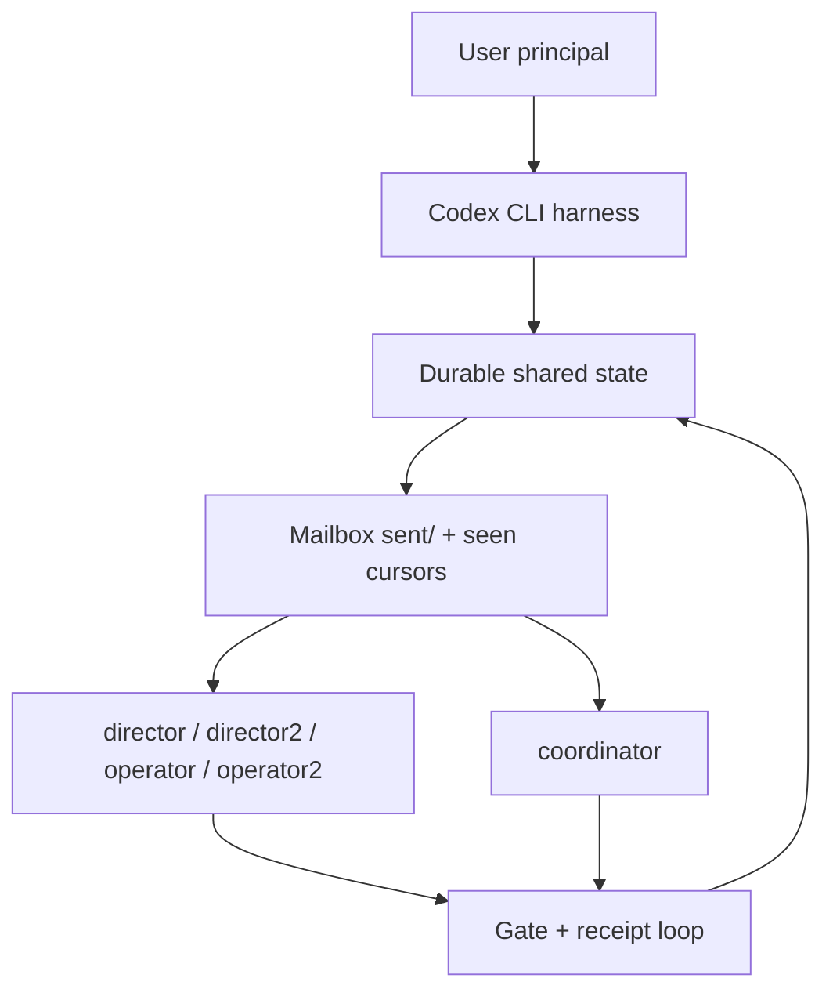

# Codex continuation protocol

This document renders the executable Codex harness model from
`scripts/codex_protocol_model.py` into runtime instructions. It does not
replace `AGENTS.md` or the agent-agnostic protocol under
`docs/protocol/agents/`; it maps those durable repo rules onto Codex-native
surfaces.

Central invariant: durable shared state beats chat memory. Treat git commits,
committed files, mailbox bodies, `sent/` events, seen cursors, locks, logs,
gate evidence, and operator verification reports as the source of protocol
truth.

## Harness model



## Live loop

1. Orient from `seat_status.py` plus `git log` before protocol decisions.
2. Read mailbox bodies and committed files; do not decide from counts alone.
3. Classify the live role: readiness bridge, named seat, or coordinator.
4. Run gate scripts and smoke commands only as evidence, not as operator GO.
5. Send one `coordinator-to-all` route if needed, then verify receipt
   seat-by-seat.
6. Push remains user-gated; locks, paid spend, and pod spend require explicit
   consent.

## Codex surfaces

| Need | Codex surface |
|---|---|
| Durable repo rules | `AGENTS.md` |
| Protocol folder-intent map | `docs/protocol/protocol-assembly-map.md` |
| Reusable continuation workflow | `.agents/skills/four-seat-protocol/SKILL.md` |
| Explicit spawned role agents | `.codex/agents/*.toml` |
| Session lifecycle guardrails | `.codex/hooks.json` + `.codex/hooks/*.sh` |
| Read-only state report | `scripts/continuation_readiness.py` |
| Live seat orientation | `.agents/skills/four-seat-protocol/scripts/seat_status.py` |
| Reviewable handoff draft | `scripts/draft_handoff.py` |
| Protocol effectiveness loop | `scripts/protocol_effectiveness_report.py` |
| Executable harness model | `scripts/codex_protocol_model.py` |

The remaining `.claude/` script path is intentional for now: Codex wrappers
reuse the same tested shell/Python implementation instead of forking protocol
logic. Codex-facing instructions live in this file, `.agents/skills/`, and
`.codex/`.

## Agent guardrail extensions

The built-in role agents remain the core harness modules:
`readiness-bridge`, `protocol-coordinator`, `protocol-director`,
`protocol-operator`, `lane-v-verifier`, and `money-gate-reviewer`.

Optional `.codex/agents/agentNN.toml` files are self-codified guardrail
extensions. They can capture working seat heuristics, situational-awareness
loops, and synergistic routing advice as durable modules, but they extend the
harness; they do not replace built-in role agents, seat authority, mailbox
cursor rules, or user-gated push.

## Start-session inhabitance

A fresh Codex session should inhabit the Codex harness as a readiness bridge
unless the user or parent prompt gives an explicit seat or coordinator
instruction. The bridge starts from
`.venv/bin/python scripts/continuation_readiness.py`, reads the model-backed
Codex Harness Model section, and treats any discovered `agentNN.toml` files as
guardrail extensions only.

Readiness bridge mode does not consume cursors, send mailbox events, claim
locks, push, spend, or author production changes. It can report the durable
state and blockers, then stop or ask the parent to launch the appropriate core
role agent.

## Mode selection

Default mode is **readiness bridge**. A Codex thread is not a director,
operator, or coordinator unless the user explicitly says so.

Readiness bridge:

- May run read-only orientation and summarize state.
- Must not consume mailbox cursors.
- Must not send mailbox events.
- Must not edit remediation inventory, handoffs, or presence.
- Must not claim director/operator ownership.

Live seat:

- Requires an explicit seat name: `director`, `director2`, `operator`, or
  `operator2`.
- Must surface unread count before processing mailbox events.
- Reads unread mailbox events by default before deciding the seat is idle,
  routed, blocked, or ready to verify. Cursor consumption is a separate
  intentional mutation that stages cursor files.
- Must follow the seat ownership rules in `docs/protocol/agents/`.

Coordinator:

- On-demand only.
- Starts with the coordinator seat-status command, not the generic readiness
  bridge.
- Reads live coordinator/all mailbox state and recent `coordination/mailbox/sent/`
  entries before any routing, handoff, inventory, or gate claim. Decisions are
  made from mailbox bodies, not filenames or counts alone.
- Reconciles and routes; it does not author production fixes.
- Has no cursor and must not run `consume-events`.
- Writes only for a real state transition, routing need, lock correction,
  wave-open/close artifact, or user-facing escalation; otherwise it reports a
  no-op with command evidence.
- Must not mark correctness verified without the required operator GO and
  executed evidence.

## Capacity-Max Default Workflow

After the user explicitly enters a live seat, asks a coordinator to continue,
or asks Codex to advance a cycle, the default is the **capacity-max** workflow.
It uses every role that can add signal without crossing ownership boundaries:
active seats do lane work, seats with no current work return no-op evidence,
operators verify as soon as real diffs or verify requests exist, and the
coordinator reconciles once at the end.

Readiness bridge mode is still read-only and never auto-spawns seats. A user may
also ask for a deliberately single-seat or read-only pass; otherwise live
coordinator/cycle work should use the capacity-max loop:

1. The parent/coordinator captures the shared baseline:
   `seat_status.py coordinator --wave 2`, `env -u GIT_INDEX_FILE git log --oneline -5`,
   `scripts/wave_gate_check.py 2`, and `scripts/ci_smoke.py`.
2. Build a short capacity board from mailbox deltas, `docs/REMEDIATION-INVENTORY.md`,
   active locks, gate output, and any landed-but-unverified diffs. Classify each
   slot as implementation/briefing, co-sign/product-oracle review, Lane V
   verification, routing-only, or idle/no-op after reading the relevant mailbox
   bodies.
3. Orient all four live seats with
   `.agents/skills/four-seat-protocol/scripts/seat_status.py <seat> --wave 2`;
   record and surface each unread count before mailbox processing, then read
   unread mail for live seats. Consume cursors only when intentionally advancing
   the live seat. After a consolidated coordinator broadcast, compare each seat
   cursor and unread set against that broadcast so receipt splits are explicit.
4. Dispatch bounded role agents from `.codex/agents/` for every live seat in the
   cycle: `protocol-director` for `director` / `director2`, and
   `protocol-operator` for `operator` / `operator2`. Idle seats still return
   no-op evidence so the coordinator knows they were checked.
5. Each spawned prompt names the concrete seat, current HEAD, unread count, lane
   ownership, mailbox-consumption decision, allowed write set, locks/push status,
   and expected output. Directors may use bounded exploration/implementation or
   specialist pre-review subagents inside their lane; operators may use
   read-only `lane-v-verifier` and `money-gate-reviewer` sidecars while still
   owning the final GO/NITS/FAIL.
6. Run implementation in parallel only when file/lock ownership is disjoint.
   Never run two implementation agents on shared files or behind the same
   push-gated lock. Pull verification forward for already-landed diffs instead
   of leaving operators idle.
7. The parent waits for role results, then the coordinator reconciles
   inventory/locks/mailbox exactly once if a real transition occurred, or reports
   the no-op with command evidence.

Subagents do not relax the director/operator boundary: a director still cannot
verify its own work, an operator still should not author production fixes, and
the coordinator still does not author production code.

If the next ordered row requires `coordination/bin/claim-lock`, remember that
the helper performs fetch/push. Push is user-gated; without explicit push
authorization, choose eligible no-lock work or stop for authorization rather
than claiming the lock.

## Codex Live-Protocol Rules

These rules are mandatory for live Codex seats and coordinator sessions:

- **R-CODEX-MAIL:** read live mailbox state before any handoff, routing event,
  inventory/gate claim, or state-asserting protocol write. Live seats read
  pending seat mail by default after surfacing the unread count; cursor
  consumption is a separate intentional live-seat mutation. Use
  `seat_status.py <seat> --wave <N>` for seat-local unread state and
  `seat_status.py coordinator --wave <N>` plus recent
  `coordination/mailbox/sent/` entries for coordinator/all state. Decisions are
  made from mailbox bodies, not unread counts alone. Refresh again immediately
  before finalizing a handoff or commit if other seats are active.
- **R-CODEX-CONSOLIDATE:** cross-seat coordinator routing should be one
  consolidated `coordinator-to-all` mailbox event unless a narrower direct route
  is explicitly required. The event should name each seat's task, unread/cursor
  context, lock/push/spend status, allowed write set, and expected output.
- **R-CODEX-RECEIPT:** after a consolidated `coordinator-to-all` routing notice,
  a coordinator check refreshes all four seats and compares each cursor/unread
  set against that broadcast. Report any receipt split explicitly. Receipt
  evidence proves mail state only; it does not prove assigned work is complete.
- **R-CODEX-INDEX:** ordinary git and pytest commands in a seat session use
  `env -u GIT_INDEX_FILE`. If a coordinator-only docs/mailbox/log commit is
  needed while the shared index is dirty, use a scoped temporary index:
  `env -u GIT_INDEX_FILE GIT_INDEX_FILE=<temp-index> git ...`. Inspect
  `git diff --cached --name-status` under that temp index before committing,
  and refresh only the committed path in the shared index if it appears as a
  stale `D/??` pair afterward.
- **R-CODEX-SEATINDEX:** after live-seat mailbox consumption, inspect the active
  seat index before committing. Expected cursor-only scope is exactly
  `M coordination/mailbox/seen/<seat>.txt`. If `HEAD` advanced after the seat
  index was seeded, stale indexes can stage bogus deletions for files introduced
  by the newer commit; when there is no intentional staged seat work, refresh the
  seat index to `HEAD` and re-stage only the cursor. If there is intentional
  staged work, do not blindly reset the index; reconcile the mixed state
  deliberately and preserve owned paths.
- **R-CODEX-NOLOCK:** when push, pod spend, paid API spend, or lock-claim side
  effects are not user-authorized, route eligible no-lock work first or stop for
  authorization. Do not claim push-gated locks as an implementation shortcut.
- **R-CODEX-HANDOFF:** a bare `handoff` request means a narrow state-transfer
  artifact from live evidence. Do not invent implementation, verification,
  inventory churn, or mailbox noise unless the evidence shows a real transition
  or the user asks for that work.
- **R-CODEX-LEARN:** when a live protocol observation would improve capacity,
  efficacy, or efficiency, preserve it as durable memory if the user has
  authorized memory updates; if the observation is broadly reusable, codify it
  in the relevant protocol docs and rules log with evidence/provenance.

## Seat-Local Subagent Workflow

All live seats may use Codex subagents as part of their normal workflow, but the
seat remains accountable for the result. A subagent report is evidence, not a
role handoff, mailbox cursor, operator GO, or coordinator reconciliation by
itself.

- `coordinator`: holds the shared baseline, spawns `protocol-director` and
  `protocol-operator` for capacity-max cycles, and may run read-only
  `lane-v-verifier` / `money-gate-reviewer` workflows at wave-boundary or
  discovery triggers. The coordinator still does not author production fixes.
- `director` / `director2`: may use subagents for bounded exploration,
  sibling-audit help, implementation shards, or specialist pre-review. The
  director still owns the R-BRIEF, lock/co-sign decisions, final dispatch
  shape, and verify-request; subagents cannot replace the operator GO.
- `operator` / `operator2`: should use read-only verifier subagents for
  cold-context Lane V where useful, especially `lane-v-verifier` for ordinary
  diffs and `money-gate-reviewer` for spend/budget-gate diffs. The operator
  still reads the actual diff, synthesizes the final GO/NITS/FAIL, sends the
  `verification-report`, and handles lock-release atomicity on GO.

Subagent prompts must name the concrete seat, current HEAD, unread count, lane
scope, allowed write set, mailbox consumption decision, and expected output.
Never run two implementation subagents in parallel on shared files. Idle seats
return no-op evidence instead of inventing work.

## Read-only continuation command

For Codex app or ad-hoc Codex threads:

```bash
.venv/bin/python scripts/continuation_readiness.py
```

For execution-readiness checks:

```bash
.venv/bin/python scripts/continuation_readiness.py --smoke
```

This command reports git, mailbox unread counts, Wave state, ADR-028 ceremony
state, environment status, and installed Codex harness model artifacts. It exits
successfully as a report command even when Wave or ceremony gates are red.

## Partly Automated Handoff Draft

For a live seat or coordinator handoff, use the draft command to capture current
evidence into a reviewable Markdown scaffold:

```bash
.venv/bin/python scripts/draft_handoff.py <seat> --wave 2 --smoke --output
```

The draft command is read-only with respect to protocol state: it does not
consume mailbox cursors, send mailbox events, edit inventory, or decide that a
seat is done. The current seat must still review the output, fill in the
judgment fields, and refresh live state again before committing or handing off
when other seats are active. Treat the generated clean-session prompt as a
starter, not as a replacement for `seat_status.py` and mailbox-body review.

## Protocol Effectiveness Report

For a coordinator cycle wrap or handoff input, run the read-only effectiveness
report:

```bash
.venv/bin/python scripts/protocol_effectiveness_report.py --wave 2
```

Use `--stdout-only` when a summary is needed without writing the JSON artifact.
The report classifies observed progress, blockers, no-op evidence, stale claims,
and coordination volume from existing durable evidence. It is an input to the
next coordinator capacity board, not a wave gate, operator GO, inventory
authority, mailbox receipt proof, or routing automation.

## Live-seat launch

For CLI seats in one shared working tree:

```bash
cd /Users/hyungkoookkim/Content
export CODEX_SEAT=<director|director2|operator|operator2>
CODEX_GIT_DIR="$(env -u GIT_INDEX_FILE git rev-parse --absolute-git-dir)"
export GIT_INDEX_FILE="$CODEX_GIT_DIR/index-codex-$CODEX_SEAT"
[ -f "$GIT_INDEX_FILE" ] || env -u GIT_INDEX_FILE git read-tree --index-output="$GIT_INDEX_FILE" HEAD
codex
```

Inside the session, start with:

```bash
.venv/bin/python .agents/skills/four-seat-protocol/scripts/seat_status.py "$CODEX_SEAT" --wave 2
env -u GIT_INDEX_FILE git log --oneline -5
```

For an explicit coordinator session, start with:

```bash
.venv/bin/python .agents/skills/four-seat-protocol/scripts/seat_status.py coordinator --wave 2
env -u GIT_INDEX_FILE git log --oneline -5
.venv/bin/python scripts/wave_gate_check.py 2
.venv/bin/python scripts/ci_smoke.py
```

If a live seat intentionally consumes mailbox events:

```bash
coordination/bin/consume-events "$CODEX_SEAT"
```

`consume-events` mutates and stages `coordination/mailbox/seen/<seat>.txt`.
Inspect the active seat index afterward; a cursor-only consume should stage only
that seat's cursor file.
Never run it in readiness bridge mode.
Never run it for the coordinator; the coordinator is unpinned and reconciles
from all-time coordinator/all mailbox evidence at the §6f triggers.

## Codex hooks

`.codex/hooks.json` registers Codex lifecycle hooks:

- `SessionStart`: delegates to the R-START smoke tripwire.
- `PreToolUse` on `Bash`: delegates to the git-index guard.
- `PostToolUse` on `Bash|apply_patch|Edit|Write`: delegates to the state and
  heartbeat updater.

The wrappers bridge `CODEX_SEAT` to the legacy `CLAUDE_SEAT` variable used by
the shared hook implementation. Codex may require `/hooks` review/trust before
repo-local hooks run.

## Custom agents

Project custom agents live under `.codex/agents/`:

- `readiness-bridge`: read-only orientation; never upgrades itself into a seat.
- `protocol-director`: explicit `director`/`director2` work.
- `protocol-operator`: explicit `operator`/`operator2` work.
- `protocol-coordinator`: explicit cross-seat reconciliation.
- `lane-v-verifier`: read-only independent Lane V verification.
- `money-gate-reviewer`: read-only reviewer for budget/cost-gate diffs.

Use them only when the parent asks for subagents or role-specific delegation.
Codex does not spawn subagents automatically in readiness bridge mode. For
explicit live-seat, coordinator, or cycle-advance work, the parent/coordinator
should use the capacity-max workflow above as the default implementation unless
the user explicitly asks for a narrower pass.

## Evidence discipline

- `scripts/wave_gate_check.py` reports process state; it is not a correctness
  proof.
- A `verified` transition requires the protocol's operator
  `verification-report` GO plus executed evidence.
- Measurement-backed verdicts require committed instruments and citable
  `logs/` artifacts.
- For state-asserting writes, run
  `env -u GIT_INDEX_FILE git log --oneline -5` immediately before the write and
  again immediately before commit.
