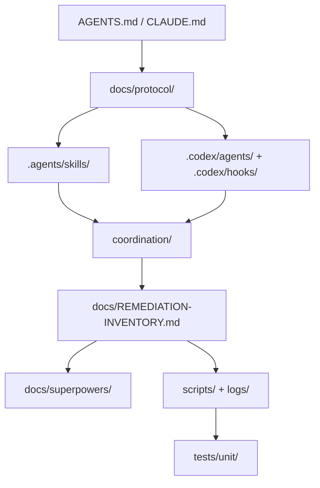

# Protocol Assembly Map

This map reverse-engineers the current folder structure into the safest places
to reassemble protocol portions. The rule is simple: use the lowest folder that can own it without ambiguity.

The map is descriptive, not a new authority layer. When a universal protocol
rule, Codex-specific instruction, mailbox event, inventory row, or proof
artifact needs a home, place it where the folder already expresses that intent.



| Protocol portion | Intended home | Example | Reason |
|---|---|---|---|
| Universal protocol policy | `docs/protocol/agents/` | `docs/protocol/agents/director-operator.md` | Rules shared by Claude, Codex, and other agents should not live in a Codex-only surface. |
| Codex protocol mapping | `docs/protocol/codex/continuation.md` | Capacity-max workflow, Codex launch pattern | Codex mechanics translate the universal rules into Codex-native tools, hooks, and role agents. |
| Start-session router | `AGENTS.md` | Codex start-session inhabitance block | The root file should route agents before task-specific docs are loaded. |
| Live seat checklists | `.agents/skills/` | `.agents/skills/seat-operator/SKILL.md` | Seat actions are reusable runtime instructions with clear trigger rules. |
| Spawnable Codex roles | `.codex/agents/*.toml` | `.codex/agents/protocol-operator.toml` | Role prompts are executable agent modules and should stay near Codex agent configuration. |
| Session guardrails | `.codex/hooks.json` and `.codex/hooks/` | `guard-git-index.sh`, `session-smoke.sh` | Hooks are lifecycle/tool boundaries, not protocol prose or mailbox state. |
| Mailbox events | `coordination/mailbox/sent/` | `*-operator2-to-all-verification-report.md` | Inter-seat protocol speech must be durable and commit-addressable. |
| Mailbox read cursors | `coordination/mailbox/seen/` | `coordination/mailbox/seen/director.txt` | Per-seat consumed-up-to timestamps are the single read-state truth. |
| Shared-file locks | `coordination/locks/` | `2-web_server.py.lock` when active | Locks are temporary ownership claims over shared implementation surfaces. |
| Campaign board | `docs/REMEDIATION-INVENTORY.md` | Wave row status and verifier columns | The inventory is the coordinator-owned single board for row lifecycle state. |
| Director work packets | `docs/superpowers/briefs/` | `2026-06-16-http-web-server-lock-redo.md` | R-BRIEFs are task-local instructions for one implementation or verification loop. |
| Plans and specs | `docs/superpowers/plans/`, `docs/superpowers/specs/` | Wave plans, stub-contract specs | Larger design and execution artifacts need durable but bounded homes. |
| Executable checks | `scripts/` | `wave_gate_check.py`, `ci_smoke.py` | Gate and readiness truth should be runnable, not only asserted in prose. |
| Committed evidence | `logs/` | `product-oracle-wave2.json`, `discovery-*.json` | Measurement and discovery outputs support R-MEASURE/R-EVIDENCE claims. |
| Protocol tool tests | `tests/unit/` | `test_coordination_bin.py`, `test_codex_protocol_model.py` | Tool contracts should be enforced by tests so prose drift is caught. |

## Placement Rule

Use this quick routing check before adding or moving protocol material:

```text
Universal rule?             -> docs/protocol/agents/
Codex-only rule?            -> docs/protocol/codex/
Seat action checklist?      -> .agents/skills/
Spawnable role prompt?      -> .codex/agents/
Lifecycle/index guardrail?  -> .codex/hooks*
Actual protocol event?      -> coordination/mailbox/sent/
Read cursor?                -> coordination/mailbox/seen/
Lock/ownership state?       -> coordination/locks/
Wave/task status?           -> docs/REMEDIATION-INVENTORY.md
Specific fix brief?         -> docs/superpowers/briefs/
Wave plan or design spec?   -> docs/superpowers/plans/ or docs/superpowers/specs/
Executable proof?           -> scripts/
Proof output?               -> logs/
Tool contract test?         -> tests/unit/
```

## Non-Goals

- Do not centralize all protocol text into this file.
- Do not move live mailbox, cursor, lock, or inventory state into docs.
- Do not duplicate universal rules in Codex-specific surfaces.
- Do not treat a script's green result as an operator GO when the protocol
  requires a mailbox `verification-report`.
