# Three-Way Protocol — Canonical Architecture Diagram

**This is the canonical topology diagram.** It merges the accuracy of the Codex-drawn
flowchart with the visual styling of the Antigravity-drawn one, and corrects the errors found
in both (see *What this corrects* below). The **normative truth** is the spec
([`docs/superpowers/specs/2026-06-19-cross-provider-seat-topology-design.md`](../../superpowers/specs/2026-06-19-cross-provider-seat-topology-design.md))
and the `threeway/` package — consult them for any detail; when this diagram and they disagree,
they win.

> **Status:** this depicts the *target* topology. The `threeway/` package (Slice 1+2) is built but
> **wired into nothing** today; the live substrate is still the legacy mailbox bus. See
> [`UNIFIED-OPERATING-DOCTRINE.md`](UNIFIED-OPERATING-DOCTRINE.md) §I.5.

## Topology

```mermaid
flowchart TB
  classDef mech fill:#2b2b2b,stroke:#ffffff,stroke-width:2px,color:#ffffff;
  classDef codex fill:#005A9C,stroke:#ffffff,stroke-width:2px,color:#ffffff;
  classDef claude fill:#D97757,stroke:#ffffff,stroke-width:2px,color:#ffffff;
  classDef agy fill:#1EAEDB,stroke:#0a8a00,stroke-width:2px,color:#ffffff,stroke-dasharray:5 5;
  classDef bus fill:#f4f4f4,stroke:#333333,stroke-width:2px,color:#111111;
  classDef note fill:#fff6d6,stroke:#e0a800,stroke-width:1px,color:#333333;

  Bus[("Immutable Threeway Bus<br/>refs/threeway/events<br/>signed JSON facts, seq-ordered")]:::bus

  subgraph Strategic["1. Strategic Loop (control plane, human-relayed)"]
    direction TB
    Chief["Dual Chief<br/>Gemini Deep Think + ChatGPT Pro<br/>apps, no repo writes"]:::mech
    Agy["Antigravity (agy)<br/>NO Layer-1 seat<br/>optional relayed-strategy app<br/>same lane as chiefs, never the decider<br/>or read-only observer"]:::agy
    Human["Human Relay"]
    Overseer["Mechanical Overseer<br/>read-only on code, dispatcher + ledger<br/>SIGNS brief, assignment, cycle_go, release_order<br/>may NOT issue a verdict"]:::mech
    Chief -->|"analyze and order (advisory prose)"| Human
    Agy -.->|"advisory prose only"| Human
    Human -->|"relays order"| Overseer
  end

  Overseer -->|"signs brief, assignment, cycle_go"| Bus
  Bus -.->|"results, data-to-info summary (loop closes)"| Overseer
  Overseer -.->|"feeds analysis up"| Chief

  subgraph PairA["2. Tactical Loop - Pair A (Codex builds, Claude verifies and integrates)"]
    direction TB
    DA["director (Codex)<br/>builder"]:::codex
    OA["operator (Claude)<br/>primary verifier, read-only repo"]:::claude
    CA["coordinator (Claude)<br/>deterministic integrator, merge-only"]:::claude
    BrA[("branch_sha")]:::bus
    StA[("staging integration_sha")]:::bus
    DA -->|"1. builds candidate"| BrA
    BrA -->|"2. fresh checkout, preliminary verify"| OA
    CA -->|"4. merge-only stage, conflict aborts to rework"| StA
    StA -->|"5. final verify on exact integration_sha"| OA
  end

  Bus -->|"reads brief and assignment"| DA
  OA -->|"3. signs PRELIMINARY attestation on branch_sha"| Bus
  Bus -->|"observes preliminary GO"| CA
  CA -->|"signs candidate on integration_sha"| Bus
  OA -->|"6. signs RELEASE attestation on integration_sha"| Bus
  CA -->|"7. signs release_requested"| Bus

  subgraph PairB["2b. Tactical Loop - Pair B (Claude builds, Codex verifies and integrates), mirror"]
    direction TB
    DB["director2 (Claude)<br/>builder"]:::claude
    OB["operator2 (Codex)<br/>primary verifier"]:::codex
    CB["coordinator2 (Codex)<br/>deterministic integrator"]:::codex
    DB -->|"same 7 steps, providers swapped"| OB
    OB --> CB
  end

  Bus -->|"reads Pair-B brief"| DB
  OB -->|"preliminary + release attestations"| Bus
  CB -->|"candidate + release_requested"| Bus

  subgraph Release["3. Release Gate (protected, single mechanical writer)"]
    direction TB
    CI["CI Runner (unprivileged)<br/>SIGNS ci_result on integration_sha"]:::mech
    Gate["Merge-Gate (mechanical, sole writer)<br/>re-evaluates FULL predicate from bus state<br/>re-computes merge, never trusts coordinator SHA<br/>never runs candidate code"]:::mech
    Main[("protected main")]:::bus
    Gate -->|"exact-SHA compare-and-swap"| Main
  end

  StA -->|"tests, holds no signing key"| CI
  CI -->|"signs ci_result"| Bus
  Overseer -->|"signs release_order on integration_sha"| Bus
  Bus -->|"needs BOTH release_requested and release_order, release GO, ci_result PASS, valid sigs, in-scope diff"| Gate

  NoteInd["Cross-Provider Independence:<br/>the builder's provider is NEVER the primary verifier<br/>or executing integrator of its own work"]:::note
  NoteInd -.- DA
  NoteInd -.- OA
  NoteTier["Gate-computed tiers: T0/T1 shown.<br/>T2 adds the OTHER pair's operator co_sign.<br/>T3 adds re_verify + two human_approval.<br/>Slice 3, not yet active."]:::note
  NoteTier -.- Gate
```

## Legend

| Colour | Meaning |
|---|---|
| **Blue** | Codex seat |
| **Orange** | Claude seat |
| **Black** | Mechanical / no-AI-authority role (overseer, CI, merge-gate, dual-chief apps) |
| **Dashed blue** | Antigravity — off every Layer-1 path |
| **Grey cylinder** | Bus / git artifact (events, branch, staging, main) |
| **Yellow** | Invariant annotation |

## What to notice (the load-bearing reads)

1. **Two-phase verification by the cross-provider operator.** The same operator attests *twice* —
   preliminary on `branch_sha` (step 3) and release on `integration_sha` (step 6) — with the
   coordinator's merge-only stage *between* them (step 4). Both attestations are **signed bus facts**,
   not point-to-point messages.
2. **Cross-provider independence.** Pair A: Codex builds, Claude verifies + integrates. Pair B mirrors
   it. A provider never primarily verifies or executes integration of its own work.
3. **The overseer SIGNS, the gate EVALUATES.** The overseer is a mechanical dispatcher that issues
   `cycle_go`/`release_order` but **may not issue a verdict**. The **merge-gate** is the sole evaluator:
   it re-derives the merge itself, refuses to trust the coordinator's `integration_sha`, and never runs
   candidate code.
4. **Two release triggers.** The gate fires only when **both** the coordinator's `release_requested`
   **and** the overseer's `release_order` exist (plus a PASS `ci_result`, the release GO, valid
   signatures, and an in-scope diff) — then promotes via exact-SHA compare-and-swap.
5. **Antigravity is not the dual chief.** The chiefs are Gemini Deep Think + ChatGPT Pro. Antigravity
   is an *optional* relayed-strategy app in the same lane (never the decider) or a read-only observer —
   off the candidate branch, staging ref, and protected `main`.
6. **The strategic loop is a loop.** Results feed the overseer's data→info summary, which feeds the
   chiefs, which return orders via the human relay — not a one-way chain.

## What this corrects (vs the two draft diagrams)

| # | Issue in a draft | Corrected here |
|---|---|---|
| 1 | agy labelled the chief node "Gemini/Antigravity" and called Antigravity "the Dual Chief" | Chief is Gemini Deep Think + ChatGPT Pro; Antigravity is a separate dashed advisory node feeding the human, never the chief |
| 2 | agy had the overseer "Evaluate CI+attestation" | Overseer only *signs* `release_order`; the **gate** evaluates |
| 3 | both omitted the coordinator's `release_requested` | Both triggers shown; gate needs both |
| 4 | both drew the strategic loop one-way | Feedback arc added (results → overseer → chief) |
| 5 | agy drew the preliminary attestation as a direct edge to the coordinator | Both attestations are signed bus facts |

*Provenance: corrected against `threeway/loop.py:43-52`, `threeway/predicate.py`, `threeway/gate.py`,
and spec §4/§5.1/§6.3/§6.4/§9, via independent three-lens verification of both draft diagrams
(workflows `wf_ec50f013-100`, `wf_335e4f5d-af5`).*
